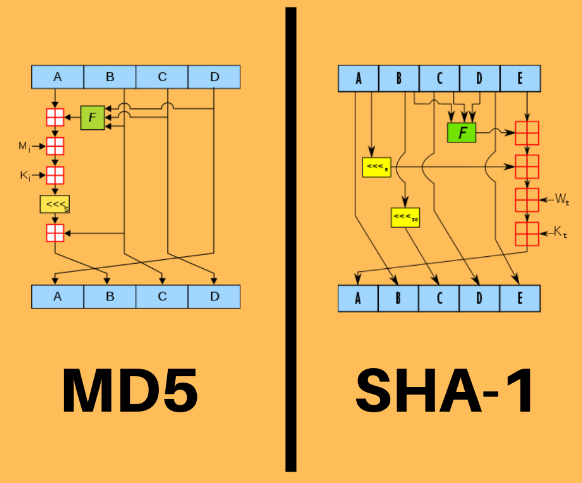
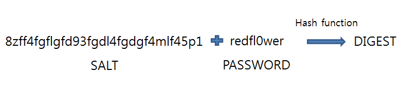
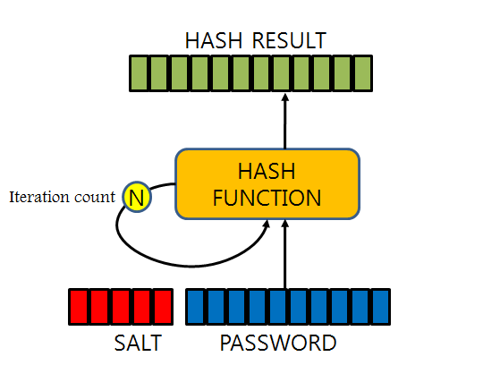

# 해시 알고리즘 Hash Algorithm

## Hash

- 임의의 크기를 가진 데이터(Key)를 고정된 크기의 데이터(Value)로 변화시켜 저장하는 방법
- 키에 대한 해시 값을 사용하여 값을 저장 → 키-값 쌍의 갯수에 따라 동적으로 크기가 증가하는 array
    - Hashing : 키에 대한 해시값을 구하는 과정 → 사용하는 함수를 해시 함수라고 함

⇒ 평균 시간복잡도 O(1)

## 해시 함수 Hash function

- 임의의 길이의 데이터를 입력받아 일정한 길이의 비트열로 반환시켜주는 함수
- 키값에 대한 중복없이 해시값을 올바르게 만드는 함수가 좋음 (해시 충돌)
    - 나눗셈법 Division Method
        - 가장 간단한 알고리즘
        - 입력 값을 테이블의 크기로 나누어 그 나머지를 테이블의 주소로 사용
            
            ⇒ 테이블의 크기는 소수, 2의 제곱수와 거리가 먼 소수
            
    - 곱셈법 Multiplication Method
        - 나눗셈 법보다는 다소 느림
        - 2진수 연산에 최적화한 컴퓨터 구조를 고려한 해시 함수

## 장점

- 적은 리소스로 많은 데이터를 효율적으로 관리 가능
- 해시 함수는 언제나 동일한 해시값을 리턴하기에 해시테이블의 크기에 상관없이 빠르게 접근 가능
- 데이터의 삽입, 삭제, 탐색 시 O(1)임

# MD5 - Message-Digest Algorithm 5

- 128비트 암호화 해시 함수
- 프로그램이나 파일이 원본 그대로인지 확인하는 무결성 검사등에 사용함
- 현재는 보안 관련 용도로 쓰이는 것을 권장하지 않음

# SHA - Secure Hash Algorithm

- 암호학적 해시 함수들의 모음
- SHA-0, SHA-1 이 있고 나머지는 SHA-2라고 불림?(SHA-224, SHA-512 등등)
- SHA-0, SHA-1은 160비트의 해시값을 만들어냄 → 알고리즘은 MD5랑 비슷함
- SHA-1은 MD5를 대체하고 있음
- 쇄도 효과?? 때문에 메시지가 조금만 바뀌어도 완전히 바뀔 수 있음

# 단방향 해시 함수

- 수학적 연산을 통해 원본 메시지를 변환하여 암호화된 메시지 다이제스트를 생성
- 암호화된 메시지를 구하는 건 쉬움 → 암호화된 메시지를 원래 메시지로 돌릴 수 없음 ⇒ 단방향
- SHA-256 등등

### 인식 가능성

- 동일한 메시지가 언제나 동일한 다이제스트를 가질때 공격자가 다이제스트를 많이가지고 있으면 발생하는 문제
- 다이제스트 목록 : 레인보우 테이블 Rainbow Table → 레인보우 공격 Rainbow Attack

### 속도

- 해시 함수는 암호화를 위해 만들어진것이 아닌 데이터 검색용으로 개발됨
- 해시함수의 빠른 처리 속도는 공격자에게 빠른 다이제스트를 비교할 수 있게됨
    
    ex) MD5를 사용할 경우 1초당 56억개의 다이제스트를 대입 가능
    

## 솔팅 Salting

- 솔트 Salt : 단방향 해시 함수에서 다이제스트를 생성할 때 추가되는 바이트 단위 임의의 문자열
- 원본 메시지에 솔트를 추가하여 다이제스트를 생성하는 것이 솔팅
- 모든 패스워드가 고유의 솔트를 가지고 솔트의 길이는 32바이트 이상 →  솔트랑 다이제스트 추측 어려워짐
    
    
    

## 키 스트레칭 Key Stretching

- 다이제스트를 입력값으로 다시 다이제스트를 만들어서 반복하는 방법
- 억지 기법 공격으로 패스워드를 추축하는데 많은 시간이 걸리게 하는 방법

## **Adaptive Key Derivation Functions**

다이제스트를 생성할때 추가로 보안의 강도를 높일 수 있는 방법??

### PBKDF2

- 가장 많이 사용됨, NIST 미국표준기술연구소에서 승인, 미국 정부 시스템에서도 사용

### bcrypt

- 패스워드 저장 목적으로 개발됨
- work factor 라는 인자로 얼마만큼의 처리 과정을 거칠지 결정
- 72바이트의 입력값의 제한이 있음

### scrypt

- 메모리 오버헤드를 갖도록 설계해서 병렬화처리가 매우 힘듬 ← 공격자 입장

MD5, SHA-1, SHA-256, SHA-512 등의 해시 함수는 메시지 인증과 무결성 체크를 위한 방법

→ 패스워드 인증을 위해 사용할려면 **Adaptive Key Derivation Functions 사용**

서드파티의 라이브러리에 의존 안할려면 PBKDF2-HMAC-SHA-256/SHA-512를 사용

가장 좋은 보안 방법은 사용자에게 최대한 긴 패스워드를 사용하도록 권장하는방법 ㅋㅋㅋ