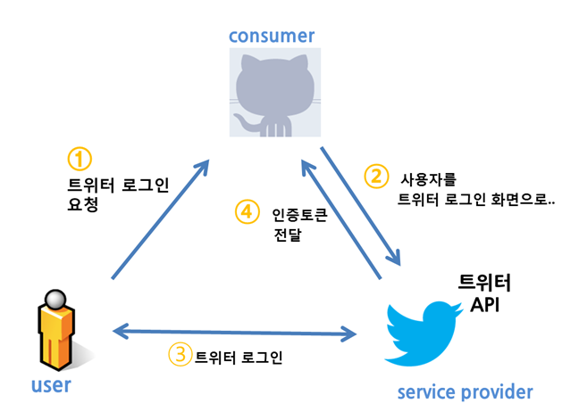
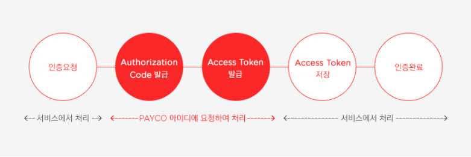
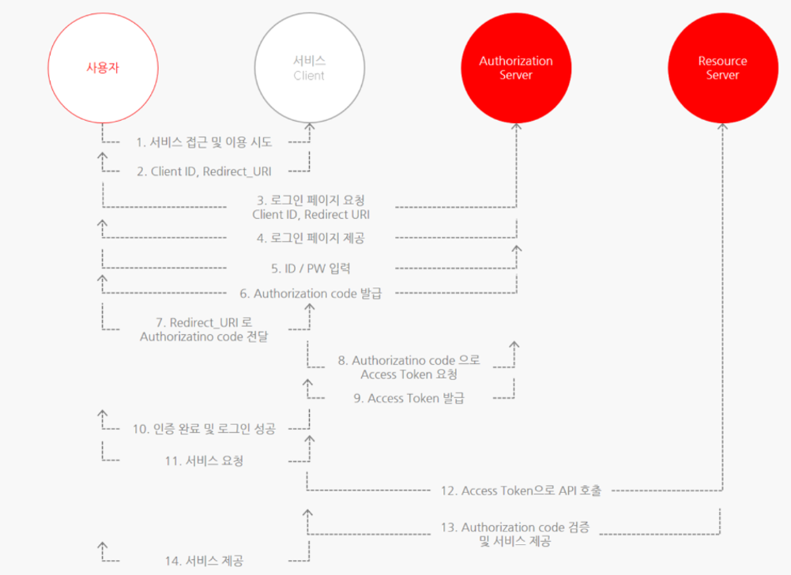

# OAuth

OAuth 2.0은 다양한 플랫폼 환경에서 권한 부여를 위한 산업 표준 프로토콜

→ 간단하게 인증(Authentication)과 권한(Authorization)을 획득하는 것

- 인증 : 시스템 접근을 확인 ex) 로그인
- 권한 : 행위의 권리를 검증

## 배경

- 서드 파티 애플리케이션에 아이디와 비밀번호를 제공하고 싶지 않아서 → 여러곳에 개인정보를 가지고 있으면 보안이 취악
    
    ### 비밀번호 인증방식의 문제
    
    - 신뢰 : 사용자가 ID랑 PW를 제공하기 꺼려함 ??
    - 피싱에 둔감 : 여러 애플리케이션에 ID PW를 계속 제공할 때 ??
    - 접근범위 확장에 따른 위험 부담 : ID 랑 PW를 알고 있는 애플리케이션은 모든 권한을 가짐
    - 신뢰성 제한 : PW를 변경하면 애플리케이션은 동작을 못함
    - 폐기 문제 : 권한을 폐기할려면 유일한 방법이 PW를 변경하는 것

## OAuth 1.0

- 트위터의 주도로 개발됨
- 3-legged-auth : 유저, 컨슈머, 서비스 프로바이더
- 구현이 복잡
- 웹이 아닌 애플리케이션에서의 지원이 부족?
- HMAC을 통해 암호화를 하는 번거로운 과정을 겪음
- 인증토큰(access token)이 만료되지 않음

# OAuth 2.0

- https가 필수 → 암호화는 https에 맡김
- 1.0a 에 비해 다양한 인증방식을 지원
- api서버에서 인증서버를 분리 할 수 있도록 해둠
    
    ### 구성요소
    
    - Resource Owner : 웹 서비스를 이용할려는 유저 (Resource 는 개인정보?)
    - Client : 개인이 만든 애플리케이션 서버 → client가 Resource Server에 요청을해서 클라이언트임 ㅋ
    - Authorization Server : 권한을 부여해주는 서버
        - 사용자는 이서버에 ID, PW를 넘겨 Authorization Code를 발급 받음
        - Client 는 Authorization Code를 넘겨 Token을 받음
    - Resource Server : 사용자의 개인정보를 가지고 있는 애플리케이션 (구글 등등)
    - Access Token : 자원에 대한 접근 권한을 Resource Owner가 인가하였음을 나타내는 자격증명 (짧은 만료시간)
    - Refresh Token : Access Token에 비해 긴 만료시간을 가짐 → Access Token이 만료되면 이걸 통해 다시 재발급 받음
    

## 인증 종류

### Authorization Code Grant 권한 부여 승인 코드 방식

- 서버 사이드 코드로 인증하는 방식 → 가장 기본이 되는 방식
- 권한서버가 클라이언트와 리소스 서버간의 중재역할
- Access Token 을 바로 클라이언트로 전달 X → 잠재적 유출을 방지
- 로그인시에 페이지 URL에 response_type=code 라고 넘김

### Implicit Grant 암묵적 승인 방식

- 브라우저 기반의 애플리케이션, 모바일에서 사용함?? → 스크립트 언어를 사용한 클라이언트에게 최적
- 권한코드 없이 바로 발급되어 보안에 취악 → Access token의 유효기간을 짧게
    
     ⇒ Refresh Token 불가능
    
- 로그인 시 페이지 URL에 response_type=token 이라고 넘김

### Password Credentials Grant 자원 소유자 자격증명 승인 방식

- Client에 ID/PW 를 저장하고 직접 access token을 받아오는 방식
- API서비스의 공식 애플리케이션이나 믿을 수 있는 Client 한해서 사용
    
    ⇒ 권한서버, 리소스서버, 클라이언트가 모두 같은 시스템일때만 사용해야 함
    
- 로그인 시 API에 POST로 grant_type=password 라고 남김

### Client Credentials Grant 클라이언트 자격증명 승인 방식

- 가장 간단한 방식 → 자신이 관리하는 권한 서버에 해당 클라이언트를 위한 리소스 접근 권한이 설정되어 있을 때 사용 ??
- 애플리케이션이 Confidential Client 일 때 ID 와 secret를 가지고 인증
- 로그인 시 API에 POST로 grant_type=client_credentials 라고 넘김

 
 
 
 
 
 
 
 
 
 
 

[https://showerbugs.github.io/2017-11-16/OAuth-란-무엇일까](https://showerbugs.github.io/2017-11-16/OAuth-%EB%9E%80-%EB%AC%B4%EC%97%87%EC%9D%BC%EA%B9%8C)

[https://inpa.tistory.com/entry/WEB-📚-OAuth-20-개념-💯-정리](https://inpa.tistory.com/entry/WEB-%F0%9F%93%9A-OAuth-20-%EA%B0%9C%EB%85%90-%F0%9F%92%AF-%EC%A0%95%EB%A6%AC)

[https://blog.naver.com/mds_datasecurity/222182943542](https://blog.naver.com/mds_datasecurity/222182943542)