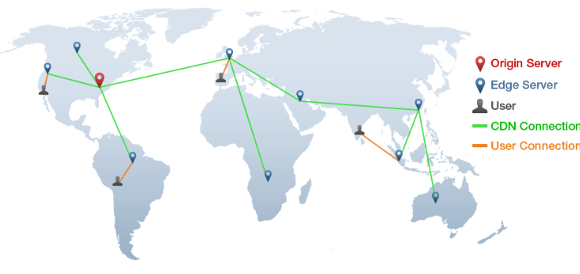
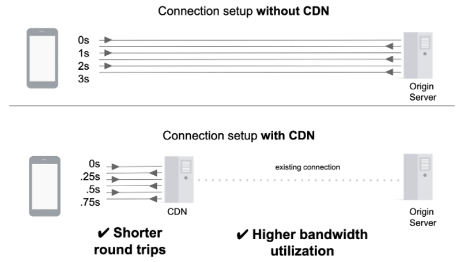
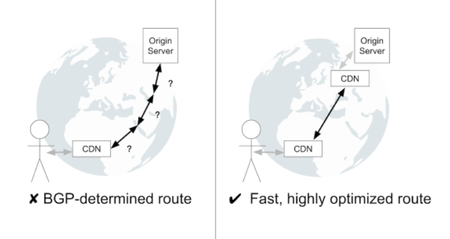

# CDN 컨텐츠 전송 네트워크

## Content Delivery Network

지리적 제약 없이 전 세계 사용자들에게 빠르고 안전하게 콘텐츠를 전송할 수 있는 **콘텐츠 전송 기술**

 
 

## 특징

- 서버와 사용자 사이의 **물리적인 거리를 줄여** 콘텐츠 로딩에 소요되는 시간을 최소화
- 각 지역에 캐시 서버 ( PoP, Points of Presence )를 분산 배치 → 근접한 사용자의 요청에 원본서버가 아닌 캐시 서버가 콘텐츠를 전송
- **특정 지역 혹은 나라**만 서비스 할 목적이라면 딱히 필요 없음 ⇒ 오히려 느려짐
- 사용자랑 Origin Server 보다 가까이 있기 때문에 **Round-trip-time RTT** 이 짧음
- 여러 CDN과의 연결은 BGT 보다 안정적이고 최적화된 경로를 찾을 확률이 높음?

 
 
 
 

## 캐싱 Caching

<aside>
💡 CDN은 사용자에게 빠르게 콘텐츠를 전달하기 위해 콘텐츠를 캐싱하는 캐시 서버를 활용함

</aside>

### 캐시 상태

1. Cache Miss
    - 캐시 서버에 콘텐츠가 없는 상태
    - 최초의 콘텐츠 요청이나 Cache가 삭제된 이후 요청이 들어온 상태
    - Origin Server에서 콘텐츠를 가져와 캐싱 후 요청에 대해 응답
2. Cache Hit
    - 캐시 서버에 콘텐츠가 저장되어 있는 상태
    - Origin Server를 거치지 않고 바로 응답
    - Cache Hit율이 높을 수록 원본 서버의 요청과 부하를 줄임 → 그만큼 효율적

### 캐시 유효성 검증 Cache Re-Validation

> 캐싱이 되었는지 되지 않았는지 확인하는 방법
> 
1. Cache Refresh Hit
    - 캐시 서버에 저장된 콘텐츠가 만료되어 원본 서버로 부터 유효성 검증 절차시 HTTP 304응답 받은 상태
    - 캐싱으로 저장된 콘텐츠를 수정하지 않고 Cache TTL만 갱신하여 요청에 대해 응답
2. Cache Refresh Miss
    - 유효성 검사 시 HTTP 200 받았은 상태
    - 원본 서버로 부터 새로 응답받은 콘텐츠로 캐싱을 갱신하고 요청에 응답