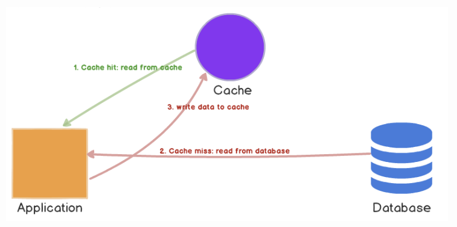
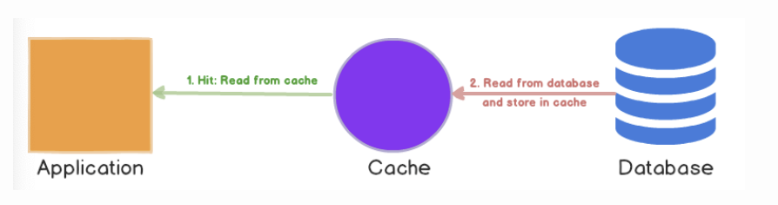
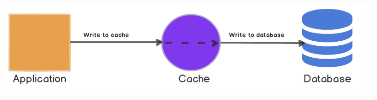

# 캐싱 전략 Caching Strategies
캐시 구성 방법?

### 캐시 데이터의 수명

모든 데이터를 지우지 않고 계속 가지고 있으면 캐시 저장소의 효울성이 떨어짐

→ 오랜 시간이 지난 데이터는 삭제하는것이 올바름

## Cache Aside

1. 애플리케이션은 캐시 저장소에 데이터가 있는지 조회
2. 없으면 디비에서 가져와서 가져온 데이터를 캐시저장소에 저장

- 캐시를 옆에 두고 필요할 때만 데이터를 캐시에 로드하는 전략
- 캐시 클러스터가 다운되어도 시스템 전체의 오류로 가지 않음
- 캐시가 데이터베이스와 모델이 달라도 됨?
- 캐시 데이터의 동기화 문제가 발생할 수도 있음

## Read-Through

1. 캐시 미스가 발생하면 데이터베이스에서 누락된 데이터를 가져와서 캐시에 채우고 이를 애플리케이션에 반환

- Cache Aside 와의 차이점은 애플리케이션이 캐시를 채우는 역할을 하는지 마는지
- 캐시가 데이터베이스의 모델과 다르면 안됨

## Write-Through

- 데이터베이스에 작성을 할때마다 캐시에 데이터를 추가하거나 업데이트 하는 방법
- 항상 동기화 되어 있음
- 쓰지 않는 데이터도 캐시에 저장되기 때문에 리소스 낭비
- 쓰기 지연 시간이 늘어남