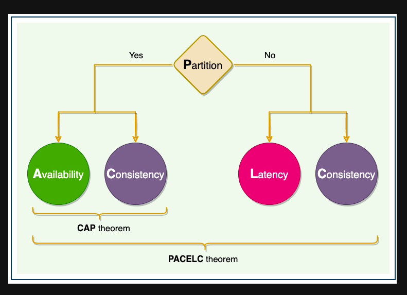

# CAP 이론

데이터베이스의 선택의 척도??

# CAP 이론

네트워크로 연결되어 있는 **분산된 데이터베이스 시스템**은 **일관성(Consistency), 가용성(Availability), 분할 내구성(Partition Tolerance)** 의 3가지 특성중 2가지 특성만을 충족 할수 있고 3가지 모두를 충족할 수 없다는 이론

## 일관성 Consistency

- 모든 데이터를 요청할 때 응답으로 **가장 최신의 데이터를 리턴 또는 실패** 한다는 의미
    
    → 모든 읽기에 대해 DB노드가 항상 동일한 데이터를 가지고 있어야 한다는 의미
    
    ex) 두개의 인스턴스가 있을때 어떤 디비에 요청을 해도 같은 값을 반환해야 함
    

## 가용성 Availability

- 모든 요청에 대해서 **정상적인 응답**을 한다는 의미
- 클러스터의 노드 일부분에서 장애가 발생해도 READ와 WRITE의 동작은 항상 성공적으로 리턴 되야 함

## 파티션 허용성 Partition Tolerance

- **DB 노드간의 통신장애가 발생하더라도 동작**해야 한다는 의미
    
    ex) 두개의 인스턴스가 있을 때 네트워크 장애가 발생하면 서로의 상태를 모르지만 자신 자체만으로도 작동이 되야함
    

## 허점

### CP 시스템

- 완벽한 일관성을 가지는 분산시스템
- 데이터 변경 시 모든 노드를 복제해야 완료됨 → 다른 곳의 데이터도 동일해야 함으로
- 노드가 늘어날 수록 지연시간이 길어짐 → 가용성 떨어짐

### AP 시스템

- 완벽한 가용성을 가지는 분산시스템
- 모든 노드가 어떤 상황에서도 응답을 할 수 있어야 함
- 네트워크 문제 발생 시 일관성을 위해 데이터를 무조건 반환하면 일관성이 깨짐

### CA 시스템

- 일관성과 가용성을 동시에 만족해야 함  → 네트워크 오류가 없어야함 ⇒ 말도안됨
- CAP 이론은 네트워크 파티션 허용성을 기본적으로 만족해야 함

⇒ 일관성과 가용성을 적절히 조절하여 시스템을 구성해야 함

# PACELC 이론

CAP 이론의 단점을 보완하기 위해 나온 이론

- 네트워크 장애 상황과 정상 상황을 나누어서 설명하는 이론
- 가용성과 일관성, 지연시간과 일관성

⇒ **P (네트워크 파티션)** 상황에서 **A(가용성)** 과 **C(일관성)** 의 상충관계와 **E (else, 정상)** 상황에서 **L(지연시간)** 과 **C(일관성)** 의 상충관계를 나타냄

### 네트워크 분할 상황 (CAP 이론)

- 물리적인 네트워크의 분할 > 노드끼리 데이터를 주고 받을 때 타임아웃이 발생하는 모든 경우를 포함

### 네트워크 정상 상황

- 모든 노드에 업데이트를 반영해 일관성을 유지 → 긴 대기/응답시간
- 일관성을 포기하고 짧은 지연시간을 얻을지를 선택