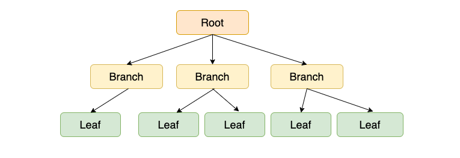
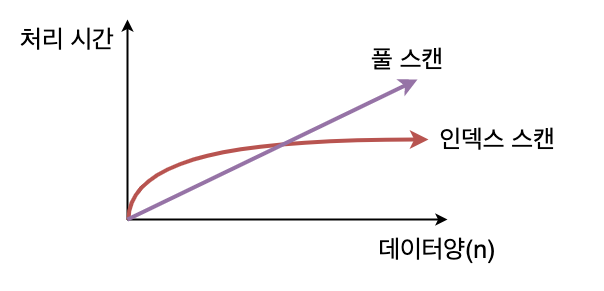
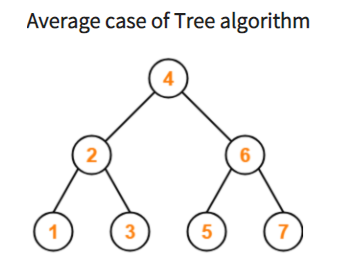
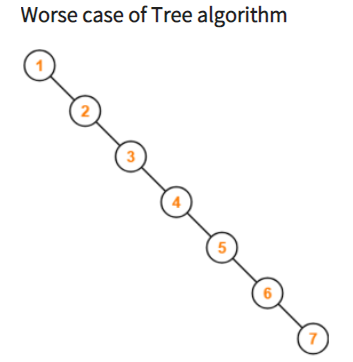
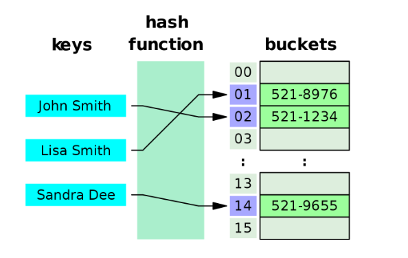
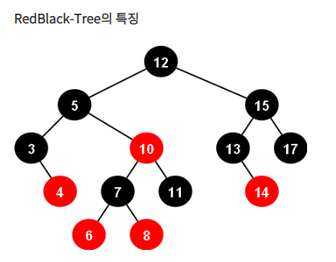
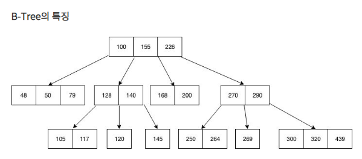
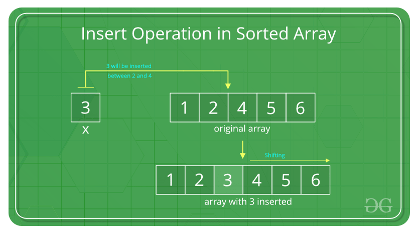

# 인덱스 Index

## 인덱스(index)란 ?

- 추가적인 쓰기 작업과 저장 공간을 활용하여 데이터베이스 테이블의 검색 속도를 향상시키기 위한 자료구조
- ex) 책의 목차 = 색인 = DB의 인덱스
- 모든 데이터를 검색하면 시간이 오래걸림 → 데이터와 데이터의 위치를 포함한 자료구조를 생성해서 빠르게 검색
- 인덱스를 활용하면 SELECT 외에 UPDATE , DELETE의 성능을 높여줌 → 해당 연산을 위해선 조회해야하기 때문에

## 인덱스 관리

- 인덱스는 항상 정렬된 상태를 유지해야 함
- 인덱스가 적용된 컬럼에 연산이 이루어지면 **추가 연산이 필요함** → 그에 따른 오버헤드 발생
    - INSERT : 새로운 데이터에 대한 인덱스 추가
    - DELETE : 삭제하는 데이터의 인덱스를 사용하지 않는다는 작업
    - UPDATE : 기존의 인덱스를 사용 X , 갱신된 데이터에 대해 인덱스 추가
- 일반적으로 따로 SQL을 실행할때 명시하지 않아도 만들어두면 옵티마이저가 알아서 적용해서 해줌 → HINT를 통해 명시적으로도 지정할수 있음?

## 인덱스의 장점과 단점

### 장점

- 테이블을 조회하는 속도와 그에 따른 성능을 향상
- 전반적인 시스템의 부하를 줄임

### 단점

- 인덱스를 관리하기 위해 DB의 약 10%에 해당하는 저장공간 필요?
- 인덱스를 관리하기 위한 추가 작업 필요
- 잘못 사용하면 오히려 성능을 낮춤 ex) 연산이 자주일어나는 속성

## 인덱스를 사용하면 좋은 경우

- 규모가 작지 않은 테이블
- **INSERT, UPDATE, DELETE 가 자주 일어나지 않는 컬럼**
- JOIN, WHERE, ORDER BY가 자주 사용되는 컬럼
- 데이터의 중복도가 낮은 컬럼 ex) 성별(남여) 보단 주민번호(????-????) ⇒ **카디널리티가 높은 컬럼**

## 인덱스의 자료구조

- **트리구조**로 이루어짐
- 여러번의 연산 (추가, 삭제) 가 이루어 지면 쿼리 속도를 저하 시키고 인덱스의 밸런스가 깨짐

 → 주기적으로 인덱스를 재구성 해줘야 함

## 인덱스에서 b+트리 사용 이유

- 일반 트리의 탐색 시간복잡도는 O(log n) → 한쪽으로 쏠려있는 트리의 경우 O(n) ⇒ 이러한 사태를 막기 위해 트리의 노드가 한 방향으로 쏠리지 않는 밸런스 트리를 사용 함

- 해시 테이블은 해시 함수를 통해 나온 해시 값을 이용해 접근하기 때문에 O(1) ⇒ 이건 단 하나의 데이터를 탐색하는 시간
- DB에서는 = 연산 이외에 <, > 를 사용하기 때문에 정렬이 되어있지 않은 해시테이블은 특정 기준보다 크거나 작은 값을 찾을 수 없음

- 레드블랙 트리는 노드 당 하나의 데이터를 가짐 → B트리는 노드 하나에 여러개의 데이터를 가질 수 있음
- 레드블랙 트리는 인접한 데이터를 찾기 위해선 포인터를 통해 접근
- B트리의 경우 노드가 배열로 되어 있기 때문에 실제 메모리상에 바로 다음 인덱스로 접근

⇒ 아무리 log n 이라도 배열의 인덱스보단 느림

- 배열은 인덱스를 통해 빠르게 조회 가능함 → 삭제나 추가가 일어나는 순간 데이터를 정렬해야 하기 때문에 O(n) 발생

### 정리

- 항상 정렬된 상태로 부등호 연산 가능
- 참조 포인터가 적어서 빠른 메모리 접근 가능
- 탐색, 저장, 수정, 삭제에도 항상 O(log n)의 시간 복잡도