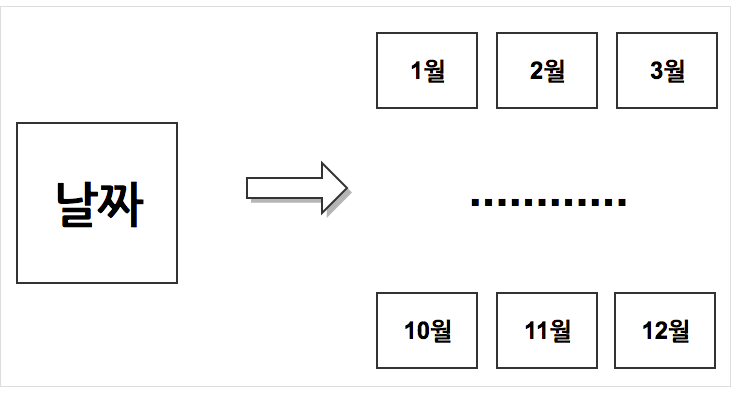
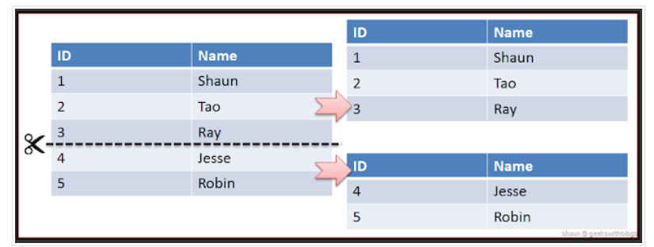
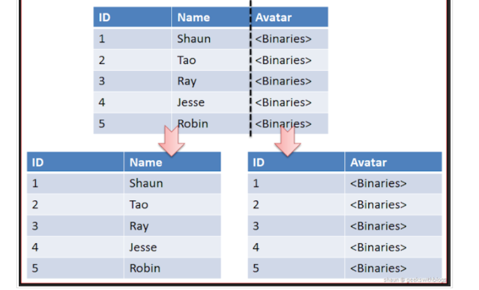

# 파티셔닝 Partitioning (분할)

- 데이터베이스를 여러 부분으로 분할하는 것
- 데이터가 너무 클 때, 조회하는 시간이 길 때 또는 관리의 용이성, 가용성 등의 향상을 위해 진행

⇒ 분할된 각 부분을 파티션

### 장점

- 가용성 Availability
    - 물리적인 파티셔닝으로 인해 전체 데이터의 훼손 가능성이 줄어들고 가용성 증가
- 관리 용이성 Manageability
    - 큰 테이블을 제거해서 관리가 쉬워짐
- 성능 Performance
    - 특정 DML과 Query의 성능을 향상
    - 많은 INSERT 가 있는 OLTP 시스템에서 Insert 작업들을 분리된 파티션들로 분산시켜 경합을 줄임

### 단점

- 테이블 간의 JOIN 비용 증가
- 테이블과 인덱스를 별도로 파티션 할 수 없음 → 같이 파티셔닝 해야 함

## 분할기준

- 범위 분할 Range Partitioning
    
    연속적인 숫자나 날짜를 기준으로 분할 → 관리 시간을 단축시킬 수 있음
    
    ex) 우편번호, 일별, 월별
    
    
    

- 목록 분할 List Partitioning
    
    분할 키 값을 기준으로 파티션을 분할 
    
    ex) 북유럽 ← 노르웨이, 스웨덴 
    
    
    

- 해시 분할 Hash Partitioning
    
    분할 키의 Hash 값에 의한 분할 → 균등한 데이터 분할 가능
    
    범위가 없는 데이터에 적합?
    
- 합성 분할 Composite Partitioning
    
    Partitioning을 한 파티션을 다시 Partitioning 하는 것
    
    범위 분할을 했음에도 너무 클 때 사용 → Range Hash, Range List
    

## 방법

### Horizontal Partitioning 수평 분할

- 데이터의 개수를 기준으로 분할하는 방법
    
    → 데이터의 개수가 작아지면서 Index의 개수도 작아짐 ⇒ 성능 향상
    
- 단점
    - 서버간의 연결과정이 많아짐
    - 데이터를 찾는 과정이 기존보다 복잡해짐
    - 하나의 서버가 고장나면 데이터의 무결성 깨질 수 있음

### Vertical Partitioning 수직 분할

- 데이터를 컬럼을 기준으로 나누어 분할하는 방법
    
    정규화랑 비슷하지만 수직분할은 이미 정규화된 데이터를 분리하는데 있어 차이점을 가짐
