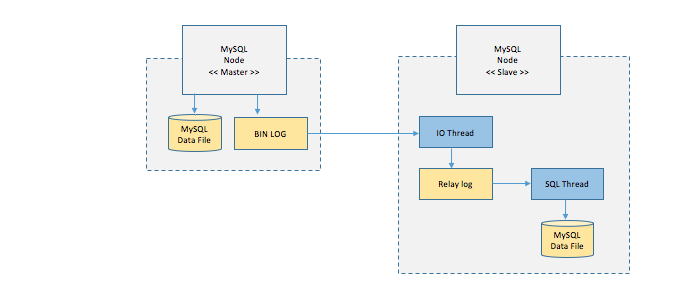

# 리플레케이션 Replication (복제)

## 리플리케이션 이란

- 여러 개의 DB를 권한에 따라 수직적인 구조( Master - Slave )로 구축하는 방법
- Master Node는 쓰기, Slave Node는 읽기 작업 만 진행 → 비동기 방식으로 노드간의 데이터를 동기화

## 처리 방식

1. Master 노드에 쓰기 트랜잭션이 수행
2. Master 노드는 데이터를 저장하고 트랜잭션에 대한 로그를 파일에 기록  ( BIN LOG )
3. Slave노드의 IO Thread 는 Master 노드의 로그 파일(BIN LOG)을 파일(Replay Log)에 복사
4. Slave 노드의 SQL Thread는 파일 (Replay Log)를 한 줄씩 읽으면서 데이터를 저장

### 로그 기반 복제

- Statement Based : SQL의 문장을 복사해서 사용 → 시간 관련 이슈 발생 가능
- Row Based : SQL에 따라 변경된 행 자체를 기록 → 변경된 행이 많으면 너무 커짐
- Mixed : 기본적으로 Statement Based 로 진행 하다가 필요에 따라 Row Based

### 장점

- 대부분의 DB의 요청은(60 ~ 80%) 는 읽기 작업이라 성능을 높이기 가능

### 단점

- 노드들 간의 데이터 동기화가 보장되지 않아 일관성 있는 데이터를 얻지 못할 수도 있음
- Master 노드가 다운되면 복구 및 대처가 까다로움