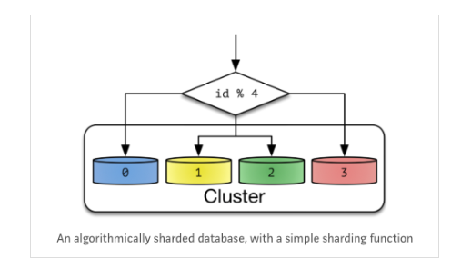
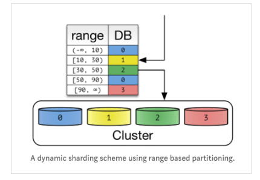

# 샤딩 Sharding

- 같은 테이블 스키마를 가진 데이터를 다수의 데이터베이스에 분산하여 저장하는 방법
- Application Level 에서도 가능하지만 Database Level 에서도 가능함
- 일종의 Horizontal Partitioning
  
   

<aside>
💡 샤딩을 적용하면 프로그래밍, 운영적인 복잡도 증가

안할 수 있으면 최대한 피하기??
- 하드웨어 스펙 높이기
- Cache 나 Replication 적용하기 (Read의 부하가 클 때)
- Vertically Partition 혹은 Hot Data, Cold Data로 분리하기 (Table의 일부 컬럼을 자주 사용할때)

</aside>

⇒ 분산이 잘되지 않고 한 쪽으로 몰리면 성능이 느려지기 때문에 균일하게 분산하는 것이 목적

 

## 방법

### Hash Sharding Modular Sharding

- Shard Key를 이용하여 데이터베이스 ID를 Hashing하여 결정
    - Hash의 크기는 Cluster 안에 있는 Node의 개수로 정함
- 매우 간단한 방법
- 단점
    - Node의 개수가 달라지면 Hash의 크기가 변해 기존에 분배된 룰에 어긋나서 ReSharding 이 필요하게 됨
    - Hash Key로 분산되기 때문에 공간에 대한 효율성을 고려하지 않음

 

### Dynamic Sharding Range Sharding

- Locator Service를 통해 Shard Key를 얻음
- 확장에 유연한 구조 → Node를 늘리면 그만큼 Locator Service에 Shard Key를 증가시킴
- 단점
    - Locator를 수정하게 되면 잘못된 Routing으로 데이터를 찾지 못함 →  Locator에 의존하게 됨