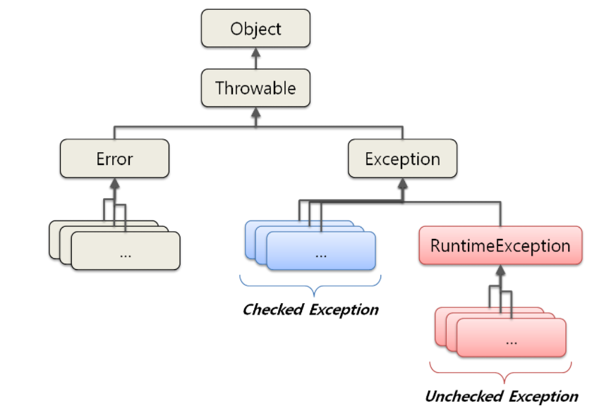

## 오류 Erorr

- 시스템에 비정상적인 상황이 생겼을 때 발생
- 시스템 레벨에서 발생한 오류 → 심각한 문제?

⇒ 개발자가 예측할 수 없기에 애플리케이션에서 오류에 대한 처리는 신경 X

## 예외 Exception

- 개발자가 구현한 로직에서 발생 ⇒ 미리 예측할 수 있어야 함

⇒ 개발자가 예외를 구분하고 그에 따른 명확한 처리 방법을 알고 있어야 함

- 모든 예외클래스는 Throwable 클래스를 상속받고 있음
- Erorr는 시스템 레벨의 심각한 수준의 에러 → 시스템에 변화를 줘서 문제를 처리
- Exception은 개발자가 로직을 추가하여 처리

|  | Checked Exception | Unchecked Exception |
| --- | --- | --- |
| 처리 여부 | 반드시 예외를 처리해야 함 | 명시적인 처리를 강제하지 않음 |
| 확인시점 | 컴파일 단계 | 실행단계 |
| 예외발생시 
트랜잭션 처리 | roll-back 하지 않음 | roll-back 함 |
| 대표 예외 | Exception의 상속받는 하위 클래스 중 Runtime Exception을 제외한 모든 예외

- IOException
- SQLException | Runtime Exception 하위 예외

- NullPointerException
- IllegalArgumentException
- IndexOutOfBoundException
- SystemException |

## 예외 복구

- 예외가 발생하여도 애플리케이션은 정상적인 흐름으로 진행된다는 것
- ex) 재시도를 통한 복구

## 예외 회피

- 예외가 발생하면 Throws를 통해 호출한쪽으로 예외를 던지고 그 처리를 회피하는 것
- 너무 막 던지지 말고 다시 받아서 처리하거나 확신할때만 사용

## 예외 전환

- 예외를 잡아서 다른 예외로 던지는 것
- 예외를 받은 곳에서 좀 더 정확한 에러를 알기 위해 사용