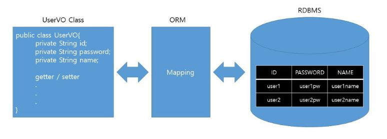
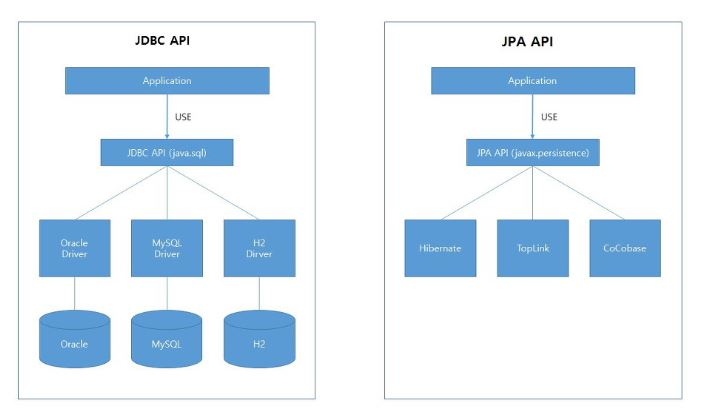
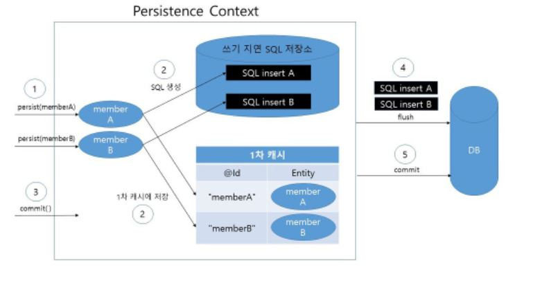
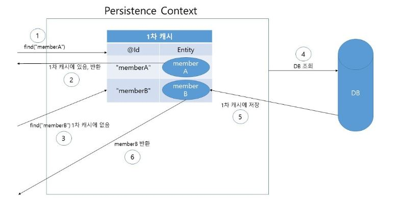
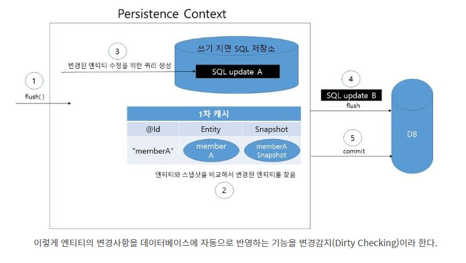

# JPA

## Java Persistence API

- RDBMS와 OPP 객체 사이의 불일치에서 오는 패러다임을 해결하기 위해 ORM을 개발
- ORM → RDBMS와 객체를 매핑하는 역할을 함

- ORM 기술을 구현하기 위해 사용된 프레임워크 Hibernate를 사용함

→ 이외에 프레임워크가 많이 등장함 (TopLink, CoCobase 등등??)

⇒ 이러한 ORM 기술을 구현한 프레임워크에 대한 표준화가 일어남 → JPA

### JDBC

- JDBC API는 어플리케이션과 DBMS 사이에서 인터페이스 역할을 함
    
      → 개발자는 사용할 DB의 드라이버를 변경
    

### ORM

- 개발자는 ORM을 사용할 때 JPA 인터페이스에 맞추어 구현되어있는 프레임워크 중 하나를 선택하여 사용 ( Hibernate 등등 )
- 만약 JPA 표준이 없다면 ORM 프레임워크를 변경해야할 때 매우 힘듬

- 개발자가 객체를 데이터베이스에 저장할때 SQL을 직접 작성할 필요 없음
- 객체를 받은 ORM 프레임워크는 저장된 자바 객체를 분석해 적절한 SQL을 생성하고 저장함

## 영속성 Persistence

1. **Entity Class**
    - 테이블과 매핑한다고 JPA에게 알려주는 클래스
    - 엔티티 클래스에서 만들어진 객체를 엔티티라고 함
    
2. **영속성 컨텍스트 Persistence Context**
    - 엔티티 클래스에서 만들어지는 **엔티티를 영구 저장하고 관리하는 환경**
        
        4가지 상태
        
        - 비영속 - 엔티티 객체가 만들어져서 아직 저장되지 않은 상태, 영속성 컨텍스트와 전혀 관계가 없는 상태
        - 영속 - 엔티티가 영속성 컨텍스트에 저장되어, 영속성 컨텍스트가 관리할 수 있는 상태
        - 준영속 - 엔티티가 영속성 컨텍스트에 저장되어 있다가 분리된 상태로, 영속성 컨텍스트가 더 이상 관리하지 않는 상태
        - 삭제 - 엔티티를 영속성 컨텍스와 DB 저장
        
        특징
        
        - 영속성 컨텍스트는 엔티티를 **식별자 값(ID)로 테이블의 기본키와 매핑한 필드값으로 구분함** → 영속 상태에서는 식별자 값이 있어야 함
        - 영속성 컨텍스트에 엔티티를 저장하면 바로 DB에 저장되는 것이 아닌 1차 캐시에 엔티티를 생성하고 **쓰기 지연 SQL 저장소**에 쿼리문을 생성해서 저장 → 쌓인 쿼리문은 flush()가 실행될 때 DB에 반영
     
     
    ### 엔티티 생성
    
    
    
    1. 자바 어플리케이션에서 엔티티가 만들어져 JPA에게 디비 저장을 부탁
    2. 만들어진 엔티티는 **1차적으로 영속성 컨텍스트에 저장** → 쿼리문을 생성시켜 쓰기 지연 SQL 저장소에 저장 → 엔티티와 쿼리문들을 영속성 컨텍스트에 저장
    3. 커밋 명령이 실행되면 자동으로 영속 컨텍스트에서 flush() 가 호출 됨
    4. 영속성 컨텍스트 변경 내용을 데이터베이스와 동기( flush ) 화 함 → SQL 저장소의 쿼리를 실행
    5. 디비에게 커밋 쿼리문을 명령
     
     
    ### 엔티티 조회
    
    
    
    1. JPA 데이터베이스 조회 부탁 → 1차적으로 영속성 컨텍스트에서 엔티티를 찾음
    2. 있으면 넘기고 없으면 쿼리문을 통해 찾아와서 영속성 컨텍스트에 엔티티를 저장하고 엔티티를 넘김
     
     

    ### 엔티티 변경
    
    
    
    스냅샷 : JPA는 엔티티를 영속성 컨텍스트에 보관할 때 최초의 상태를 복사해서 저장하는 것
    
    1. 커밋 명령이 들어오면 영속 컨텍스트에는 자동으로 flush() 가 호출
    2. 엔티티와 스냅샷을 비교해서 변경된 엔티티를 찾음
    3. 변경된 엔티티가 있으면 쿼리를 생성하고 컨텍스트의 변경내용을 데이터베이스와 동기( flush )화 함 → SQL 쿼리 저장소의 쿼리를 실행
    4. 디비에게 커밋 쿼리문을 명령함
     
     
    ### 엔티티 삭제
    
    1. 엔티티 삭제명령이 들어오면 엔티티를 찾아 쓰기 지연 SQL 저장소에 delete 쿼리를 생성
    
    1. 커밋 명령이 들어오면 자동으로 flush() 가 호출 → 동기화 → 디비에 커밋 쿼리문 실행
 
 
## JPA 메소드

### flush

영속성 컨텍스트의 변경 내용을 데이터베이스에 반영

### detach

- 특정 엔티티를 준영속 상태로 만듬
- 더 이상의 관리를 받지 않음, 영속 컨텍스트가 지원하는 어떤 기능도 작동 X

### clear

영속성 컨텍스트를 초기화 ⇒ 모든 엔티티를 준영속 상태로 만듬

### close

영속성 컨텍스트를 종료 ⇒ 모든 엔티티를 준영속 상태로 만듬

### merge

**준영속 상태의 엔티티를 이용해** 새로운 영속 상태의 엔티티를 반환 (엔티티 변경)

💡 새로운 영속 상태의 엔티티를 만듬 → 준영속 상태의 엔티티 값을 영속 상태의 엔티티에 채워 넣어서 반환

### find

식별자 값을 가지고 엔티티를 찾아 반환 (엔티티 조회)

### persist

자바 어플리케이션에서 생성된 엔티티를 영속성 컨텍스트와 DB에 저장(엔티티 생성)

### remove

식별자 값을 가지고 엔티티를 찾아서 삭제(엔티티 삭제)

 
 
 
 
 
 
 
노션 링크 : https://scientific-whip-bb9.notion.site/JPA-3647fc2b69e44c4089b7b53a3dbca574