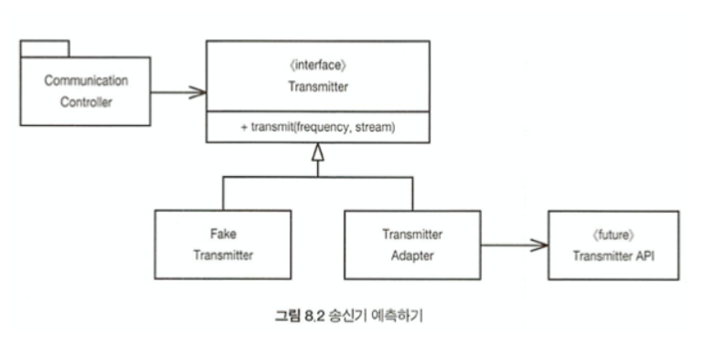

시스템에 들어가는 모든 소프트웨어를 직접 개발하는 경우는 드물다. 때로는 패키지를 사고, 때로는 오픈 소스를 이용한다. 때로는 사내 다른 팀이 제공하는 컴포넌트를 사용한다. 어떤 식으로든 이 외부 코드를 우리 코드에 깔끔하게 통합해야만 한다. 이 장에서는 소프트웨어 경계를 깔끔하게 처리하는 기법과 기교를 살펴본다. 

### 외부 코드 사용하기
인터페이스 제공자와 사용자 사이에는 특유의 긴장이 존재한다.
- 패키지 제공자나 프레임워크 제공자는 적용성을 최대한 넓히려 애쓴다. 더 많은 환경에서 돌아가야 더 많은 고객이 구매하니까
- 사용자는 자신의 요구에 집중하는 인터페이스를 바란다.


ex) java.util.Map
- Map은 굉장히 다양한 인터페이스로 수많은 기능을 제공한다.
- 예를 들어, 프로그램에서 Map을 만들어 여기저기 넘긴다고 가정하자. 넘기는 쪽에서는 아무도 Map내용을 삭제하지 않으리라 믿을지도 모르겠다. 그런데 clear() 메소드를 통해서 Map사용자라면 누구나 Map내용을 지울 권한이 있다.
- 또 다른 예로, 설계 시 Map에 특정 객체 유형만 저장하기로 결정했다고 가정하자. 그렇지만 Map은 객체 유형을 제한하지 않는다. 마음만 먹으면 사용자는 어떤 객체 유형도 추가할 수 있다.


```java
Map sonsors = new HashMap();
Sensors s = (Sensor)sensors.get(sonsorId);
```
Map이 반환하는 Object를 올바른 유형으로 변환할 책임은 Map을 사용하는 클라이언트에 있다. 


```java
Map<String, Sensor> sensors = new HashMap<Sensor>();
...
Sensor s = sensors.get(sensorId);
```
제네릭스를 사용한다면 코드 가독성이 크게 높아진다.
하지만 프로그램에서 Map<String, Sensor> 인스턴스를 여기저기로 넘긴다면, Map인터페이스가 변할 경우, 수정할 코드가 상당히 많아진다. (자바5가 제네릭스를 지원하면서 Map 인터페이스가 변했다는 사실을 명심)


```java
public class Sensors {
	private Map sensors = new HashMap();

	public Sensor getById(String id) {
		return (Sensor) sensors.get(id);
	}

	//이하 생략
}
```
경계 인터페이스인 Map을 Sensors 안으로 숨긴다. 따라서 Map 인터페이스가 변하더라도 나머지 프로그램에는 영향을 미치지 않는다. Sensors 클래스 안에서 객체 유형을 관리하고 변환하기 때문이다.
<br>


### 경계 살피고 익히기
외부 코드를 사용하면 적은 시간에 더 많은 기능을 출시하기 쉬워진다. 만약 외부에서 가져온 패키지를 사용하고 싶다면 어디서 어떻게 시작해야 좋을까? 외부 패키지 테스트가 우리 책임은 아니다. 하지만 우리 자신을 위해 우리가 사용할 코드를 테스트하는 편이 바람직하다.
- 우리쪽 코드를 작성해 외부 코드를 호줄하는 대신 먼저 간단한 테스트 케이스를 작성해 외부 코드를 익히는 것을 ***학습 테스트*** 라 부른다.
<br>


### log4j 익히기
로깅 기능을 직접 구현하는 대신 아파치의 log4j 패키지를 사용하려 한다고 가정하자. 패키지를 내려 받아 소개 페이지를 연다. 문서를 자세히 읽기 전에 첫 번째 테스트 케이스를 작성한다. 화면에 "hello"를 출력하는 테스트 케이스다.

```java
@Test
public void testLogCreate() {
	Logger logger = logger.getLogger("MyLogger");
	logger.info("hello");
}
```
테스트 케이스를 돌렸더니 Appender라는 뭔가가 필요하다는 오류가 발생한다.
문서를 조금 더 읽어보니 ConsoleAppender라는 클래스가 있다. 그래서 ConsoleAppender를 생성한 후 테스트 케이스를 다시 돌린다.


```java
@Test
public void testLogAddAppender() {
	Logger logger = logger.getLogger("MyLogger");
	ConsoleAppender appender = new ConsoleAppender();
	logger.addAppender(appender);
	logger.info("hello");
}
```
이번에는 Appender에 출력 스트림이 없다는 사실을 발견한다. 구글링 다시 시도한다.


```java
@Test
public void testLogAddAppender() {
	Logger logger = Logger.getLogger("MyLogger");
	logger.removeAllAppenders();
	logger.addAppender(new ConsoleAppender(
		new PatternLayout("%p %t %m%n"),
		ConsoleAppender.SYSTEM_OUT));
	logger.info("hello");
}
```
이제서야 제대로 돌아간다. ConsoleAppender.SYSTEM_OUT 인수를 제거했더니 문제가 없다. 여전히 "hello"가 찍힌다. 하지만 PatternLayout을 제거했더니 또 다시 출력 스트림이 없다는 오류가 뜬다. 문서를 자세히 읽어보니  ConsoleAppender 생성자는 '설정되지 않은' 상태란다. 당연하지도 유용하지도 않다. log4j 버그이거나 적어도 일관성 부족으로 여겨진다.


### 학습 테스트는 공짜 이상이다.
- 학습 테스트에 드는 비용은 없다. 어쨌든 API를 배워야 하므로 오히려 필요한 지식만 확보하는 손쉬운 방법이다. 학습 테스트는 이해도를 높여주는 정확한 실험이다.
- 학습 테스트는 공짜 이상이다. 투자하는 노력보다 얻는 성과가 더 크다. 패키지가 새 버전이 나온다면 학습 테스트를 돌려 차이가 있는지 확인한다.
- 학습 테스트는 패키지가 예상대로 도는지 검증한다. 일단 통합한 이후라고 하더라도 패키지가 우리 코드와 호환되리라는 보장은 없다. 패키지 작성자는 버그를 수정하고 기능도 추가한다. 새 버전이 우리 코드와 호환되지 않으면 학습 테스트가 이 사실을 곧바로 밝혀낸다.
- 경계 테스트가 있다면 패키지의 새 버전으로 이전하기 쉬워진다.


### 아직 존재하지 않는 코드를 사용하기
경계와 관련해 또 다른 유형은 아는 코드와 모르는 코드를 분리하는 경계다. 때로는 우리 지식이 경계를 너머 미치지 못하는 코드 영역도 있다.


몇 년 전 나는 무선통신 시스템에 들어갈 소프트웨어 개발에 참여했다. 우리 소프트웨어에는 송신기라는 하위 시스템이 있었는데, 우리는 여기에 대한 지식이 거의 없었다.
1. 송신기 시스템을 책임진 사람들은 인터페이스도 정의하지 못한 상태
2. 프로젝트 지연을 원하지 않았기에 송신기 하위 시스템과 아주 먼 부분부터 작업
3. 우리 세상과 저쪽 세상이 만나는 경계가 어디쯤인지는 대략 감이 있음
4. 점차 우리에게 필요한 경계 인터페이스가 무엇인지 알게 됨 -> 지정한 주파수를 이용해 이 스트림에서 들어오는 자료를 아날로그 신호로 전송하라.
5. 저쪽 팀이 아직 API를 설계하지 않았으므로 구체적인 구현은 나중으로 미룸
6. 이쪽 코드를 진행하기 위해 자체적으로 인터페이스 정의 -> 인터페이스를 전적으로 통제한다는 장점, 코드의 가독성과 의도가 분명해짐
7. 송신기 API가 정의되면 Adapter클래스를 통해 간극을 메움



### 깨끗한 경계
경계에 위치하는 코드는 깔끔히 분리한다. 또한 기대치를 정의하는 테스트 케이스도 작성한다. 이쪽 코드에서 외부 패키지를 세세하게 알아야 할 필요가 없다.


**통제가 불가능한 외부 패키지에 의존하는 대신 통제가 가능한 우리 코드에 의존하는 편이 훨씬 좋다**


외부 패키지를 호출하는 코드를 줄여 경계를 관리하는 법
1. Map에서 봤듯이 새로운 클래스로 경계를 감싼다.
2. ADAPTER 패턴 사용

코드의 가독성이 높아지며, 경계 인터페이스를 사용하는 일관성도 높아지며, 외부 패키지가 변했을 때 변경할 코드도 줄어든다. 
