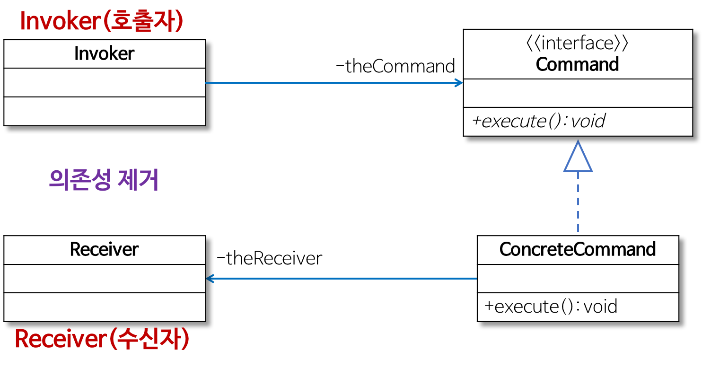
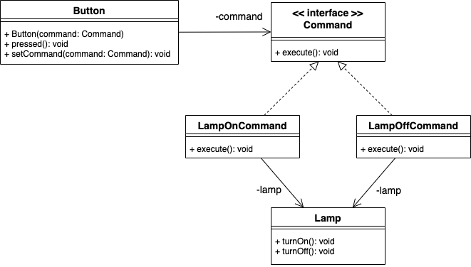

# 커맨드 패턴(Command Pattern)

## 커맨드 패턴이란?

Client가 보낸 **요청**을 객체로 캡슐화하여 이를 나중에 이용할 수 있도록 필요한 정보를 저장, 로깅, 취소할 수 있게 하는 패턴이다.

즉, **요청을 객체로 감싸서 관리**하는 패턴이다.



커맨드 패턴 클래스 다이어그램

출처 : [https://gmlwjd9405.github.io/2018/07/07/command-pattern.html](https://gmlwjd9405.github.io/2018/07/07/command-pattern.html)

- Receiver
    - 행동을 담당하는 객체 - 기능 수행
- Command
    - 수신자의 정보 + 행동이 들어있는 객체
- ConcreteCommand
    - 실제로 실행되는 기능을 구현
- Invoker
    - 커맨드를 저장하는 객체 → 버튼이 어떤 수행을 할 것인지 결정
- Client
    - 커맨드 객체를 생성
    - 발동자를 통해 수신자에게 할 행동 결정

## 예제 - 램프 불 키고 끄기



램프 프로그램 클래스 다이어그램

출처 : [https://leveloper.tistory.com/156](https://leveloper.tistory.com/156)

- Command
    - Command
    
    ```java
    public interface Command {
    	void execute();
    }
    ```
    

- Invoker
    - Button
    
    ```java
    public class Button {
    	private Command command;
    
    	public Button(Command command) {
    		setCommand(command);
    	}
    
    	public void setCommand(Command command) {
    		this.command = command;
    	}
    
    	public void pressed() {
    		command.execute();
    	}
    }
    ```
    

- Receiver
    - Lamp
    
    ```java
    public class Lamp {
    	public void turnOn() {
    		System.out.println("Lamp On");
    	}
    
    	public void turnOff() {
    		System.out.println("Lamp Off");
    	}
    }
    ```
    

- ConcreteCommand
    - LampOnCommand
    
    ```java
    public class LampOnCommand implements Command {
    	private Lamp lamp;
    
    	public LampOnCommand(Lamp lamp) {
    		this.lamp = lamp;
    	}
    
    	@Override
    	public void execute() {
    		lamp.turnOn();
    	}
    }
    ```
    
    - LampOffCommand
    
    ```java
    public class LampOffCommand implements Command {
    	private Lamp lamp;
    
    	public LampOffCommand(Lamp lamp) {
    		this.lamp = lamp;
    	}
    
    	@Override
    	public void execute() {
    		lamp.turnOff();
    	}
    }
    ```
    

- Client
    - main
    
    ```java
    public class Client {
    	public static void main(String[] args) {
    		Lamp lamp = new Lamp();
    
    		Command lampOnCommand = new LampOnCommand(lamp);
    		Command lampOffCommand = new LampOffCommand(lamp);
    
    		Button button = new Button(LampOnCommand);
    		button.pressed();
    
    		button.setCommand(lampOffCommand);
    		button.pressed();
    	}
    }
    ```
    
    - result
    
    ```
    Lamp On
    Lamp Off
    ```
    

## 커맨드 패턴 장단점

- 장점
    - 기존 code 수정 없이 새 명령 추가 가능
    - 명령의 호출자와 수신자의 의존성 제거
    
- 단점
    - 명령에 대한 클래스 증가(무지막지하게..)

## 결론

- 실행될 기능을 캡슐화
- 실행을 요구하는 호출자 클래스와 실제 기능을 실행하는 수신자 클래스 사이 의존성 제거
- 실행될 기능 변경에도 호출자 클래스 수정 없이 그대로 사용 가능
- 기능 추가 시 ConcreteCommand 클래스를 추가하면 되므로 OCP에 위반되지 않고 기능 추가 가능

## 참고

- [https://gmlwjd9405.github.io/2018/07/07/command-pattern.html](https://gmlwjd9405.github.io/2018/07/07/command-pattern.html)
- [https://huisam.tistory.com/entry/CommandPattern](https://huisam.tistory.com/entry/CommandPattern)
- [https://victorydntmd.tistory.com/295](https://victorydntmd.tistory.com/295)
- [https://leveloper.tistory.com/156](https://leveloper.tistory.com/156)