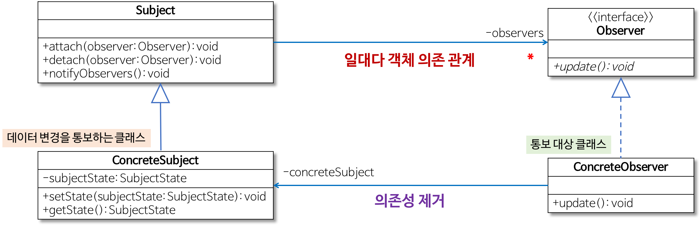
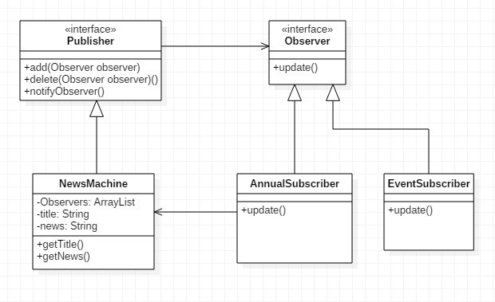

# 옵저버 패턴(Observer Pattern)

## 옵저버 패턴이란?

어떤 객체의 상태가 변할 때 그와 연관된 객체들에게 알림을 보내는 패턴이다.

상대 **클래스나 객체에 의존하지 않으면서 데이터 변경을 통보**하고자 할 때 유용하다.



옵저버 패턴 클래스 다이어그램

출처 : [https://gmlwjd9405.github.io/2018/07/08/observer-pattern.html](https://gmlwjd9405.github.io/2018/07/08/observer-pattern.html)

- Observer
    - 데이터의 변경을 통보 받는 인터페이스
    - 즉, Subject에서 Observer 인터페이스의 update 메서드를 호출함으로써 ConcreteSubject의 데이터 변경을 ConcreteObserver에게 통보
- Subject
    - ConcreteObserver 객체를 관리하는 요소
    - Observer 인터페이스를 참조해서 ConcreteObserver를 관리하므로 ConcreteObserver의 변화에 독립적
- ConcreteSubject
    - 변경 관리 대상이 되는 데이터가 있는 클래스
    - setState 메서드에서는 자신의 데이터인 subjectState를 변경하고 Subject의 notifyObservers 메서드를 호출해서 ConcreteObserver 객체에 변경을 통보
- ConcreteObserver
    - ConcreteSubject의 변경을 통보받는 클래스
    - Observer 인터페이스의 update 메서드를 구현함으로써 변경을 통보 받음

## 예제 - 뉴스

예제와는 다르지만 좀 더 자세한 내용을 얻고 싶으면

[https://velog.io/@hanna2100/디자인패턴-2.-옵저버-패턴-개념과-예제-observer-pattern](https://velog.io/@hanna2100/%EB%94%94%EC%9E%90%EC%9D%B8%ED%8C%A8%ED%84%B4-2.-%EC%98%B5%EC%A0%80%EB%B2%84-%ED%8C%A8%ED%84%B4-%EA%B0%9C%EB%85%90%EA%B3%BC-%EC%98%88%EC%A0%9C-observer-pattern)



뉴스 구독 클래스 다이어그램

출처 : [https://flowarc.tistory.com/entry/디자인-패턴-옵저버-패턴Observer-Pattern](https://flowarc.tistory.com/entry/%EB%94%94%EC%9E%90%EC%9D%B8-%ED%8C%A8%ED%84%B4-%EC%98%B5%EC%A0%80%EB%B2%84-%ED%8C%A8%ED%84%B4Observer-Pattern)

- Observer
    - Observer
    
    ```java
    public interface Observer {
    	void update(String title, String news);
    }
    ```
    

- Subject
    - Publisher
    
    ```java
    public interface Publisher {
    	void add(Observer observer);
    	void delete(Observer observer);
    	void notifyObserver();
    }
    ```
    

- ConcreteSubject
    - NewsMachine
    
    ```java
    public class NewsMachine implements Publisher {
    	private ArrayList<Observer> observers;
    	private String title;
    	private String news;
    
    	public NewsMachine() {
    		observers = new ArrayList<>();
    	}
    
    	@Override
    	public void add(Observer observer) {
    		observers.add(observer);
    	}
    
    	@Override
    	public void delete(Observer observer) {
    		int index = observers.indexOf(observer);
    		observers.remove(index);
    	}
    
    	@Override
    	public void notifyObserver() {
    		for(Observer observer : observers) {
    			observer.update(title, news);
    		}
    	}
    
    	public void setNewsInfo(String title, String news) {
    		this.title = title;
    		this.news = news;
    		notifyObserver();
    	}
    
    	public String getTitle() {
    		return title;
    	}
    
    	public String getNews() {
    		return news;
    	}
    ```
    
- ConcreteObserver
    - AnnualSubscriber
    
    ```java
    public class AnnualSubscriber implements Observer {
    	private String newsString;
    	private Publisher publisher;
    
    	public AnnualSubscriber(Publisher publisher) {
    		this.publisher = publisher;
    		publisher.add(this);
    	}
    
    	@public void update(String title, String news) {
    		this.newsString = title + "\n-------\n " + news;
    		display();
    	}
    
    	private void display() {
    		System.out.println("\n\n오늘의 뉴스\n================\n\n" + newsString);
    	}
    }
    ```
    
    - EventSubscriber
    
    ```java
    public class EventSubscriber implements Observer {
    	private String newsString;
    	private Publisher publisher;
    
    	public EventSubscriber(Publisher publisher) {
    		this.publisher = publisher;
    		publisher.add(this);
    	}
    
    	@public void update(String title, String news) {
    		this.newsString = title + "\n-------\n " + news;
    		display();
    	}
    
    	private void display() {
    		System.out.println("\n\n이벤트 유저\n================\n\n" + newsString);
    	}
    }
    ```
    

- Client
    - main
    
    ```java
    public class Client {
    	public static void main(String[] args) {
    		NewsMachine newsMachine = new NewsMachine();
    		AnnualSubscriber as = new AnnualSubscriber(newsMachine);
    		EventSubscriber es = new EventSubscriber(newsMachine);
    
    		newsMachine.setNewsInfo("오늘 한파", "전국 영하 18도 입니다.");
    	}
    }
    ```
    
    - result
    
    ```java
    오늘의 뉴스
    ===========
    오늘 한파
    ----------
    전국 영하 18도 입니다.
    
    이벤트 유저
    ===========
    오늘 한파
    ----------
    전국 영하 18도 입니다.
    
    ```
    

## 옵저버 패턴 장단점

- 장점
    - 실시간으로 한 객체의 변경사항을 다른 객체에 전파 가능
    - 느슨한 결합으로 유연한 시스템, 객체 간 의존성 제거

- 단점
    - 사용량이 많으면 상태 관리 힘듦
    - 데이터 배분에 문제가 생길 시 큰 문제로 이어질 가능성이 있음

## 결론

- 한 객체의 상태가 바뀌면 **그 객체에 의존하는 다른 객체들에게 연락이 가고 자동으로 정보가 갱신** 되는 1:N 의 관계를 정의
- 인터페이스를 이용하여 느슨한 결합성을 유지
- 옵저버 패턴은 푸시 방식과 풀 방식으로 언제든지 구현 가능
- Java에서 기본적으로 Observable 클래스와 Observer 인터페이스를 제공
- Swing, Android 등 UI관련 된 곳에서 옵저버 패턴을 주로 사용

## 참조

- [https://gmlwjd9405.github.io/2018/07/08/observer-pattern.html](https://gmlwjd9405.github.io/2018/07/08/observer-pattern.html)
- [https://pjh3749.tistory.com/266](https://pjh3749.tistory.com/266)
- [https://velog.io/@hanna2100/디자인패턴-2.-옵저버-패턴-개념과-예제-observer-pattern](https://velog.io/@hanna2100/%EB%94%94%EC%9E%90%EC%9D%B8%ED%8C%A8%ED%84%B4-2.-%EC%98%B5%EC%A0%80%EB%B2%84-%ED%8C%A8%ED%84%B4-%EA%B0%9C%EB%85%90%EA%B3%BC-%EC%98%88%EC%A0%9C-observer-pattern)
- [https://coding-factory.tistory.com/710](https://coding-factory.tistory.com/710)
- [https://flowarc.tistory.com/entry/디자인-패턴-옵저버-패턴Observer-Pattern](https://flowarc.tistory.com/entry/%EB%94%94%EC%9E%90%EC%9D%B8-%ED%8C%A8%ED%84%B4-%EC%98%B5%EC%A0%80%EB%B2%84-%ED%8C%A8%ED%84%B4Observer-Pattern)