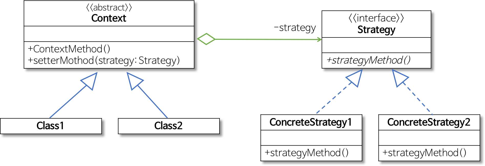
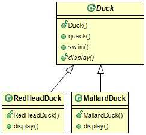
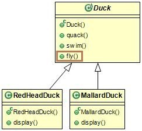
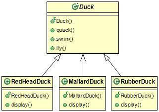
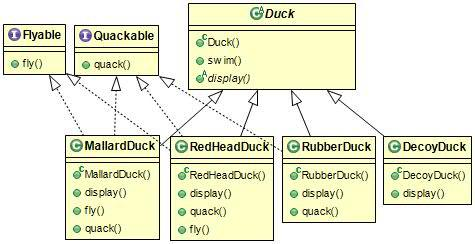
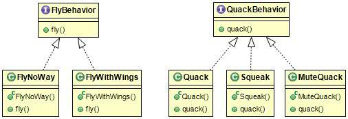
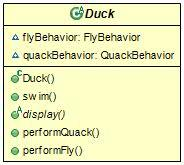
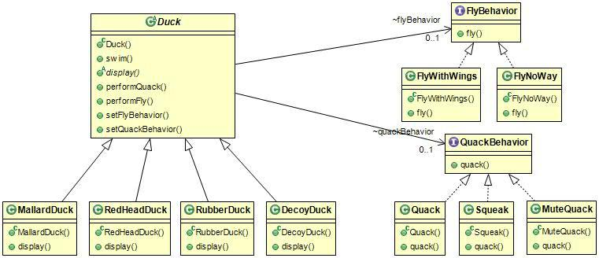

# 스트래티지 패턴(Strategy Pattern)

## 스트래티지 패턴이란?

행위를 클래스로 캡슐화 하여 동적으로 행위를 자유롭게 바꿀 수 있게 해주는 패턴이다.

전략(일의 수행 방식, 비즈니스 규칙, 문제 해결 알고리즘 등)을 쉽게 바꿀 수 있도록 해주는 디자인 패턴이다.

특히 게임 프로그래밍 중 게임 캐릭터가 처한 상황에 따라 공격이나 행동의 방식을 바꾸고 싶을 때 매우 유용하다.(카트라이더 부스터 중 고개 젖힘, 등)



스트래티지 패턴 클래스 다이어그램

출처 : [https://gmlwjd9405.github.io/2018/07/06/strategy-pattern.html](https://gmlwjd9405.github.io/2018/07/06/strategy-pattern.html)

- Strategy
    - 인터페이스나 추상 클래스로 외부에서 동일한 방식으로 알고리즘을 호출하는 방법 명시
- ConcreteStrategy
    - 스트래티지 패턴에서 명시한 알고리즘을 실제로 구현한 클래스
- Context
    - 스트래티지 패턴을 이용하는 역할 수행

## 예제 - 오리들

출처 : [https://jusungpark.tistory.com/7](https://jusungpark.tistory.com/7)



오리게임을 만든다고 가정하였을 때 Duck이라는 수퍼 클래스를 확장하여 다른 종류들의 오리를 만든다.

### 문제의 시작 1



날 수 있는 기능이 필요하여 `fly()`라는 기능을 추가하였다.



하지만 RubberDuck이라는 가짜 오리가 추가 된다면 맞지 않게 상속되는 메서드들을 오버라이드 해서 구현해야 하는 문제가 생긴다.

### 문제의 시작 2



이처럼 새로운 오리가 계속해서 업데이트 된다면, 매번 모든 오리 서브 클래스의 `fly()`와 `quack()` 같은 메서드를 일일이 살펴보아야 하고 오버라이드로 해결해야 한다. (코드 중복이 매우 매우 심하다.)

### 해결책



오리마다 달라지는 부분인 `fly()`와 `quack()`을 분리 시켜 각 행동을 나타낼 새로운 클래스의 집합을 만들어 준다.

행동에 관한 인터페이스가 생기고 구체적인 행동을 구현하는 클래스들이 생성된다.



Duck 클래스에는 두 개의 인터페이스 형식의 인스턴스 변수가 추가된다.

- Context
    - Duck
    
    ```java
    public abstract class Duck {
    	FlyBehavior flyBehavior;
    	QuackBehavior quackBehavior;
    
    	public void swim(){
    		System.out.println("물에 떠있습니다.");
    	}
    
    	public abstract void display();
    
    	public void performQuack(){
    		quackBehavior.quack();
    	}
    
    	public void performFly(){
    		flyBehavior.fly();
    	}
    
      public void setFlyBehavior(FlyBehavior flyBehavior) {
    		this.flyBehavior = flyBehavior;
    	}
    
    	public void setQuackBehavior(QuackBehavior quackBehavior) {
    		this.quackBehavior = quackBehavior;
    	}
     }
    
    ```
    

- Strategy & ConcreteStrategy
    - FlyBehavior & Fly 관련 클래스
    
    ```java
    public interface FlyBehavior {	
      public void fly();
    }
    
    public class FlyWithWings implements FlyBehavior{
      @Override
    	public void fly() {
    	  System.out.println("난다!");
      }
    }
    
    public class FlyNoWay implements FlyBehavior{
    	@Override
    	public void fly(){
    		System.out.println("날지 못해요.");
    	}
    }
    ```
    
    - QuackBehavior & Quack 관련 클래스
    
    ```java
    public interface QuackBehavior {	
    	public void quack();
    }
    
     
    
    public class Quack implements QuackBehavior {
    	@Override
    	public void quack() {
    		System.out.println("꽥꽥.");
    	}
    }
    
    public class Squack implements QuackBehavior {
    	@Override
    	public void quack(){
    		System.out.println("삑삑.");
    	}
    }
    
    public class MuteQuack implements QuackBehavior {
    @Override
    	public void quack(){
    		System.out.prinln("조용.");
    	}
    }
    ```
    

- Class
    - MallardDuck
    
    ```java
    public class MallardDuck extends Duck {
    
    	public MallardDuck(){
    		flyBehavior = new FlyWithWings();
    		quackBehavior = new Quack();
    	}
    
    	@Override
    	public void display(){
    		System.out.println("청둥오리 입니다.");
    	}
    } 
    ```
    

- Client
    - main
    
    ```java
    public class MiniDuckSimulator{
    
    	public static void main(String[] args){
    		Duck mallard = new MallardDuck();
    		mallard.performQuack();
    		mallard.performFly();
    
    		mallard.setFlyBehavior(new FlyNoWay());
    		mallard.performFly();
    	}
    }
    ```
    
    - result
    
    ```
    꽥꽥.
    난다!
    날지 못해요 ㅜ
    ```
    



구현한 최종 클래스 다이어그램이다.

## 스트래티지 패턴 장단점

- 장점
    - 클래스를 상속하고 메서드를 오버라이딩 하는 대신 단순한 인터페이스 구현
    - Strategy 객체는 Context 클래스를 필요로 하지 않기에 알고리즘 특정 데이터에 집중할 수 있음
    - 새로운 Strategy 추가 용이

- 단점
    - 통신 오버헤드가 클 수 있음
    - 오버헤드가 너무 클 경우 Strategy 객체에 전달된 인자 일부가 사용되지 않을 가능성이 있음

## 결론

- 알고리즘군을 정의하고, 각각을 캡슐화하여 사용
- 클라이언트와 스트래티지 사이에 독립적으로 알고리즘을 변경할 수 있음
- 코드의 복잡함 없이 각 클래스에서 필요한 메서드만 호출
- 행동에 관한 클래스에는 그에 맞는 행동만 정의하고 구현하면 됨

## 출처

- [https://kscory.com/dev/design-pattern/strategy](https://kscory.com/dev/design-pattern/strategy)
- [https://gmlwjd9405.github.io/2018/07/06/strategy-pattern.html](https://gmlwjd9405.github.io/2018/07/06/strategy-pattern.html)
- [https://velog.io/@hanna2100/디자인패턴-1.-스트래티지-패턴-strategy-pattern](https://velog.io/@hanna2100/%EB%94%94%EC%9E%90%EC%9D%B8%ED%8C%A8%ED%84%B4-1.-%EC%8A%A4%ED%8A%B8%EB%9E%98%ED%8B%B0%EC%A7%80-%ED%8C%A8%ED%84%B4-strategy-pattern)
- [https://memostack.tistory.com/58](https://memostack.tistory.com/58)
- [https://jusungpark.tistory.com/7](https://jusungpark.tistory.com/7)
- [https://www.crocus.co.kr/1526](https://www.crocus.co.kr/1526)