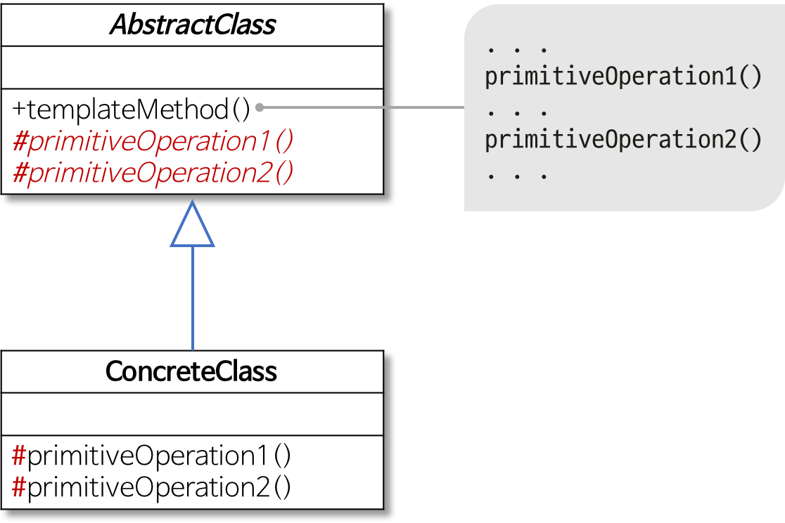
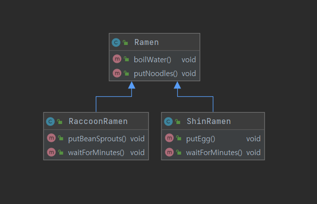
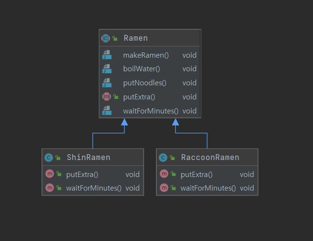

# 템플릿 메서드 패턴(Template Method Pattern)

## 템플릿 메서드 패턴이란?

어떤 작업을 처리하는 **일부분을 서브 클래스로 캡슐화**하여 전체 구조는 바꾸지 않고 **코드 중복을 최소화** 할 때 유용하다.

두 개 이상의 프로그램이 기본적으로 동일한 골격 하에서 동작할 때 기본 골격에 해당하는 알고리즘은 **일괄적으로 관리하면서 각 프로그램마다 달라지는 부분들에 대해서는 따로 만들고 싶을 때** 템플릿 메서드 패턴을 사용하면 좋습니다.



템플릿 메서드 클래스 다이어그램

출처 : [https://gmlwjd9405.github.io/2018/07/13/template-method-pattern.html](https://gmlwjd9405.github.io/2018/07/13/template-method-pattern.html)

- AbstractClass
    - 템플릿 메서드를 정의하는 클래스
    - 하위 클래스의 공통 알고리즘을 정의
- ConcreteClass
    - 물려받은 메서드를 구현하는 클래스

## 예제 - 라면 끓이기



라면 끓이기 클래스 다이어그램

출처 : [https://steady-coding.tistory.com/384](https://steady-coding.tistory.com/384)

신라면은 계란을 넣고 4분 기다리며, 너구리라면은 콩나물을 넣고 5분을 기다린다고 한다.

Ramen이라는 클래스를 정의하여 중복되는 물 넣기, 면 넣기에 대한 코드는 제거할 수 있다.

- AbstractClass
    - Ramen
    
    ```java
    public abstract class Ramen {
    
        public void makeRamen() {
            boilWater();
            putNoodles();
            putExtra();
            waitForMinutes();
        }
    
        public void boilWater() {
            System.out.println("물을 끓인다.");
        }
    
        public void putNoodles() {
            System.out.println("면을 넣는다.");
        }
    
        public abstract void putExtra();
    
        public abstract void waitForMinutes();
    }
    ```
    
- ConcreteClass
    - ShinRamen
    
    ```java
    public class ShinRamen extends Ramen {
    
        @Override
        public void putExtra() {
            System.out.println("계란을 넣는다.");
        }
    
        @Override
        public void waitForMinutes() {
            System.out.println("4분 기다린다.");
        }
    }
    ```
    
    - RaccoonRamen
    
    ```java
    public class RaccoonRamen extends Ramen {
    
        @Override
        public void putExtra() {
            System.out.println("콩나물을 넣는다.");
        }
    
        @Override
        public void waitForMinutes() {
            System.out.println("5분 기다린다.");
        }
    }
    ```
    
    
    
    결과적으로 이러한 구조를 나타낼 수 있다.
    

## 템플릿 메서드 패턴 장단점

- 장점
    - 중복 코드 제거
    - 자식 클래스의 역할 감소 → 핵심 로직의 관리 용이
    - 코드를 좀 더 객체 지향적으로 구성 가능

- 단점
    - 추상 메서드가 많아지면서 클래스 관리 복잡
    - 클래스간 관계와 코드가 꼬여버릴 수 있음

## 결론

- 알고리즘의 뼈대를 맞추는 것을 목표
- 전체적인 레이아웃을 통일 하지만 상속 받은 클래스는 훅 메서드를 이용하여 확장할 수 있는 유연성을 가짐
- 객체 관리, 유지보수 용이
- 재사용성 증가
- 구조를 보호하면서 부분적인 수정 가능

## 참조

- [https://gmlwjd9405.github.io/2018/07/13/template-method-pattern.html](https://gmlwjd9405.github.io/2018/07/13/template-method-pattern.html)
- [https://coding-factory.tistory.com/712](https://coding-factory.tistory.com/712)
- [https://steady-coding.tistory.com/384](https://steady-coding.tistory.com/384)
- [https://www.crocus.co.kr/1531](https://www.crocus.co.kr/1531)
- [https://western-sky.tistory.com/40](https://western-sky.tistory.com/40)