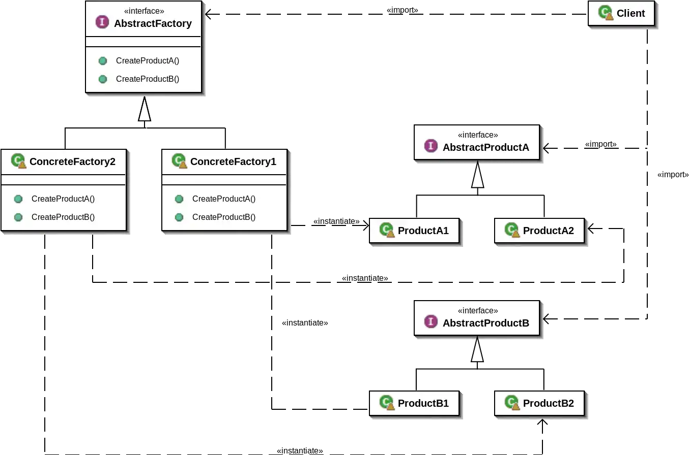
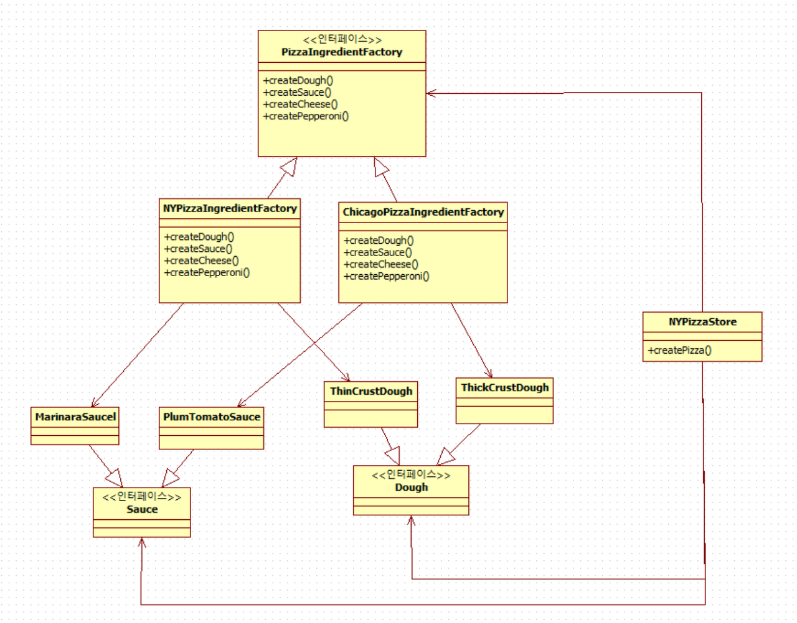

# 추상 팩토리 패턴(Abstract Factory Pattern)

## 추상 팩토리 패턴이란?

구체적인 클래스에 의존하지 않고 서로 연관되거나 의존적인 객체들의 조합을 만드는 인터페이스를 제공하는 패턴이다.


추상 팩토리 패턴 구조

출처 : https://im-yeobi.io/posts/design-pattern/factory-pattern-2/

추상 팩토리 패턴은 다양한 구성 요소 별로 `객체의 집합(군)`을 만들기 위한 디자인 패턴이다. 추상 팩토리를 사용하는 클라이언트에서는 추상 인터페이스를 통해 일련의 객체의 군을 공급받을 수 있다. 이때, 클라이언트에서는 실제로 어떤 객체가 생성되었는지 알 필요가 없다. 따라서 클라이언트와 팩토리에서 생성되는 객체를 `분리`시킬 수 있다.

위 다이어그램에서 보면 AbstractFactory 추상 팩토리를 상속 받은 ConcreteFactory1, ConcreteFactory2 두 개의 구상 클래스가 있다. 각각의 구상 클래스는 서로 다른 `객체의 집합`을 의미한다. 즉, ConcreteFactory1 형식에 맞는 제품 군, ConcreteFactory2 형식에 맞는 제품 군을 이루고 있는 것이다.

## 추상 팩토리 적용 예제

지난 번 팩토리 메서드 패턴에서 예시를 들었던 뉴욕 가게와 시카고 가게에서 Pizza(객체)를 만들 때 사용되는 재료들은 중복이 된다. 세부 디테일이 다를 수 있지만 두 가게 모두 도우, 소스, 토핑, 치즈가 필요하다. 이러한 부분을 묶어서 팩토리화 하는 것이 추상 팩토리 패턴이다.

즉, 팩토리를 이용하여 피자에 사용되는 구체적인 재료들을 다르게 만들어 주는 것이다.


피자에 사용되는 구체적인 재료 팩토리화

출처 : https://flower0.tistory.com/416

위 그림을 보면 `NYPizzaIngredientFactory`에서 `createDough()`를 호출한다면 `ThinCrustDough`를 반환할 것이고, `ChicagoPizzaIngredientFactory`에서 `createDough()`를 호출한다면 `ThickCrustDough`를 반환할 것이다.

피자를 사용하는 client 입장(PizzaStore)에서는 반환하는 도우의 디테일을 알 필요가 없다. 단지 도우라는 재료(수퍼클래스의 Dough)로만 알고 있으면 된다.

→ 만들어지는 재료는 어떤 팩토리를 쓰는지에 따라 달라지며, 피자 클래스에서는 전혀 신경쓸 필요가 없다. 이렇게 서로 다른 상황별로 적절한 제품을 생산할 수 있는 다양한 팩토리를 구현할 수 있다.

- Factory Interface
    - PizzaIngredientFactory
    
    ```java
    public interface PizzaIngredientFactory {
        Dough createDough();
        Sauce createSauce();
    }
    ```
    
    피자 재료를 만드는 팩토리 인터페이스 PizzaIngredientFactory이다. 간단히 도우와 소스를 생성하도록 한다.
    

- Factory Class
    - NYPizzaIngredientFactory
    
    ```java
    public class NYPizzaIngredientFactory implements PizzaIngredientFactory {
        @Override
        public Dough createDough() {
            return new ThinCrustDough();
        }
    
        @Override
        public Sauce createSauce() {
            return new MarinaraSauce();
        }
    }
    ```
    
    - ChicagoPizzaIngredientFactory
    
    ```java
    public class ChicagoPizzaIngredientFactory implements PizzaIngredientFactory {
        @Override
        public Dough createDough() {
            return new ThickCrustDough();
        }
    
        @Override
        public Sauce createSauce() {
            return new PlumTomatoSauce();
        }
    }
    ```
    

- Creator Class
    - NYPizzaStore
    
    ```java
    public class NYPizzaStore extends PizzaStore {
        protected Pizza createPizza(String item) {
            Pizza pizza = null;
    				// 기존 팩토리 메서드 패턴과 다른 점(뉴욕 피자 재료를 전달한다.)
            PizzaIngredientFactory ingredientFactory = new NYPizzaIngredientFactory();
    
            if (item.equals("cheese")) {
                pizza = new NYStyleCheesePizza(ingredientFactory);
                pizza.setName("New York Style Cheese Pizza");
            } else if (item.equals("veggie")) {
                pizza = new NYStyleVeggiePizza(ingredientFactory);
                pizza.setName("New York Style Veggie Pizza");
            }
            return pizza;
        }
    }
    ```
    
    - ChicagoPizzaStore 생략

- Dough Interface

```java
// Dough Interface
public interface Dough {
    String getName();
}

// ThinCrustDough Class
public class ThinCrustDough implements Dough {
    @Override
    public String getName() {
        return "ThinCrustDough";
    }
}

// ThickCrustDough Class
public class ThickCrustDough implements Dough {
    @Override
    public String getName() {
        return "ThickCrustDough";
    }
}
```

- Sauce Interface

```java
// Sauce Interface
public interface Sauce {
    String getName();
}

// MarinaraSauce Class
public class MarinaraSauce implements Sauce {
    @Override
    public String getName() {
        return "MarinaraSauce";
    }
}

// PlumtomatoSauce Class
public class PlumTomatoSauce implements Sauce {
    @Override
    public String getName() {
        return "PlumTomatoSauce";
    }
}
```

- Product
    - NYStyleCheesePizza
    
    ```java
    public class NYStyleCheesePizza extends Pizza {
        PizzaIngredientFactory ingredientFactory;
    
        public NYStyleCheesePizza(PizzaIngredientFactory ingredientFactory) {
            this.ingredientFactory = ingredientFactory;
        }
    
        @Override
        void prepare() {
            dough = ingredientFactory.createDough();
            sauce = ingredientFactory.createSauce();
            System.out.println("preparing~~ " + name + ", "
                    + dough.getName() + ", " + sauce.getName());
        }
    ```
    
    - NYStyleVeggiePizza 및 시카고 피자 생략
    
- Client
    - main
    
    ```java
    PizzaStore nyStore = new NYPizzaStore();
    nyStore.orderPizza("cheese");
    ```
    
    - result
    
    ```
    preparing~~ New York Style Cheese Pizza, ThinCrustDough, MarinaraSauce
    baking~~
    boxing~~
    ```
    

## 결론

- **연관된 객체들의 집합을 형성할 때 이용**하는 디자인 패턴
- 객체들의 집합을 추상화시키고 클라이언트에게 추상화된 인터페이스 제공
- 클라이언트에게 일관된 객체 전달

## 팩토리 메서드 패턴과 추상 팩토리 패턴 차이점

- 팩토리 메서드 패턴
    - 상속을 통해 객체 생성
    - 팩토리 메서드의 수퍼 클래스 확장 및 오버라이드를 통한 객체 생성
    - 객체 생성을 담당하는 팩토리가 서브 클래스에 구현
    - 일반적으로 한 가지 객체 생성 시 사용
    
- 추상 팩토리 패턴
    - 객체 구성을 통해 생성
    - 연관된 객체들의 집합을 만들기 위한 추상 형식 제공
    - 제품이 생산되는 방법은 추상 형식의 서브 클래스에 정의
    - 여러 객체를 하나의 응집화 된 군을 만들 때 사용

객체 생성을 캡슐화 한다는 공통점이 존재한다. 이러한 디자인 패턴을 활용하여 객체 간의 느슨한 결합 관계를 만들고, 특정 구현에 의존하지 않는 설계를 할 수 있다.

## 참조

- [https://im-yeobi.io/posts/design-pattern/factory-pattern-2/](https://im-yeobi.io/posts/design-pattern/factory-pattern-2/)
- [https://flower0.tistory.com/416](https://flower0.tistory.com/416)
- [https://velog.io/@jamieshin/추상-팩토리-패턴-Abstract-Factory-Pattern](https://velog.io/@jamieshin/%EC%B6%94%EC%83%81-%ED%8C%A9%ED%86%A0%EB%A6%AC-%ED%8C%A8%ED%84%B4-Abstract-Factory-Pattern)
- [https://gmlwjd9405.github.io/2018/08/08/abstract-factory-pattern.html](https://gmlwjd9405.github.io/2018/08/08/abstract-factory-pattern.html)