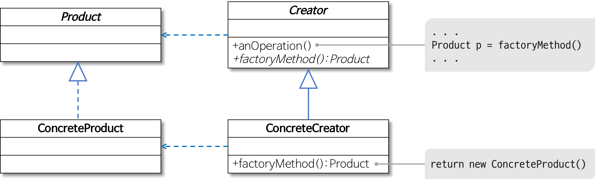

# 팩토리 메서드 패턴(Factory Method Pattern)

## 팩토리 메서드 패턴이란?

객체를 생성하기 위한 인터페이스를 정의하고, **어떤 클래스의 인스턴스를 생성할지에 대한 처리는 서브클래스가 결정하도록 캡슐화하는 패턴**이다.

객체 생성 코드를 별도 클래스, 메서드로 분리하여 객체 생성의 변화에 대비하는데 유용하다.

특정 기능의 구현은 개별 클래스를 통해 제공되는 것이 바람직한 설계 방법이다. 왜냐하면 기능의 변경이나 상황에 따른 기능 선택은 해당 객체를 생성하는 코드의 변경을 초래하며, 상황에 따라 적절한 객체를 생성하는 코드는 자주 중복될 수 있고 객체 생성 방식의 변화는 해당되는 모든 코드 부분을 변경해야 하는 문제가 발생한다.

## 팩토리 메서드 구조


팩토리 메서드 구조

출처 : https://gmlwjd9405.github.io/2018/08/07/factory-method-pattern.html

- Product
    - 팩토리 메서드로 생성될 객체의 공통 인터페이스
- ConcreteProduct
    - 구체적으로 객체가 생성되는 클래스
- Creator
    - 팩토리 메서드를 갖는 클래스
- ConcreteCreator
    - 팩토리 메서드를 구현하는 클래스로 ConcreteProduct 객체를 생성

## 팩토리 메서드 패턴을 사용하는 이유

- 클래스의 생성, 사용의 처리로직을 분리하여 결합도를 낮추기 위함
- 직접 객체를 생성하여 사용하는 것을 방지
- 서브 클래스에 생성 로직을 위임하여 효율적인 코드 제어
- 의존성 제거

## 팩토리 메서드 예제

- Creator Class
    - PizzaStore
    
    ```java
    public abstract class PizzaStore {
        public Pizza orderPizza(String type) {
            Pizza pizza = createPizza(type);
    
            pizza.prepare();
            pizza.bake();
            pizza.box();
    
            return pizza;
        }
    
        abstract Pizza createPizza(String type);
    }
    ```
    

- ConcreteCreator
    - NYPizzaStore
    
    ```java
    public class NYPizzaStore extends PizzaStore {
        @Override
        Pizza createPizza(String item) {
            if ("cheese".equals(item)) {
                return new NYStyleCheesePizza();
            } else if ("veggie".equals(item)) {
                return new NYStyleVeggiePizza();
            } else if ("clam".equals(item)) {
                return new NYStyleClamPizza();
            } else {
                return null;
            }
        }
    }
    ```
    
    - ChicagoPizzaStore
    
    ```java
    public class ChicagoPizzaStore extends PizzaStore {
        @Override
        Pizza createPizza(String item) {
            if ("cheese".equals(item)) {
                return new ChicagoStyleCheesePizza();
            } else if ("veggie".equals(item)) {
                return new ChicagoStyleVeggiePizza();
            } else if ("clam".equals(item)) {
                return new ChicagoStyleClamPizza();
            } else {
                return null;
            }
        }
    }
    ```
    

- Product
    - Pizza
    
    ```java
    public abstract class Pizza {
        String name;
        String dough;
        String sauce;
    
        void prepare() {
            System.out.println("preparing~~ " + name);
        }
    
        void bake() {
            System.out.println("baking~~");
        }
    
        void box() {
            System.out.println("boxing~~");
        }
        
        public String getName() {
            return name;
        }
    }
    ```
    

- ConcreteProduct
    - NYStyleCheesePizza
    
    ```java
    public class NYStyleCheesePizza extends Pizza {
        public NYStyleCheesePizza() {
            name = "NYStyleCheesePizza";
        }
    }
    ```
    
    - NYStyleClamPizza
    
    ```java
    public class NYStyleClamPizza extends Pizza {
        public NYStyleClamPizza() {
            name = "NYStyleClamPizza";
        }
    }
    ```
    
    - NYStyleVeggiePizza
    
    ```java
    public class NYStyleVeggiePizza extends Pizza {
        public NYStyleVeggiePizza() {
            name = "NYStyleVeggiePizza";
        }
    }
    ```
    
    - ChicagoStyle 관련 생략

- Client
    - main
    
    ```java
    PizzaStore nyStore = new NYPizzaStore();
    PizzaStore chicagoStore = new ChicagoPizzaStore();
    
    Pizza nyCheesePizza = nyStore.orderPizza("cheese");
    Pizza nyClamPizza = nyStore.orderPizza("clam");
    
    Pizza chicagoCheesePizza = chicagoStore.orderPizza("cheese");
    Pizza chicagoClamPizza = chicagoStore.orderPizza("clam");
    ```
    
    - result
    
    ```
    preparing~~ NYStyleCheesePizza
    baking~~
    boxing~~
    preparing~~ NYStyleClamPizza
    baking~~
    boxing~~
    preparing~~ ChicagoStyleCheesePizza
    baking~~
    boxing~~
    preparing~~ ChicagoStyleClamPizza
    baking~~
    boxing~~
    ```
    

## 결론

- 팩토리 메서드 패턴은 클래스간의 결합도를 낮추기 위함
- 직접 객체를 생성해 사용하는 것을 방지
- 서브 클래스에 객체 생성에 대해 위임함으로써 보다 효율적인 코드 제어
- 의존성 제거 및 낮은 결합도

<aside>
💡 결합도(coupling) : 클래스의 변경점이 생겼을 때 얼마나 다른 클래스에도 영향을 주는 정도

</aside>

## 참조

- [https://jdm.kr/blog/180](https://jdm.kr/blog/180)
- [https://gmlwjd9405.github.io/2018/08/07/factory-method-pattern.html](https://gmlwjd9405.github.io/2018/08/07/factory-method-pattern.html)
- [https://velog.io/@jamieshin/팩토리-메소드-패턴Factory-Method-Pattern](https://velog.io/@jamieshin/%ED%8C%A9%ED%86%A0%EB%A6%AC-%EB%A9%94%EC%86%8C%EB%93%9C-%ED%8C%A8%ED%84%B4Factory-Method-Pattern)
- [https://bamdule.tistory.com/157](https://bamdule.tistory.com/157)
- [https://robin00q.tistory.com/85](https://robin00q.tistory.com/85)
- [https://johngrib.github.io/wiki/pattern/factory-method/](https://johngrib.github.io/wiki/pattern/factory-method/)