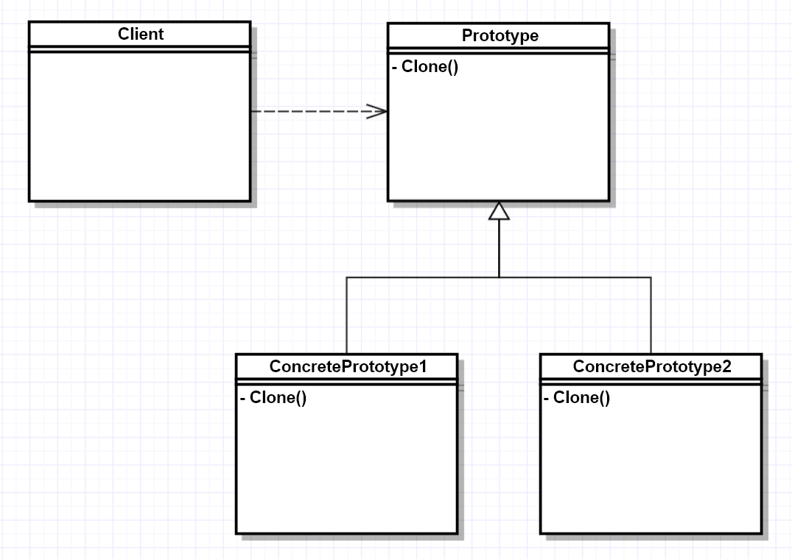

# 프로토타입 패턴(Prototype Pattern)

## 원형 패턴(프로토타입 패턴)이란?

프로토타입은 주로 실제 제품을 만들기에 앞서 대략적인 샘플 정도의 의미로 사용된다.

프로토타입 패턴은 객체를 생성하는 데 비용(시간과 자원)이 많이 들고, 비슷한 객체가 이미 있는 경우에 사용되는 패턴 중 하나이다.

Original 객체를 새로운 객체에 복사하여 필요에 따라 수정하는 메커니즘을 제공한다.

이 패턴은 복사를 위해 `clone()`을 사용한다.

## 프로토타입 예제


프로토타입 패턴 구성도

출처 : https://velog.io/@newtownboy/디자인패턴-프로토타입패턴Prototype-Pattern

앞서 말했듯이 객체 생성에 비용이 들고, 유사 객체가 존재하는 경우 사용한다.

`clone()`을 사용하기에 그에 대한 `override`가 요구된다. 여기서 주의할 점은 생성하고자 하는 객체의 클래스에 반드시 매서드가 재 정의 되어야 한다.

데이터를 수차례 수정해야하는 요구사항이 있는 경우 매번 `new` 키워드를 사용하여 모든 데이터를 가져오는 것은 좋은 아이디어가 아니다.

한번 DB에 접근하여 데이터를 가져와 필요에 따라 **새로운 객체에 복사하여 수정 작업을 진행**하는 것이 더 좋은 방법이다.

```java
/* User Class */
public class User implements Cloneable { // 깊은 복사를 위한 Cloneable implements.
	private String name;
	private String job;
	private int age;

	// User 클래스 생성자
	User(String name, String job, int age) {
		this.name = name;
		this.job = job;
		this.age = age;
	}

	// getter, setter 생략
	...

	// 깊은 복사를 위한 Clone() 재정의
	@Override
	public Object clone() throws CloneNotSupportedException {
		User user = (User)super.clone();
		return user;
	}
}
```

User 클래스에 깊은 복사를 제공해주는 Cloneable 인터페이스 구현

```java
public class ProtoTypePattern {
    public static void main(String[] args) throws CloneNotSupportedException {
        User user1 = new User("수지", "Engineer", 26);
        System.out.println("user1"
                + ", 이름 : " + user1.getName()
                + ", 직업 : " + user1.getJob()
                + ", 나이 : " + user1.getAge());

        /* 깊은 복사의 예 */
        User user2 = (User)user1.clone();         //clone 을 통한 깊은 복사 진행.
        System.out.println("user2"
                + ", 이름 : " + user2.getName()
                + ", 직업 : " + user2.getJob()
                + ", 나이 : " + user2.getAge());

        /* 깊은 복사로 생성된 user2의 데이터 수정 */
        user2.setName("성민");
        user2.setJob("백수");
        user2.setAge(29);
        System.out.println("user2"
                + ", 이름 : " + user2.getName()
                + ", 직업 : " + user2.getJob()
                + ", 나이 : " + user2.getAge());

        /* user2의 수정에도 user1의 데이터는 변동없음 */
        System.out.println("user1"
                + ", 이름 : " + user1.getName()
                + ", 직업 : " + user1.getJob()
                + ", 나이 : " + user1.getAge());
    }
}
```

- 결과

```
user1, 이름 : 수지, 직업 : Engineer, 나이 : 26
user2, 이름 : 수지, 직업 : Engineer, 나이 : 26
user2, 이름 : 성민, 직업 : 백수, 나이 : 29
user1, 이름 : 수지, 직업 : Engineer, 나이 : 26
```

## 결론

- 동일한 객체 생성을 위해 매번 new 키워드로 객체 생성 시 중복된 자원 소모 발생
- 깊은 복사를 활용하여 인스턴스화 과정을 거치지 않은 객체 복제 생성
- 인스턴스화를 통해 생성 로직에 소모되는 처리시간과 자원 절약
- 적은 리소스로 많은 객체를 생성할 경우 매우 유용