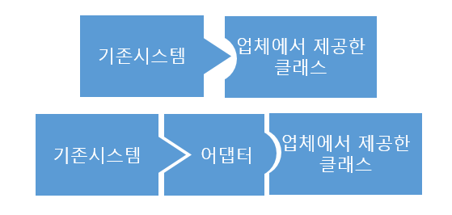
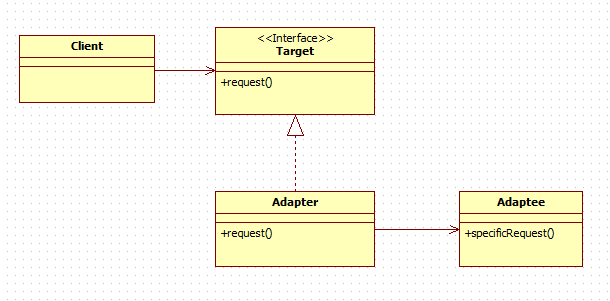
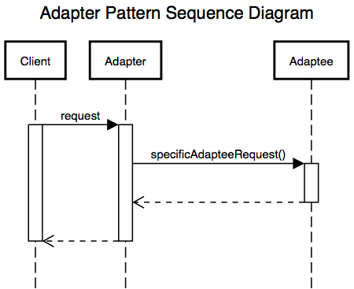

# 어댑터 패턴(Adapter Pattern)

## 어댑터 패턴이란?

이름대로 어댑터처럼 사용되는 패턴이다. 예를 들어 220V 콘센트를 어댑터를 이용하면 110V를 사용하는 곳에서도 그대로 사용할 수 있는 것처럼 중간 다리 역할을 한다.

호환성 없는 인터페이스 때문에 동작할 수 없는 클래스들을 함께 작동하도록 도와주는 패턴이 어댑터 패턴이다. 이를 위해 새로운 어댑터 역할을 가진 클래스를 만들어야 한다.

기존 시스템에 **새로운 써드파티 라이브러리가 추가**된다던지, **레거시 인터페이스를 새로운 인터페이스로 교체**하는 경우에 코드의 **재사용성을 높일 수 있는 방법**이 어댑터 패턴을 사용하는 것이다.



클라이언트와 구현된 인터페이스를 분리 시킬 수 있고, 인터페이스가 바뀌더라도 변경 내역은 어댑터에 캡슐화 되기에 클라이언트의 코드는 변경하지 않아도 된다.

## 어댑터 패턴 구조 및 호출 과정



- Client
    - 써드파티 라이브러리나 외부시스템에 사용하려는 클래스
- Adaptee
    - 써드파티 라이브러리나 외부시스템
- Target Interface
    - Adapter가 구현하는 인터페이스
    - Client는 Target Interface를 통해 Adaptee인 써드파티 라이브러리 사용
- Adapter
    - Client와 Adaptee 중간에서 호환성 없는 둘을 연결 시켜주는 역할
    - Target Interface를 구현하며, Client는 Target Interface를 통해 어댑터에 요청
    - Client의 요청에 Adpater가 전달하여 Adaptee에서 처리



클라이언트 -> `request()` -> 어댑터 -> `specificAdapteeRequest()` -> 어댑티

클라이언트는 타겟 인터페이스에 맞게 구현

어댑터는 타겟 인터페이스를 구현하며, 어댑티 인스턴스가 들어있음.

## 어댑터 패턴 예제


- Interface
    - VideoPlayer
    
    ```java
    public interface VideoPlayer {
        void playFile(String filename);
    }
    ```
    
- Target Interface
    - AudioPlayer
    
    ```java
    public interface AudioPlayer {
        void play(String filename);
    }
    ```
    
- Adaptee - Video Player Class
    - MP4
    
    ```java
    public class MP4 implements VideoPlayer{
        @Override
        public void playFile(String filename) {
            System.out.println("Playing MP4 File : " + filename);
        }
    }
    ```
    
    - MKV
    
    ```java
    public class MKV implements VideoPlayer{
        @Override
        public void playFile(String filename) {
            System.out.println("Playing MKV File : " + filename);
        }
    }
    ```
    

- Audio Player Class
    - MP3
    
    ```java
    public class MP3 implements AudioPlayer{
        @Override
        public void play(String filename) {
            System.out.println("Playing MP3 File : " + filename);
        }
    }
    ```
    
- Adapter
    - FormatAdapter
    
    ```java
    public class FormatAdapter implements AudioPlayer{
    
        private VideoPlayer media;
    
        public FormatAdapter(VideoPlayer video) {
            this.media = video;
        }
    
        @Override
        public void play(String filename) {
            System.out.print("Using Adapter : ");
            media.playFile(filename);
        }
    }
    ```
    
- Client
    - main
    
    ```java
    public class Client {
    
        public static void main(String[] args) {
            AudioPlayer mp3 = new MP3();
            mp3.play("file.mp3");
    
            VideoPlayer mp4 = new MP4();
            mp4.playFile("file.mp4");
    
            AudioPlayer audioPlayerAdapter = new FormatAdapter(mp4);
            audioPlayerAdapter.play("file.mp4");
    
        }
    }
    ```
    
    - result
    
    ```
    Playing MP3 File : file.mp3
    Playing MP4 File : file.mp4
    Using Adapter : Playing MP4 File : file.mp4
    ```
    

## Why Adapter Pattern?

> 두개의 인터페이스가 달라 호환이 되지 않는다면 하나를 변경하거나 둘 다 변경하면 되는 것 아닌가?
> 

- 오픈소스가 아니라 미리 컴파일 된 클래스 바이너리 파일 만을 제공 받은 써드파티 라이브러리라면 직접적인 접근이 불가능
- 직접적으로 접근 하더라도 변경된 코드로 인한 라이브러리 및 벤더 쪽 시스템 전체 오류 가능성 증가

## 결론

- 기존 클래스의 소스 코드를 수정 하지 않고 타겟 인터페이스에 맞춰 동작
- 기존 클래스의 명세(사양)만 알면 얼마든지 새로운 클래스도 작성 가능
- 소스 코드가 간단해지고 유지 보수도 원할 하게 하는 이점 존재

## 참조

- [https://jusungpark.tistory.com/22](https://jusungpark.tistory.com/22)
- [https://yaboong.github.io/design-pattern/2018/10/15/adapter-pattern/](https://yaboong.github.io/design-pattern/2018/10/15/adapter-pattern/)
- [https://velog.io/@bae_mung/디자인-패턴-구조-Adapter-Pattern](https://velog.io/@bae_mung/%EB%94%94%EC%9E%90%EC%9D%B8-%ED%8C%A8%ED%84%B4-%EA%B5%AC%EC%A1%B0-Adapter-Pattern)
- [https://niceman.tistory.com/141](https://niceman.tistory.com/141)