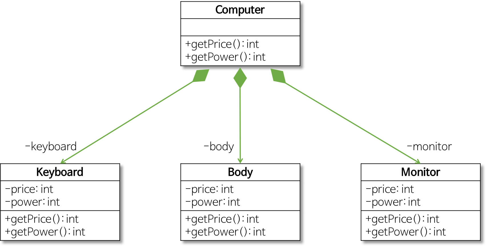
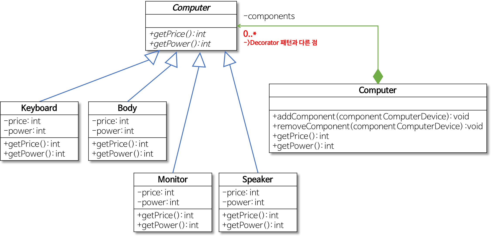

# 컴포지트 패턴(Composite Pattern)

## 컴포지트 패턴이란?

클라이언트가 복합 객체나 단일 객체를 동일하게 취급하는 것을 목적으로 한다.

컴포지트 패턴은 전체의 계층을 하나의 인터페이스로 통합하여 트리 구조로 구성하는 구조 패턴 중 하나 이다.


- Component
    - 구체적인 부분
    - Leaf 클래스와 전체에 해당하는 Composite 클래스에 공통 인터페이스 정의
- Leaf
    - 구체적인 부분 클래스
    - Composite 객체의 부품으로 설정 (ex : 컴퓨터에 포함 된 모니터, 마우스, 스피커, etc)
- Composite
    - 전체 클래스
    - 복수 개의 Component를 갖도록 정의
    - 그러므로 복수 개의 Leaf, 심지어 복수 개의 Composite 객체를 부분으로 가질 수 있음

## 예제를 통한 컴포지트 패턴 이해하기 - 컴퓨터에 추가 장치 지원

### 컴포지트 패턴을 사용하지 않은 경우



여기에 Speaker 이라는 클래스를 새로이 추가할 예정이다.

```java
public class Keyboard {
  private int price;
  private int power;
  public Keyboard(int power, int price) {
    this.power = power;
    this.price = price;
  }
  public int getPrice() { return price; }
  public int getPower() { return power; }
}
public class Body { 동일한 구조 }
public class Monitor { 동일한 구조 }
```

```java
public class Computer {
  private Keyboard Keyboard;
  private Body body;
  private Monitor monitor;

  public addKeyboard(Keyboard keyboard) { this.keyboard = keyboard; }
  public addBody(Body body) { this.body = body; }
  public addMonitor(Monitor monitor) { this.monitor = monitor; }

  public int getPrice() {
    int keyboardPrice = keyboard.getPrice();
    int bodyPrice = body.getPrice();
    int monitorPrice = monitor.getPrice();
    return keyboardPrice + bodyPrice + monitorPrice;
  }
  public int getPower() {
    int keyboardPower = keyboard.getPower();
    int bodyPower = body.getPower();
    int monitorPower = monitor.getPower();
    return keyboardPower + bodyPower + monitorPower;
  }
}
```

- Client
    - main
    
    ```java
    public class Client {
      public static void main(String[] args) {
        // 컴퓨터의 부품으로 Keyboard, Body, Monitor 객체를 생성
        Keyboard keyboard = new Keyboard(5, 2);
        Body body = new Body(100, 70);
        Monitor monitor = new Monitor(20, 30);
    
        // Computer 객체를 생성하고 부품 객체들을 설정
        Computer computer = new Computer();
        computer.addKeyboard(keyboard);
        computer.addBody(body);
        computer.addMonitor(monitor);
    
        // 컴퓨터의 가격과 전력 소비량을 구함
        int computerPrice = computer.getPrice();
        int computerPower = computer.getPower();
        System.out.println("Computer Price: " + computerPrice + "만원");
        System.out.println("Computer Power: " + computerPower + "W");
      }
    }
    ```
    
    - result
    
    ```
    Computer Price: 125만원
    Computer Power: 102W
    ```
    

- 스피커를 추가할 경우
    - Speaker
    
    ```java
    public class Speaker {
      private int price;
      private int power;
      public Speaker(int power, int price) {
        this.power = power;
        this.price = price;
      }
      public int getPrice() { return price; }
      public int getPower() { return power; }
    }
    ```
    
    - Computer
    
    ```java
    public class Computer {
      . . .
      private Speaker speaker; // 추가
    
      . . .
      public addSpeaker(Speaker speaker) { this.speaker = speaker; } // 추가
    
      public int getPrice() {
        . . .
        int speakerPrice = speaker.getPrice(); // 추가
        return keyboardPrice + bodyPrice + monitorPrice + speakerPrice;
      }
      public int getPower() {
        . . .
        int speakerPower = speaker.getPower(); // 추가
        return keyboardPower + bodyPower + monitorPower + speakerPower;
      }
    }
    ```
    
    위와 같은 방식의 설계는 확장성이 좋지 않고, **Computer 클래스에 속한 부품의 구체적인 객체를 가리키게 되어 OCP를 만족하지 않는다.**
    
    > OCP(개방-폐쇄 원칙, Open-Closed Principle)
    - 기존의 코드를 변경하지 않고(Closed) 기능을 수정하거나 추가할 수 있도록(Open) 설계해야 한다.
    > 
    

### 컴포지트 패턴을 사용한 경우



- Component
    - ComputerDevice
    
    ```java
    public interface ComputerDevice {
        public int getPrice();
        public int getPower();
    }
    ```
    
- Leaf
    
    ```java
    public class Keyboard implements ComputerDevice{
        private int price;
        private int power;
        public Keyboard(int price, int power) {
            this.price = price;
            this.power = power;
        }
        @Override
        public int getPrice() {
            return price;
        }
        @Override
        public int getPower() {
            return power;
        }
    }
    
    나머지 구조 동일..
    ```
    
- Composite
    - Computer
    
    ```java
    public class Computer implements ComputerDevice {
    
        private List<ComputerDevice> components = new ArrayList<ComputerDevice>();
    
        public void addComponent(ComputerDevice component) {
            components.add(component);
        }
    
        public void removeComponent(ComputerDevice component) {
            components.remove(component);
        }
    
        @Override
        public int getPrice() {
            int price = 0;
            for(ComputerDevice component : components) {
                price += component.getPrice();
            }
            return price;
        }
    
        @Override
        public int getPower() {
            int power = 0;
            for(ComputerDevice component : components) {
                power += component.getPower();
            }
            return power;
        }
    }
    ```
    
- Client
    - main
    
    ```java
    public class Client {
        public static void main(String[] args) {
            Keyboard keyboard = new Keyboard(5, 2);
            Body body = new Body(100, 70);
            Monitor monitor = new Monitor(20, 30);
    
            Computer computer = new Computer();
            computer.addComponent(keyboard);
            computer.addComponent(body);
            computer.addComponent(monitor);
    
            System.out.println(computer.getPrice() + "만원");
            System.out.println(computer.getPower() + "W");
        }
    }
    ```
    
    - result
    
    ```
    125만원
    102W
    ```
    
- 스피커를 추가할 경우
    - Leaf Class로 추가 해주며, Client에 객체 생성과 `addComponent()`만 지정해주면 된다.
    

## 그 외

트리 구조의 느낌으로도 활용 가능하다.

ex) 파일, 폴더

- Component
    - FileSystem
    
    ```java
    public interface FileSystem {
        void print();
    }
    ```
    
- Leaf
    - File
    
    ```java
    public class File implements FileSystem {
        private String name;
    
        @Override
        public void print() {
            System.out.println(this.getClass().getSimpleName() + "(" + name + ")");
        }
    
        public File(String name) {
            this.name = name;
        }
    }
    ```
    
- Composite
    - Folder
    
    ```java
    public class Folder implements FileSystem {
        private String name;
        private List<FileSystem> files = new ArrayList<>();
    
        @Override
        public void print() {
            System.out.println(this.getClass().getSimpleName() + "(" + name + ")");
            files.forEach(fileSystem -> fileSystem.print());
        }
    
        public void addFile(FileSystem file) {
            files.add(file);
        }
    
        public Folder(String name) {
            this.name = name;
        }
    }
    ```
    
- Client
    - main
    
    ```java
    public class Client {
    
        public static void main(String[] args) {
    
            Folder folder1 = new Folder("최상위 폴더");
            File myFile1 = new File("myFile1");
            File myFile2 = new File("myFile2");
            folder1.addFile(myFile1);
            folder1.addFile(myFile2);
    
            Folder folder2 = new Folder( "1depth");
            File myFile3 = new File("myFile3");
            File myFile4 = new File("myFile4");
            folder2.addFile(myFile3);
            folder2.addFile(myFile4);
    
            Folder folder3 = new Folder("2depth");
            File myFile5 = new File("myFile5");
            File myFile6 = new File("myFile6");
            folder3.addFile(myFile5);
            folder3.addFile(myFile6);
    
            Folder folder4 = new Folder("3depth");
            File myFile7 = new File("myFile7");
            File myFile8 = new File("myFile8");
            folder4.addFile(myFile7);
            folder4.addFile(myFile8);
    
            folder1.addFile(folder2);
            folder2.addFile(folder3);
            folder3.addFile(folder4);
    
            folder1.print();
            System.out.println("====================");
            folder2.print();
            System.out.println("====================");
            folder3.print();
            System.out.println("====================");
    
        }
    }
    ```
    
    - result
    
    ```
    Folder(최상위 폴더)
    	File(myFile1)
    	File(myFile2)
    	Folder(1depth)
    		File(myFile3)
    		File(myFile4)
    		Folder(2depth)
    			File(myFile5)
    			File(myFile6)
    			Folder(3depth)
    				File(myFile7)
    				File(myFile8)
    ====================
    Folder(1depth)
    	File(myFile3)
    	File(myFile4)
    	Folder(2depth)	
    		File(myFile5)
    		File(myFile6)
    		Folder(3depth)
    			File(myFile7)
    			File(myFile8)
    ====================
    Folder(2depth)
    	File(myFile5)
    	File(myFile6)
    		Folder(3depth)
    		File(myFile7)
    		File(myFile8)
    ====================
    ```
    

## 결론

- 부분 객체의 추가나 삭제 등이 이어도 전체 객체의 클래스 코드를 변경 불필요
- 전체-부분 관계를 갖는 객체들 사이의 관계를 정의할 때 유용
- 설계에 있어 범용성이 크기에 새로운 요소 추가에 있어 복합 객체의 구성 요소에 제약을 갖기 힘듦

## 참조

- [https://gmlwjd9405.github.io/2018/08/10/composite-pattern.html](https://gmlwjd9405.github.io/2018/08/10/composite-pattern.html)
- [https://sup2is.github.io/2020/06/25/composite-pattern.html](https://sup2is.github.io/2020/06/25/composite-pattern.html)
- [https://it-mesung.tistory.com/176](https://it-mesung.tistory.com/176)
- [https://mygumi.tistory.com/343](https://mygumi.tistory.com/343)
- [https://dailyheumsi.tistory.com/193](https://dailyheumsi.tistory.com/193)