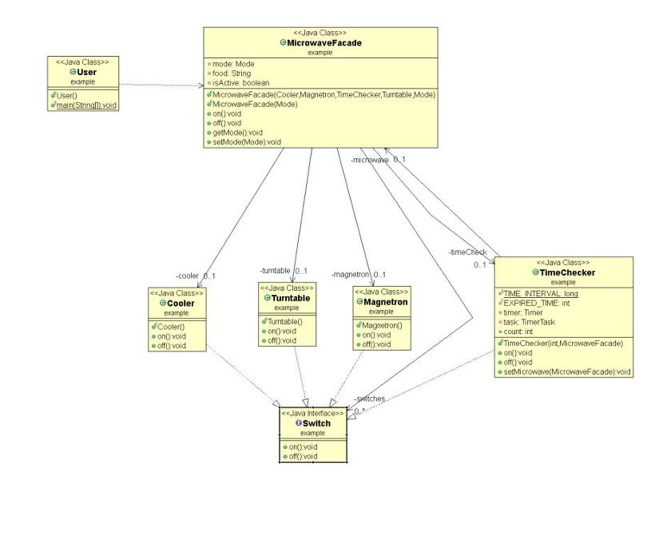

# 파사드 패턴(Facade Pattern)

## 파사드 패턴이란?

파사드란 프랑스어로 건물 외관이라는 뜻을 가진다. 건물 외벽에서 보면 안의 구조는 보이지 않는다.

따라서 파사드 패턴은 많은 서브시스템(내부 구조)을 거대한 클래스(외벽)로 감싸서 편리한 인터페이스를 제공해 준다.

**하위 시스템을 보다 쉽게 사용할 수 있게 해주는 패턴**으로 **원래 코드를 다른 코드와 작동할 수 있게 해주는 어댑터 패턴**과 다르게 **원래 코드를 더 쉽게 처리해준다.**

사용 예 :

- 캡슐화 되지 않은 코드를 처리할 때 사용
- 원하는 코드를 다시 작성할 수 없을 때 사용
    - 기본 코드가 변경된다면 Facade 패턴도 변경해야 한다.

## 예제 - 전자레인지 구현



전자레인지를 사용할 때 단순한 버튼 하나로 타이머, 마이크로파, 쿨러를 전부 동작하게 하는 인터페이스를 구현한다.

- 스위치 - 부품의 전원을 켜고 끄는 역할
    - Switch
    
    ```java
    public interface Switch {
        void turnOn();
        void turnOff();
    }
    ```
    
- 쿨러 - 전자레인지의 열을 식혀준다.
    - Cooler
    
    ```java
    public class Cooler implements Switch {
        @Override
        public void turnOn() {
            System.out.println("쿨러 작동 시작..");
        }
    
        @Override
        public void turnOff() {
            System.out.println("쿨러 작동 끝..");
        }
    }
    ```
    
- 마그네트론 - 마이크로파를 발생시킨다.
    - Magnetron
    
    ```java
    public class Magnetron implements Switch {
        @Override
        public void turnOn() {
            System.out.println("마이크로파 발생기 켜짐.. 작동중");
        }
    
        @Override
        public void turnOff() {
            System.out.println("마이크로파 발생기 꺼짐..");
        }
    }
    ```
    
- 턴테이블 - 조리할 음식을 회전시킨다.
    - Turntable
    
    ```java
    public class Turntable implements Switch {
        @Override
        public void turnOn() {
            System.out.println("Turntable이 움직입니다..");
        }
    
        @Override
        public void turnOff() {
            System.out.println("Turntable이 멈췄습니다..");
        }
    }
    ```
    
- 타이머 - 시간이 되면 전자레인지를 끈다.
    - TimeChecker
    
    ```java
    public class TimeChecker implements Switch {
    
        public static long TIME_INTERVAL = 1000;
        private final int EXPIRED_TIME;
        private Timer timer;
        private TimerTask task;
        int count = 0;
        MicrowaveFacade microwave;
    
        public TimeChecker(int milSec, MicrowaveFacade microwave) {
            super();
            this.EXPIRED_TIME = milSec;
            this.count = EXPIRED_TIME / 1000;
            timer = new Timer();
            this.microwave = microwave;
            task = new TimerTask() {
                @Override
                public void run() {
                    if(count > 0) {
                        System.out.println("Timer.. " + (count--) + "초");
                    } else {
                        System.out.println("조리가 완료되었습니다.");
                        timer.cancel();
                        microwave.off();
                    }
                }
            };
        }
    
        @Override
        public void turnOn() {
            timer.schedule(task, 0, TIME_INTERVAL);
        }
    
        @Override
        public void turnOff() {
            timer.cancel();
        }
    }
    ```
    
- 모드 - 전자레인지를 작동할 시간
    - Mode
    
    ```java
    public enum Mode {
        FAST(30000), MIDDLE(50000), SLOW(100000);
    
        private final int value;
        Mode(int value) { this.value = value; }
        public int getValue() {return value;}
        public String getName() { return name(); }
    }
    ```
    
- 모든 작동 순서를 편리하게 모아줄 파사드 클래스
    - MicrowaveFacade
    
    ```java
    public class MicrowaveFacade {
        Cooler cooler;
        Magnetron magnetron;
        TimeChecker timeCheck;
        Turntable turntable;
        Mode mode;
        Switch[] switches;
        String food;
        boolean isActive = false;
    
        public MicrowaveFacade(Cooler cooler, Magnetron magnetron, TimeChecker timeCheck, Turntable turntable, Mode mode) {
            super();
            this.cooler = cooler;
            this.magnetron = magnetron;
            this.timeCheck = timeCheck;
            this.turntable = turntable;
            this.mode = mode;
            switches = new Switch[]{cooler, magnetron, turntable, timeCheck};
        }
    
        public MicrowaveFacade(Mode mode) {
            super();
            cooler = new Cooler();
            magnetron = new Magnetron();
            timeCheck = new TimeChecker(mode.getValue(), this);
            turntable = new Turntable();
            this.mode = mode;
            switches = new Switch[]{cooler, magnetron, turntable, timeCheck};
        }
    
        public void on() {
            for(int i=0; i<switches.length; ++i) {
                switches[i].turnOn();
            }
            isActive = true;
        }
    
        public void off() {
            for(int i=0; i<switches.length; ++i) {
                switches[i].turnOff();
            }
            isActive = false;
        }
    
        public void getMode() {
            System.out.println("현재 모드는... " + mode.getName());
        }
    
        public void setMode(Mode mode) {
            this.mode = mode;
        }
    }
    ```
    

사용자는 `on()`과 `off()`로 전자레인지를 작동 시킬 수 있다.

또한 다른 부품으로 교체하여 작동 시킬 수도 있다.

- Client
    - main
    
    ```java
    public static void main(String[] args) {
    	// Facade 적용 전
    	Cooler cooler = new Cooler();
    	Magnetron magnetron = new Magnetron();
    	... // 기타 나머지
    
    	System.out.println("=== 파사드 전 === ");
    	cooler.turnOn();
    	magnetron.turnOn();
    	... // 기타 나머지
    
    	// Facade 적용 후
    	System.out.println("=== 파사드 후 ===");
    	MicrowaveFacade microwave = new MicrowaveFacade(Mode.FAST);
    	microwave.on();       
    }
    ```
    
    - result
    
    ```
    === 파사드 전 ===
    쿨러 작동 시작..
    마이크로파 발생기 켜짐.. 작동중
    Turntable이 움직입니다..
    현재 모드는... FAST
    Timer.. 30초
    Timer.. 29초
    ...
    
    === 파사드 후 ===
    쿨러 작동 시작..
    마이크로파 발생기 켜짐.. 작동중
    Turntable이 움직입니다..
    현재 모드는... FAST
    Timer.. 30초
    Timer.. 29초
    ...
    ```
    
    - 중간에 끌 경우
    
    ```java
    	public static void main(String[] args) {
    	MicrowaveFacade microwave = new MicrowaveFacade(Mode.FAST);
    	microwave.on();
    	
    	try {
    	    Thread.sleep(1500);
    	    microwave.off();
    	} catch (InterruptedException e) {
    	    e.printStackTrace();
    	}
    }
    ```
    
    - result
    
    ```
    쿨러 작동 시작..
    마이크로파 발생기 켜짐.. 작동중
    Turntable이 움직입니다..
    현재 모드는... FAST
    Timer.. 30초
    Timer.. 29초
    쿨러 작동 끝..
    마이크로파 발생기 꺼짐..
    Turntable이 멈췄습니다..
    ```
    

다른 예제를 확인해보고 싶다면

[https://readystory.tistory.com/193](https://readystory.tistory.com/193)

[https://imasoftwareengineer.tistory.com/29](https://imasoftwareengineer.tistory.com/29)

으로 들어가 보길 추천한다.

## 결론

- 클라이언트 애플리케이션의 헬퍼 역할(서브 시스템 인터페이스를 숨기는 것이 아님 - 캡슐화 X)
- 특정 기능에 대한 인터페이스 수가 확장되고, 시스템이 복잡해질 수 있을 때 사용
- 비슷한 작업을 해야 하는 다양한 인터페이스들 중 하나의 인터페이스를 클라이언트에 제공해야 할 때 적용
- 종종 팩토리 패턴과 함께 사용
- 사용자 입장에서 서브 클래스에 대해 알 필요가 없어짐

## 참조

- [https://lktprogrammer.tistory.com/42](https://lktprogrammer.tistory.com/42)
- [https://break-over.tistory.com/47](https://break-over.tistory.com/47)
- [https://gdtbgl93.tistory.com/142](https://gdtbgl93.tistory.com/142)
- [https://readystory.tistory.com/193](https://readystory.tistory.com/193)
- [https://imasoftwareengineer.tistory.com/29](https://imasoftwareengineer.tistory.com/29)