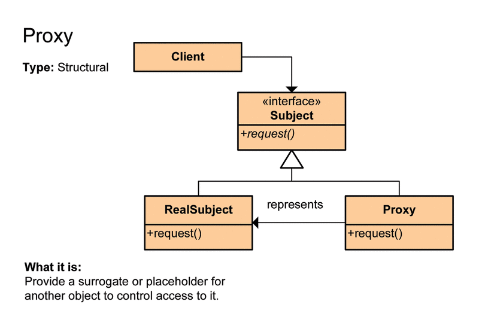

# 프록시 패턴(Proxy Pattern)

## 프록시 패턴이란?

Proxy는 우리말로 대리자, 대변인 이라는 뜻이다.

Proxy 패턴은 어떤 일을 대신 시킬 클래스를 만드는 것이다.

해당 객체가 메모리에 존재하지 않아도 **기본적인 정보를 참조하거나 설정**할 수 있고 또한 **실제 객체의 기능이 반드시 필요한 시점까지 객체의 생성을 미룰 수 있다.**

## 예제 - 이미지 로딩



- Subject
    - Image
    
    ```java
    public interface Image {
    	void displayImage();
    }
    ```
    
- RealSubject
    - Real Image
    
    ```java
    public class RealImage implements Image {
    	private String fileName;
    
    	public RealImage(String fileName) {
    		this.fileName = fileName;
    		loadFromDisk(fileName);
    	}
    
    	private void loadFromDisk(String fileName) {
    		System.out.println("Loading " + fileName);
    	}
    
    	@Override
    	public void displayImage() {
    		System.out.println("Displaying " + fileName);
    	}
    }
    ```
    
    - ProxyImage
    
    ```java
    public class ProxyImage implements Image {
        private RealImage realImage;
        private String fileName;
        
        public ProxyImage(String fileName) {
            this.fileName = fileName;
        }
        
        @Override
        public void displayImage() {
            if (realImage == null) {
                realImage = new RealImage(fileName);
            }
            realImage.displayImage();
        }
    }
    ```
    
- Client
    - main
    
    ```java
    public class ProxyMain {
        public static void main(String[] args) {
            Image image1 = new ProxyImage("test1.png");
            Image image2 = new ProxyImage("test2.png");
            
            image1.displayImage();
            System.out.println();
            image2.displayImage();
        }
    }
    ```
    
    - result
    
    ```
    Loading test1.png
    Displaying test1.png
    
    Loading test2.png
    Displaying test2.png
    ```
    

## 프록시 패턴의 장단점

- 장점
    - 사이즈가 큰 객체(ex : 이미지)가 로딩 되기 전에도 프록시를 통해 참조 가능
    - 실제 객체의 public, protected 메서드들을 숨기고 인터페이스를 통해 노출 가능
    - 로컬에 있지 않고 떨어져 있는 객체 사용 가능
    - 원래 객체의 접근에 대해 사전 처리 가능

- 단점
    - 객체 생성 시 한 단계를 더 거치기에 빈번한 객체 생성이 필요한 경우 성능 저하
    - 프록시 내부에서 객체 생성을 위한 스레드 생성, 동기화가 구현되기에 성능 저하
    - 로직이 복잡하여 가독성 저하
    

## 프록시 패턴 종류

- 가상 프록시
- 원격 프록시
- 보호 프록시

** 더 자세한 내용을 원하면 [https://jdm.kr/blog/235](https://jdm.kr/blog/235)

## 결론

- 인터페이스를 중간에 두어 구체 클래스들에게 영향을 받지 않게 설계
- 직접 접근하지 않고 Proxy를 통해 한번 더 우회해서 접근
- OCP, DIP 설계 원칙이 녹아져 있음

<aside>
💡 OCP(개방 폐쇄 원칙) : 자신의 확장에는 열려 있고, 주변의 변화에 대해서는 닫혀 있어야 한다.

</aside>

<aside>
💡 DIP(의존 역전 원칙) : 자신보다 변하기 쉬운 것에 의존하지 마라.

</aside>

## 참조

- [https://limkydev.tistory.com/m/79](https://limkydev.tistory.com/m/79)
- [https://limkydev.tistory.com/77](https://limkydev.tistory.com/77)
- [https://velog.io/@newtownboy/디자인패턴-프록시패턴Proxy-Pattern](https://velog.io/@newtownboy/%EB%94%94%EC%9E%90%EC%9D%B8%ED%8C%A8%ED%84%B4-%ED%94%84%EB%A1%9D%EC%8B%9C%ED%8C%A8%ED%84%B4Proxy-Pattern)
- [https://coding-factory.tistory.com/711](https://coding-factory.tistory.com/711)
- [https://jdm.kr/blog/235](https://jdm.kr/blog/235)