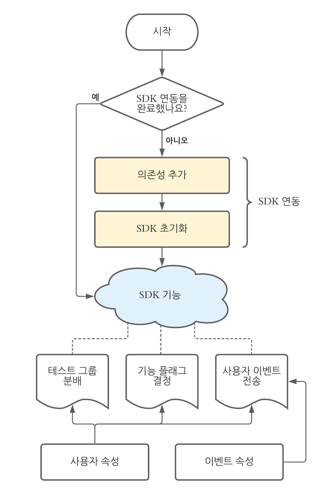

# A/B 테스트

## A/B 테스트란?

분할 테스트 또는 버킷 테스트라고도 하는 A/B 테스트는 **두 가지 콘텐츠를 비교**하여 방문자/뷰어가 **더 높은 관심을 보이는 버전을 확인**하여 가장 **성공적인 버전을 측정하기 위해 변형(B)** 버전과 비교하여 **컨트롤(A)** 버전을 **검증**한다.

A/B 테스트 외에도 A/B/N (N은 C~n개) 테스트도 있으며 변수(변형)가 두 개 이상인 유형이다.

 

## A/B 테스트의 이점
 

- 미세한 성능 조정 방법을 위한 **권장 사항을 지속적으로 제공**

- 테스트에 사용할 수 있는 옵션이 거의 무제한이므로 **지속적인 테스트를 수행 가능**

- 테스트 페이지뿐만 아니라 기타 유사한 페이지도 개선할 수 있는 **의사 결정이 가능**

 

이지만 직관적으로 느낄 수 있는 점은

- 사용자에게 제공하는 제품이 사용자의 **문제점을 해결해주고 있는지 가장 쉽고 확실하게 측정**

- 사용자의 **선택과 행동이 데이터로 쌓여 결과 도출**

- 이러한 데이터를 조합으로 의사 **결정 가능**

 

## Alda의 A/B 테스트 클라이언트
 

Alda는 현재 **Hackle**을 통해 A/B 테스트를 진행한다.

 

## 백엔드의 A/B 테스트 과정
 

### 작업 순서



SDK 연동 → SDK 기능

SDK 연동 : 의존성 추가 → SDK 초기화

SDK 기능 : 테스트 그룹 분배, 기능 플래그 결정, 사용자 이벤트 전송

 

보통은 테스트 그룹 분배와 사용자 이벤트 전송 부분을 사용한다.

* 추 후 기능 플래그 결정 부분을 사용하게 된다면 새로 업로드를 하겠다.

 

현재는 **SDK 연동은 완료가 된 상태**이며 우리는 각 테스트마다 **사용될 함수 부분에 테스트의 그룹 분배와 이벤트를 전송**해주면 된다.

 

코드를 찾아보길 바란다. finance_service → HackleHandler, HackleConfig

 

**두 코드를 보고 밑의 글을 읽기를 권장한다.**

 

테스트 그룹 분배
 

본인이 현재 개발 중인 서비스가 있다 라고 가정을 하면 그 서비스가 실행될 때 테스트 그룹 분배와 이벤트 전송을 하는 코드를 작성하면 좋다.

ex)

    본래 알다 커피에서는 아메리카노의 원두(라이트 로스트)가 하나 뿐이다.

    이번에 새로운 원두(다크 로스트)를 가져왔다.

    손님이 아메리카노를 시키면 원두를 랜덤으로 제공하고자 하는데 테스트를 진행해보고 싶다.

 

간단 예시일 뿐 틀렸다고 뭐라 하기 없기..

 

OrderDrinkService


``` java
...

private List<DrinkModel> getAmericano(int drinkCount) {
  return drinkRepository.getLightRoast(drinkCount);
}

...
```

이라고 한다면

A/B 테스트를 추가 하면

``` java

...
private final HackleHandler hackleHandler;
...
private List<DrinkModel> getAmericano(long userId, int drinkCount) {
  // 핵클 테스트 실험 키 설정 후 배분 결과 반환 
  Variation variation = hackleHandler.setHackleTest({experimentKey}, userId);
  // 유저가 이 함수를 실행 시켰다는 이벤트 전송
  hackleHandler.track({evnetKey}, userId);
  
  // A 그룹은 기존대로 라이트 로스트, B 그룹은 랜덤한 원두로 만든 아메리카노
  if (Variation == Variation.A) return drinkRepository.getLightRoast(drinkCount);
  else return drinkRepository.getRandomRoast(drinkCount);
}

...

```

** if else 문이 아닌 더 좋은 방법을 찾게 된다면 바로 적용하고 수정할 예정이다.

 

식별할 수 없거나 Hackle과 연결이 되지 않는다면 기본적으로 A를 반환한다.

왠만한 테스트 기능을 사용하기 위한 SDK 연결은 구성이 되어 있는 상태이니 **어떤 서비스의 기능을 나누는지 파악 후에 A/B 테스트 코드를 작성해주면 된다.**

## 테스트를 마치면…
 

결과를 얻으면 A/B 테스트를 종료해야 한다.

테스트 종료 시 Winner 그룹을 선택하고 나면(A, B 중 하나 or N) **모든 사용자가 Winner 그룹의 결과를 보게 된다.**

따라서 **A/B 테스트와 관련된 코드를 반드시 제거해야 한다!!!!**


나머지
 

테스트의 실험키나 이벤트 키는 코비께서 지정해주신다. 본인이 해야 할 수도 있으니 인지하길 바란다.

테스트가 끝나게 된다면 꼭 **Winner 그룹이 아닌 코드와 테스트를 위해 생성했던 코드는 제거**해주길 바란다.

 

자세한 내용은 
[Getting Started](https://docs-kr.hackle.io/docs/getting-started) 의 궁금한 부분 또는 SDK 부터 읽어보길 추천한다.