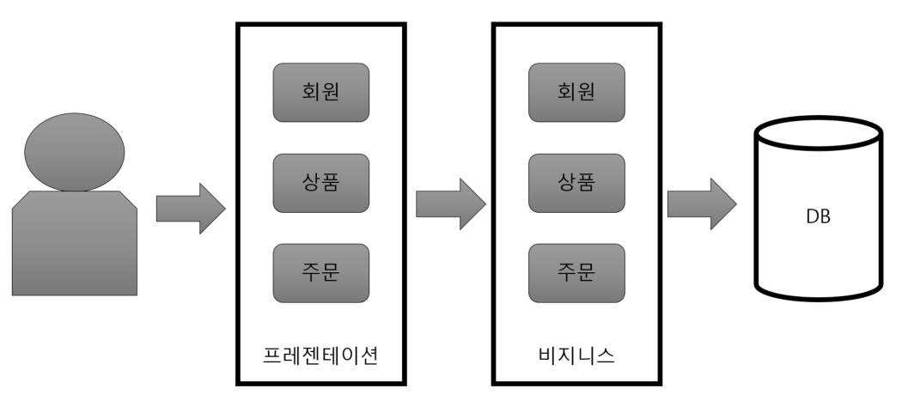
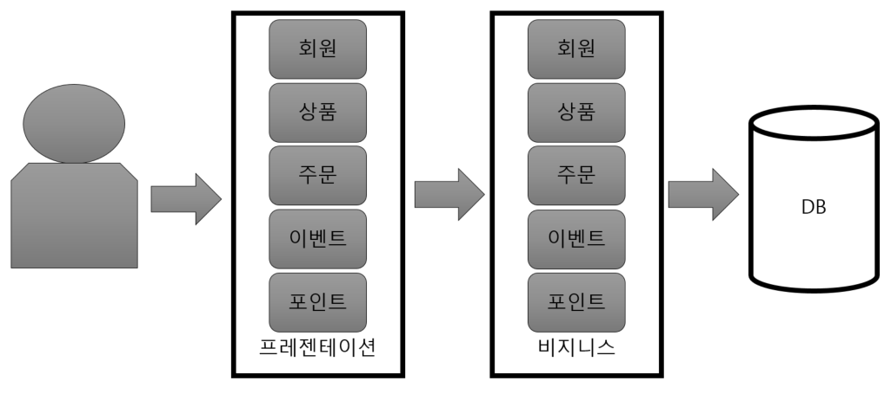
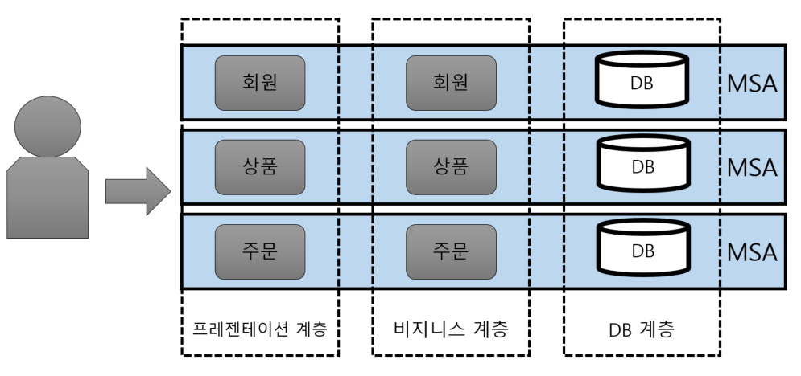
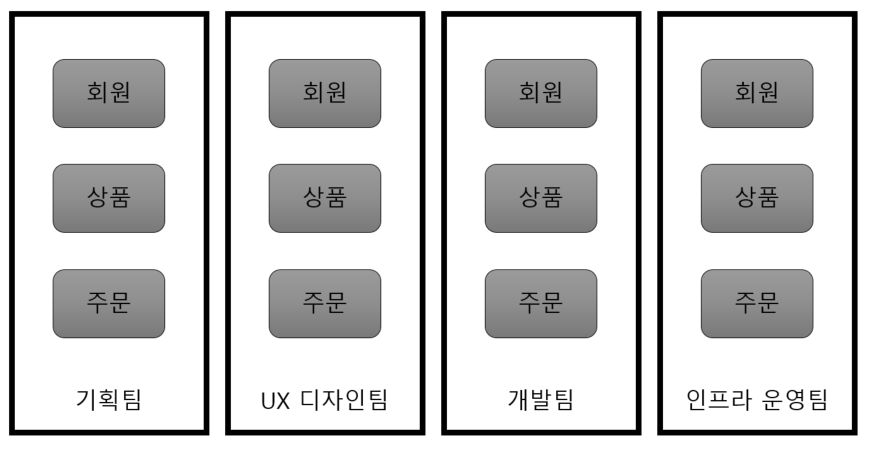
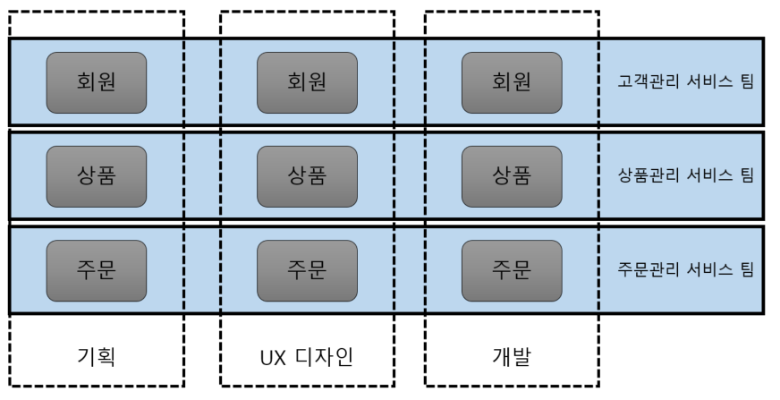

# MSA (Micro Service Architecture)

## Monolithic Architecture VS Micro Service Architecture

### Monolithic Architecture 이란?

- 기존에 사용하던 전통적인 방식
- 소프트웨어의 모든 구성 요소가 한 프로젝트에 통합된 형태
- 간단한 Architecture, 유지보수 용이
- 동일한 개발 툴을 사용하여 개발, 배포 및 테스트
- 각 컴포넌트들이 함수로 호출되기에 성능에 제약이 덜하고 운영 관리 용이
- 작은 볼륨의 시스템을 개발할 때 매우 유용
- 시스템이 커지고 여러 컴포넌트들이 더해지면 문제 발생

### Monolithic Architecture의 문제점

여러 기능이 추가되었다고 가정하자

- 빌드 / 테스트 시간이 길어짐
    - 작은 수정에도 시스템 전체를 빌드
    - CI / CD가 강조되는 시점에서 큰 문제가 될 수 있음

- 선택적 확장 불가능
    - 부분적 scale-out이 어려움
    - 이벤트로 인한 서비스 접속량이 폭증할 경우 프로젝트 전체 확장

- 하나의 서비스가 모든 서비스에 영향
    - 트래픽이 몰려 해당 서버가 죽게 된다면 다른 모든 서비스 역시 마비

### MSA(Micro Service Architecture 이란?

- 단일 프로그램을 각 컴포넌트 별로 나누어 작은 서비스의 조합으로 구축
- 각 컴포넌트는 서비스 형태로 구현, API를 이용하여 타 서비스와 통신
- 독립된 서버로 타 컴포넌트와 의존성이 없어 독립된 배포
- 하나의 서비스의 트래픽이 증가한다면 해당 서버만 확장

- 서비스간 호출을 API통신을 이용하기에 속도가 느림
- 통신에 사용하기 위해 값을 데이터 모델로 변환시켜주는 오버헤드 발생 가능성이 있음

## MSA 특징

- 데이터 분리
    - DB 중앙 집중화 하지 않고 서비스 별 데이터베이스 사용
    - 같은 DB를 사용하더라도 나누어서 사용
    - 데이터 분산으로 인한 다른 서비스 컴포넌트의 의존성 X → 독립적으로 개발 및 배포 / 운영 가능
    - 다른 컴포넌트 데이터를 API 통신을 통해 가져와야 하기에 성능 상 문제 발생
    - 트렌젝션으로 묶을 수 없음

- API Gateway
    - 각 서비스가 다른 서버에 분리 배포되어있기에 서버 URL이 각기 다름
    - API Gateway가 API 서버 앞 단에서 모든 API 서버들의 End-Point를 단일화 하여 묶는 역할
    - 복잡한 서비스간의 API 호출 구조 단순화
    - 라우팅, 로드밸런싱, 인증 등 여러 역할 수행

### 팀의 변화

- Monolithic 역할 별 팀 구분
- 인력 관리와 운영에 유연성 부여
- 팀 간 커뮤니테이션이 원활하지 못하고 시간 지연

- MSA 서비스 별 팀 구분
- 팀 내에서 서비스 기획부터 설계 개발 운영이 이루어지기에 다른 팀에 대한 의존성이 사라짐
- 역할 별 요청 피드백 속도 증가, 유연하고 지속적인 운영과 개발
- 인력 리소스 관리의 어려움
    - 각 팀 역할 담당자들은 기본적인 업무 성숙도를 가지고 있어야 함

## MSA의 정의

Martin FLower는 MSA에 대해 아래와 같이 설명하였다.

> ··· In short, the microservice architectural style is an approach to developing a single application as a suite of **small services, each running in its own process** and communicating with lightweight mechanisms, often an HTTP resource API. These services are built around business capabilities and **independently deployable** by fully automated deployment machinery. ···
> 

스스로 돌아갈 수 있는 작은 서비스이며, 독립적 배포가 가능하다고 한다.

- 각각의 서비스는 그 크기가 작을 뿐, 서비스 자체는 하나의 Monolithic Architecture과 유사한 구조
- 각각의 서비스는 독립적으로 배포가 가능해야 함
- 각각의 서비스는 다른 서비스에 대한 의존성이 최소화 되어야 함
- 각 서비스는 개별 프로세스로 구동 되며, REST와 같은 가벼운 방식으로 통신 되어야 함

일반적으로 하나의 서비스는 하나의 기능, 프로젝트로 볼 수 있지만 비즈니스와 시스템에 맞게 서비스의 범위(크기)를 설정하는 것이 중요

## MSA의 장단점

### 장점

MSA는 서비스가 커지면서 생겼던 Monolithic Architectue의 문제점을 어느 정도 보완한다.

- 배포(Deployment) 관점
    - 서비스 별 개별 배포 가능(배포 시 전체 서비스의 중단이 없음)
        - 요구사항을 신속하게 반영하여 빠르게 배포

- 확장(Scaling) 관점
    - 특정 서비스에 대한 확장성이 용이
        - 클라우드 사용에 적합

- 장애(Failure) 관점
    - 장애가 전체 서비스로 확장될 가능성이 적음
        - 부분적 장애에 대한 격리가 수월

- 그 외
    - 신기술 적용이 유연
    - 서비스를 polyglot하게 개발 / 운영 할 수 있음

### 단점

비교적 단순한 Monolithic Architecture에 비해 MSA는 보다 복잡하며 전체 서비스가 커짐에 따라 복잡도가 기하급수적으로 늘어날 수 있다.

- 성능 관점
    - 서비스 간 호출 시 API를 사용하기에 통신 비용이나 Latency가 늘어남

- 테스트 / 트랜잭션 관점
    - 서비스가 분리되어 있어 테스트와 트랜잭션의 복잡도가 증가
    - 많은 자원을 필요로 함

- 데이터 관리 관점
    - 데이터가 여러 서비스에 걸쳐 분산되기에 한번에 조회하기 어려움
    - 데이터의 정합성 또한 관리하기 어려움

## 필요 스택

** 본 스택은 Alda에서 필요한 MSA Stack이다.

[Eureka](https://www.notion.so/Eureka-905caa6b7e524f679cf75c6b1c85490e)

[Spring Cloud Gateway](https://www.notion.so/Spring-Cloud-Gateway-97d5f7b7f0e24fe080f371e452225cdc)

[Spring Cloud config](https://www.notion.so/Spring-Cloud-config-2f9e0e47d49f40188a920924cfba84c7)

[RabbitMQ](https://www.notion.so/RabbitMQ-76240331b2e24321930840194c8e4bd1)

## 정리

- 복잡한 웹 시스템에 맞춰 개발된 API기반의 서비스 지향적 아키텍처 스타일
- 업무나 비즈니스 특징에 따라 MSA와 Monolithic Architecture 사용
- 대용량 웹 서비스에 적합한 만큼 개개인의 높은 숙련도가 필요
- 기술적인 관점이 아닌 거시적인 관점에서 고려해 볼 필요가 있음

## 참조

- [http://clipsoft.co.kr/wp/blog/마이크로서비스-아키텍처msa-개념/](http://clipsoft.co.kr/wp/blog/%EB%A7%88%EC%9D%B4%ED%81%AC%EB%A1%9C%EC%84%9C%EB%B9%84%EC%8A%A4-%EC%95%84%ED%82%A4%ED%85%8D%EC%B2%98msa-%EA%B0%9C%EB%85%90/)
- [https://velog.io/@tedigom/MSA-제대로-이해하기-1-MSA의-기본-개념-3sk28yrv0e](https://velog.io/@tedigom/MSA-%EC%A0%9C%EB%8C%80%EB%A1%9C-%EC%9D%B4%ED%95%B4%ED%95%98%EA%B8%B0-1-MSA%EC%9D%98-%EA%B8%B0%EB%B3%B8-%EA%B0%9C%EB%85%90-3sk28yrv0e)
- [https://shaul1991.medium.com/초보개발자-일지-대세-msa-너-뭐니-efba5cfafdeb](https://shaul1991.medium.com/%EC%B4%88%EB%B3%B4%EA%B0%9C%EB%B0%9C%EC%9E%90-%EC%9D%BC%EC%A7%80-%EB%8C%80%EC%84%B8-msa-%EB%84%88-%EB%AD%90%EB%8B%88-efba5cfafdeb)