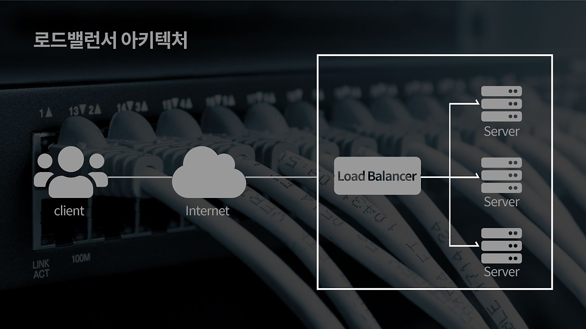
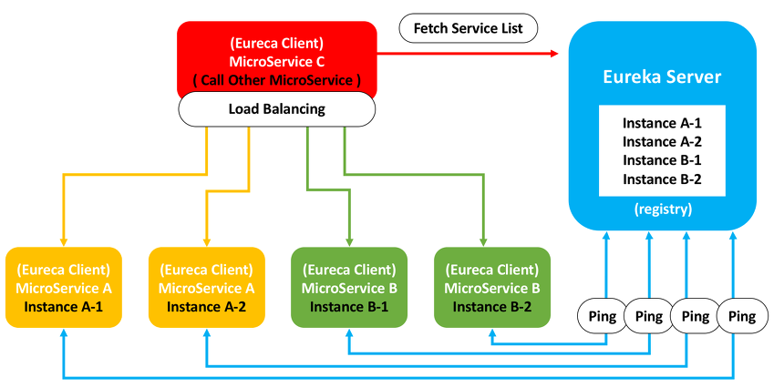
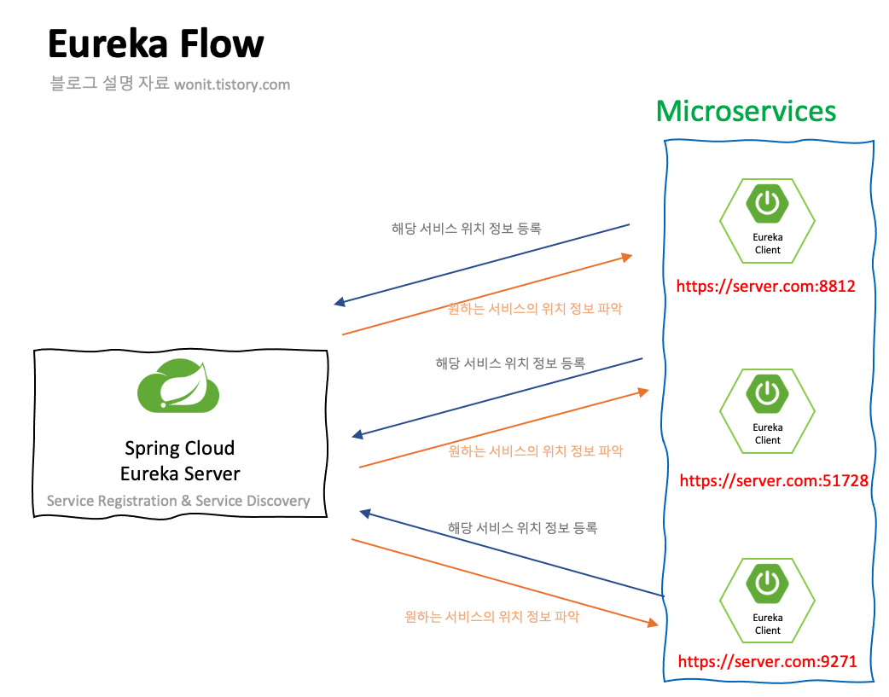
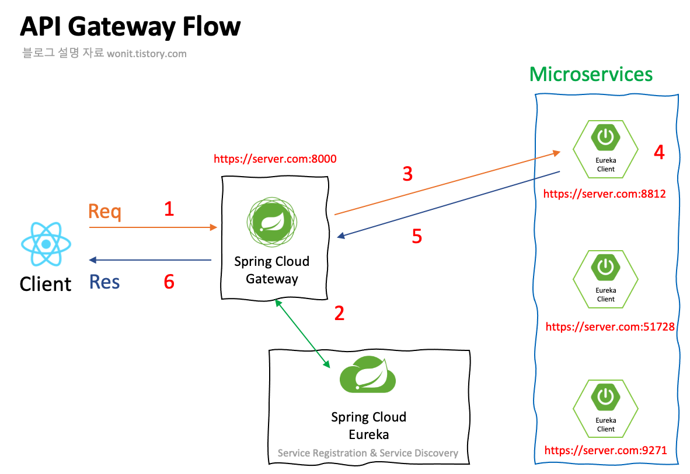

# Eureka 유레카

Eureka를 더 잘 이해하기 위해서는 LB(Load Balancer)가 무엇인지 먼저 알아야 한다.

## LB(Load Balancer)

많은 서비스들은 인터넷을 이용한다. SNS, 카카오톡 메신저, 유튜브 시청, 검색 등 거의 모든 동작이 인터넷을 통하여 해당 회사 서버로부터 응답 값을 받게 된다.

이 때, 회사 서버가 하나라면 수십억의 요청에도 과연 버틸 수 있을까?

버티기 쉽지 않다. 서버가 마비가 될 것이 뻔하다.

그러기 위해 회사는 많은 서버를 준비하고, 이렇게 많은 서버의 트래픽을 골고루 분산하기 위해 배분해줄 기술이 필요하다. 이 때 사용하는 것이 **LB**이다.

## LB는 어떻게 작동하는가?

LB는 특정 서버에 어떻게 트래픽을 배정할 수 있는가?

LB는 MSA의 각 모듈에 대한 연결 정보(ip, port, hostname)를 알아야한다. 우리는 그런 각 모듈의 연결 정보를 LB에 등록해야 한다.

그러면, CI/CD를 수행하면서 업그레이드 되는 각 모듈의 연결 정보가 바뀔 것인데 계속 LB에 정보를 새롭게 등록해야 하는가?

그래서 Eureka라는 기술이 등장하게 된 것이다.

## Eureka란?

Eureka는 Nefilx에서 제공한 MSA를 위한 클라우드 오픈 소스이다.

> Eureka는 LB와 Middle-tier server에 에러 대응을 위한 Rest 기반 서비스이다.
> 

### Spring Cloud Netflix

> Netflix는 2007년 심각한 DB손상으로 3일간 서비스 장애를 겼었는데, 이에 운영진들과 기술 리더들은 **신뢰성 높고 수평확장이 가능한 Cloud System으로** 이전을 해야 함을 느꼈었다고 한다. 그리고 결국 MSA를 7년만에 완벽하게 이전하게 되었는데, 이 때 쌓은 경험치를 바탕으로 MSA 기술을 Spring에게 오픈소스로 풀게 되었다.
> 

Spring Cloud Netflix는 Spring Boot Application에 대한 통합 환경 구성을 지원하는 Netflix OSS 서비스 이다.

### Netflix OSS의 Eureka

Netflix OSS에는 다양한 서비스들이 존재하지만 그 중에서도 가장 자주 애용하는 Eureka에 대해 알아보자

- Eureka : Discovery Server
    - 각각의 서비스 인스턴스들이 동적으로 확장, 축소 되더라도 인스턴스의 상태를 하나의 서비스로 관리할 수 있는 서비스

### Eureka의 개념

- Service Discovery
    - 각각의 서비스의 위치가 등록된 서버에서 특정 작업을 위한 서버의 위치를 파악하는 작업
- Service Registry
    - 각각의 서비스가 자신의 위치(IP) 정보를 특정 서버에 등록 Registry 하는 작업

## Service Discover 과정

1. Service Registry 기능을 할 Eureka Server가 최초에 가동
2. Service Registry 서버인 Eureka Server에 등록될 서비스들을 가동
    1. 여기서 등록 된 서비스는 Eureka Client
3. Eureka 서버는 자신에게 등록된 Eureka Client에게 30초마다 Ping을 보내며 Health Checking을 수행한다.
4. 만약 30초마다 보내는 Heart Heat가 일정 횟수 이상으로 동작하지 않으면 Eureka Server는 해당 Client를 삭제한다.

Eureka는 단지 서비스의 위치만을 표현하는 역할로 보통 **Spring Cloud Gateway**나 Netflix Zuul과 같은 Gateway 서비스나 Ribbon 같은 클라이언트 사이드 로드밸런서와 함께 동작한다.

## 실습

Spring Boot를 이용하여 Eureka Server와 Client를 구성한다.

실습과정에는 2개의 서비스와 1개의 Service Discovery 서버를 가용할 것이다.

- Service Discovery Server(Eureka)
    - Discovery Application
        - Spring Cloud Eureka-Server

- Microservices
    - UserService
        - Spring Cloud Eureka-Client
    - OrderService
        - Spring Cloud Eureka-Client

### Spring Cloud Eureka Server

- 프로젝트 생성
- 의존성 추가
- application.yml 작성
- DiscoveryApplication에 `@EnableEurekaServer`등록
- Eureka Dashboard

### 프로젝트 생성

추후 작성

### Spring Cloud Eureka Client

- 프로젝트 생성
- 의존성 추가
- application.yml 작성
- UserApplication, OrderApplication에 `@EnableDiscoveryClient` 어노테이션 추가
- 각 서버의 Controller 생성

### 프로젝트 생성

추후 작성

## 결론

- MSA의 각 모듈이 서로 정보를 주고 받을 때 사용
- 하지만 정보를 얻기 위해선 각 URL과 포트번호 등이 필요함
- 그런 상황에서 도움이 될 수 있는 고급 설정 기법들이 있음

## 참조

- [https://wonit.tistory.com/495](https://wonit.tistory.com/495)
- [https://velog.io/@jkijki12/Eureka란](https://velog.io/@jkijki12/Eureka%EB%9E%80)
- [https://happycloud-lee.tistory.com/210](https://happycloud-lee.tistory.com/210)
- [https://sabarada.tistory.com/61](https://sabarada.tistory.com/61)