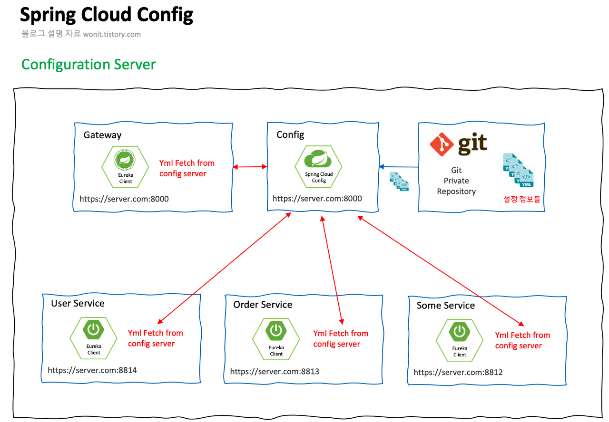
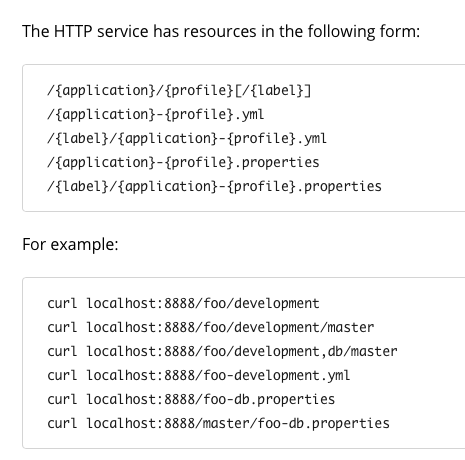

# Spring Cloud Config

## Spring Cloud Config란?

[Spring Cloud Config Docs](https://cloud.spring.io/spring-cloud-config/reference/html/)에 따르면

> Spring Cloud Config **provides server-side and client-side support for externalized configuration in a distributed system.** With the Config Server, you have a central place to manage external properties for applications across all environments.
> 

> Spring Cloud Config는 분산 시스템(마이크로 서비스)에서 외부 설정 정보 (application.yml 등)을 위한 서버와 클라이언트를 제공한다.
> 

Spring Cloud Config는 서버가 **설정 정보를 모아서 저장하고 뿌려주는 주체**가 되고, 클라이언트는 **서버에서 뿌려주는 설정 정보를 받아 이용**하는 개념이다.

## Config File 관리

Spring Cloud Config에서는 설정 정보들을 다양한 방식으로 관리한다.

- FTP
- native file system
- Local Git Stage
- Git Hosting Service(Github, Gitlab)

하지만 기본적으로 Spring Cloud Config는 Git을 이용하는 것을 권장하고 있고 default가 Git으로 연결한다.

## Spring Cloud Config Architecture

1. 각각의 설정 정보들을 빼서 하나의 github repo로 업로드
2. Config 서버와 remote 서버(github repository) 연결
3. Remote 서버와 local git stage를 서로 연결하고 push
4. 각각의 Application 서버는 설정 정보를 Config 서버에게 요청

## Spring boot의 외부 설정 관리 방법

Spring boot application이 빌드되고 실행될 시점에 가장 먼저 application.yml 이나 application.properties 파일을 찾고, 해당 파일에 기술된 내용을 토대로 외부 설정을 주입하게 된다.

만약 **테스트 환경과 Production 환경에서 쓰일 설정을 다르게 하고 싶다면??**

예를 들어 Test 환경에서는 데이터베이스를 가볍게 돌아가는 h2로 구성하고 싶고, Production 환경에서는 안정적인 Maria db를 사용한다고 하자.

각각의 설정 파일에 들어갈 설정 정보를 환경에 따라서 각기 다른 내용으로 입력하면 되지만, 그 방법은 매우 원시적인 방법이다.

이런 상황을 조금 더 우아하게 설정 정보를 교체할 수 있는 방법이 바로 **Spring Profiles**이다.

### Spring Profiles란?

**애플리케이션의 설정을 하고 특정 환경에서만 돌아가게 하는 것**을 의미한다.

Spring Profiles를 이용한다면 Application이 실행되는 환경에 따라서 다른 Bean 들을 매핑할 수 있게 한다.

## Spring Cloud Config에서 각기 다른 설정 정보 가져오기

어떻게 Spring Cloud Config에서는 적절한 서비스에 적절한 정보를 가져오는 것인가?

정답은 **URL**이다.

Spring Cloud Config는 외부 설정 파일의 3가지 정보(name, profiles, label)를 URL경로에 따라서 구분지어놓았다.

만약 application.yml 파일이 설정 정보에 존재한다면 Global하게 적용된다.

즉, 설정 정보를 가져가는 모든 URL에 application.yml이 적용된다는 것이다.

### 예시

예를 들어 다음과 같은 설정 파일이 존재한다고 하자.

각각의 name과 profiles 정보로 나눌 수 있다.

- application.yml
    - name : none
    - profiles : none
- user-service.yml
    - name : user-service
    - profiles : default
- user-service-test.yml
    - name : user-service
    - profiles : test
- user-service-prod.yml
    - name : user-service
    - profiles : profiles
- order-service-prod.yml
    - name : order-service
    - profiles : prod

어떤 URL로 호출해야 적절한 정보가 나올까?

> Config 서버에서 name이 user가 될 수 있고 user-service가 될 수도 있으며, user-service-test도 될 수 있다. 이를 정하는 것은 각자의 역량이나 우선 user-service라고 가정하고 진행해보자.
> 

이와 같은 형태의 URL로 호출할 수 있다.

### 순서

1. Git Remote Repository 생성 & Local Git 저장소 생성
2. 설정 파일 추가
3. Config Server에서 Git URL 연결
4. User-Service에서  Config Server로 부터 받은 설정 파일 이용

내용은 [https://wonit.tistory.com/503](https://wonit.tistory.com/503)를 참조하면 좋다.

## 참조

- [https://wonit.tistory.com/502](https://wonit.tistory.com/502)
- [https://wonit.tistory.com/503](https://wonit.tistory.com/503)
- [https://wonit.tistory.com/504](https://wonit.tistory.com/504)
- [https://wonit.tistory.com/505](https://wonit.tistory.com/505)