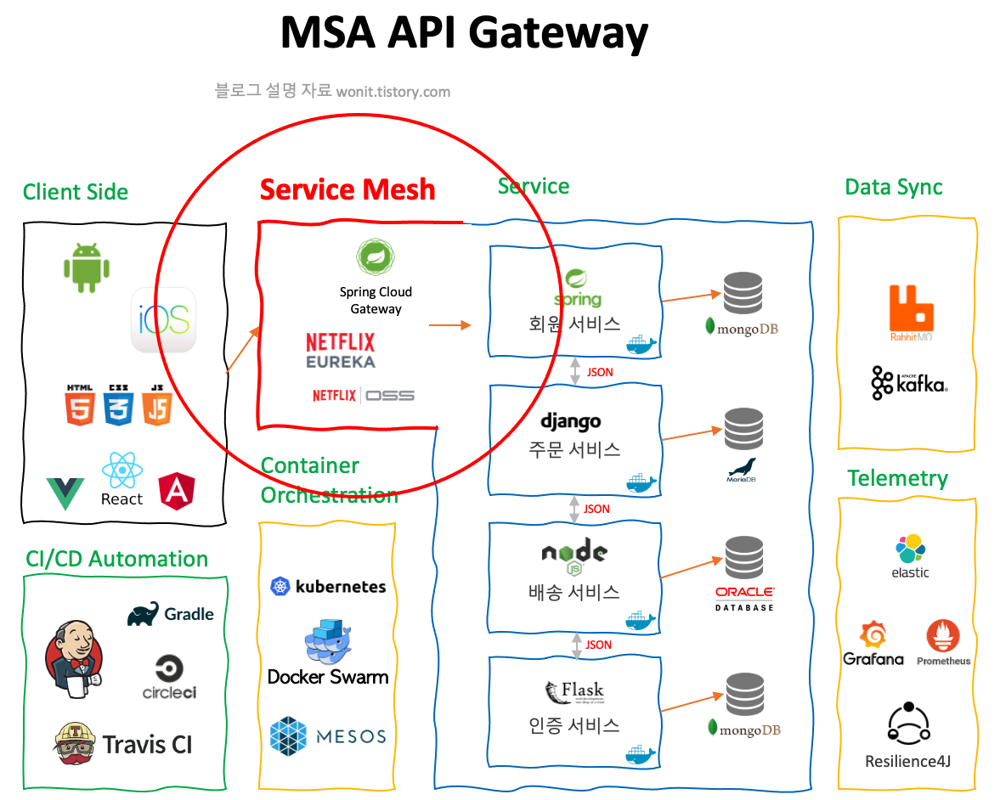
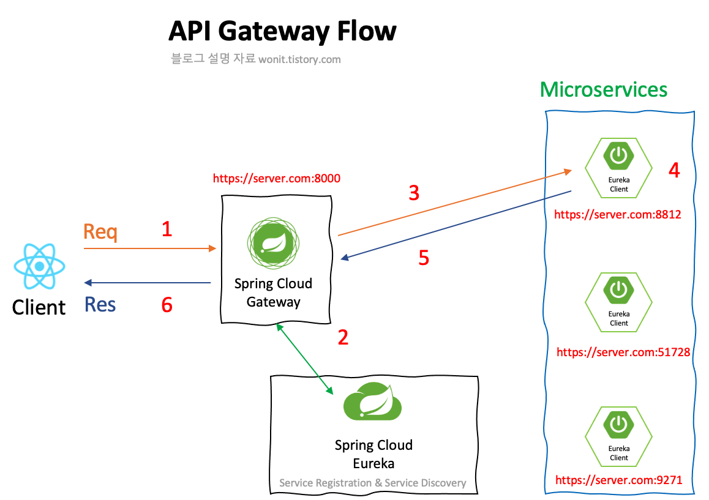
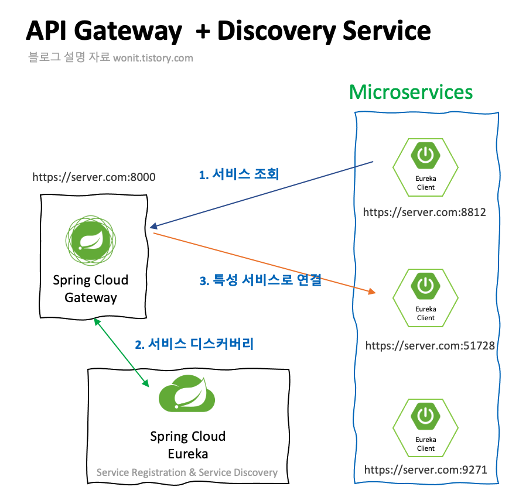
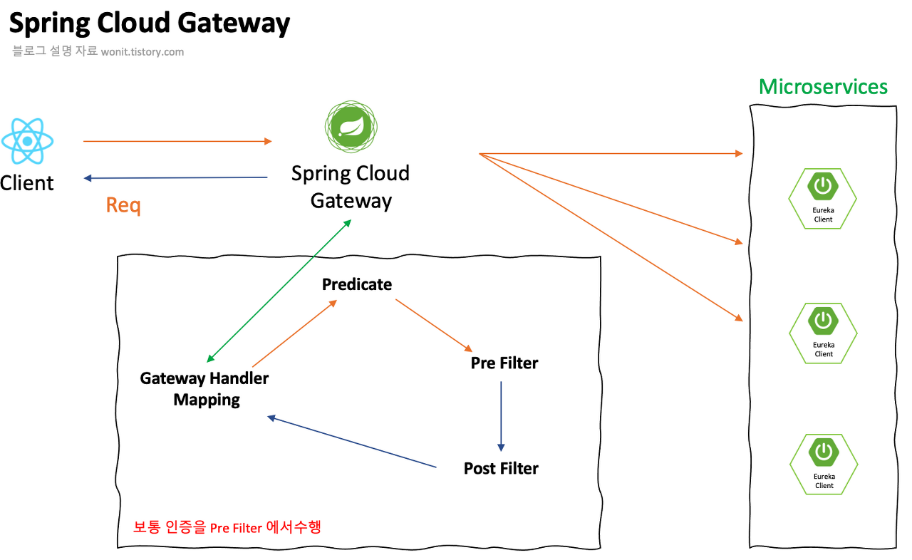

# Spring Cloud Gateway

Spring Cloud Gateway를 더 잘 이해하기 위해서는 API Gateway가 무엇인지 먼저 알아야 한다.

추후 API Gateway에 대해 업로드 할 수 있도록 하겠다.

## API Gateway



> API Gateway는 RESTful 하게 작성된 모든 서비스의 API를 손쉽게 관리하여 인증을 통한 자원의 효율적인 분배를 수행하는 기능이다.
> 

MSA는 서비스를 여러 개의 프로젝트로 분리한다고 기술하였다. 👉 [참조](https://www.notion.so/MSA-Stack-6200f48a2766467db34bf04bf807cf04)

그렇다면 웹 브라우저에서 요청된 사용자의 정보는 어떤 서비스가 맡아야 적절할까?

답은 당연하게도 **적절한 서비스**이다.

<aside>
💡 해당 요청이 어떻게 적절한지 판단을 할까?

</aside>

<aside>
💡 모든 서비스의 요청에는 **공통된 인증 과정을 수행**해야 하는데, 어디서 수행해야 할까?

</aside>

<aside>
💡 인증 서버를 따로 두어야하나?

</aside>

<aside>
💡 API의 모든 요청에 대한 로그 파일을 작성하고 싶다면 각 서비스마다 로깅 서버를 두어야 하나?

</aside>

여기서 등장하는 것이 바로 **API Gateway**이다.

공통된 과정을 비효율적인 작업으로 수행해야 하는 것을 API Gateway를 통하여 **하나의 프로젝트**에서 관리할 수 있게 한다.

## API Gateway의 동작 방식



API Gateway는 하나의 모든 클라이언트의 요청이 하나의 서버로 들어와 해당 서버에서 요청이 정제되거나 조작되어 **각자 목적에 맞는 서비스를 찾아가도록** 도와주는 방식이다.

그리고, 각 서버에서 적절한 로직을 수행한 뒤 발생하는 응답 데이터를 모아 사용자에게 분배해주는 역할을 한다.

## API Gateway의 역할

1. 프록시의 역할과 로드밸런싱
2. 인증 서버로서의 기능
3. 로깅 서버로서의 기능

위의 동작 과정에서 **모든 데이터가 하나의 서버로 전송**되므로 해당 서버에서는 **인증을 수행하기도 하고 로깅**을 수행하기도 한다.

## API Gateway의 고려사항

- 병목 현상
    
    <aside>
    💡 병목 현상 : 전체 시스템의 성능이나 용량이 하나의 구성 요소로 인해 제한을 받는 현상
    
    </aside>
    
    - API Gateway는 가장 앞단에서 많은 서비스의 요청될 수 있는 트래픽을 감당
    - API Gateway는 적절한 Scale-Out을 수행하지 않으면 많은 위험이 발생
- 네트워크 Latency
    
    <aside>
    💡 네트워크 Latency : 하나의 데이터 패킷을 한 지점에서 다른 지점으로 보내는데 소요되는 시간
    
    </aside>
    
    - API Gateway는 네트워크를 한 번 더 거쳐 네트워크 지연 현상이 발생 가능

## 왜 API Gateway?

> User-Service(8812 포트)에서 login을 수행하고 Order-Service(51728 포트)에서 상품을 주문한 뒤, Delivery-Service(9271 포트)에서 배달 주문을 수행한다.
> 

위의 Flow 대로라면 해당 주문과 배달을 위해 각각의 MicroService들은 다른 Service들의 포트를 모두 알고 있어야 한다. 만약 포트가 바뀐다면 포트가 바뀐 서버를 제외한 모든 서버는 **바뀐 포트의 번호를 수정하고 다시 빌드 → 배포**를 해야 하는 상황이다.

모든 마이크로 서비스를 호출할 때 포트를 신경 쓰지 않아도 된다면 매우 편할 것이다.

이를 위해 Spring Gateway가 등장하였다.



위의 예시를 Spring Cloud Gateway를 적용 시켰다고 가정하자.

1. User 서버는 Order 서버에 보내야 할 요청을 Gateway로 전달
2. Gateway는 Eureka Server로 Order 서버의 정보 discovery
3. Gateway가 Order Server로 연결

### 이렇게 한다면 장점이 무엇인가?

- 각각의 마이크로 서비스들은 서로의 포트 번호를 몰라도 된다.
- Front 에서는 요청을 Gateway로만 보내면 되기 때문에 Gateway 포트만 알면 모든 요청을 수행할 수 있다.
- 모든 요청은 Gateway를 거치기 때문에 로그를 쉽게 다룰 수 있다.
- Gateway가 요청의 진입점이므로 통합 인증을 수행할 수 있다.

## Spring Cloud Gateway

> Spring Cloud Gateway aims to provide a simple, yet effective way to route to APIs and **provide cross cutting concerns** to them such as: **security, monitoring/metrics, and resiliency.**
> 

Spring Cloud Gateway(SCG)는 간편하면서도 효과적인 API 라우팅 방법을 제공하고, 보안 모니터링, 메트릭, 복원력 문제를 해결하는 것을 목표로 한다.

### Spring Cloud Gateway에서 사용하는 3가지 용어

- Route
    - 목적지의 URI와 Predicates라는 조건들의 목록 그리고 필터들을 이용하여 어떤 곳으로 Routing 할 것인지 명시
    - Routes에 대한 속성과 정보를 입력하여 동작 지시
- Predicate (조건)
    
    ```yaml
    predicated: -Path=/user/**
    ```
    
    - user이라는 모든 경로를 지정
- Filter
    - 들어오는 요청과 응답을 특정 필터를 타게 함으로 원하는 방식으로 요청을 보내거나 헤더를 조작 가능
    - 해당 필터를 이용해서 로그 파일을 작성할 수 있음

## Spring Cloud Gateway의 구조



1. Client는 Spring Cloud Gateway에 요청
2. Gateway Handler Mapping 에서 해당 요청에 대한 Route와 Predicates 일치 판단
3. Gateway Web Handler에게 해당 요청 매핑
4. Handler 에서 Filter Chain을 이용하여 사전 필터 혹은 사후 필터로 나누어 동작
5. 필터링이 된 후 실제 마이크로 서비스에 전달

## Spring Cloud Gateway 내부 들여다보기

- Gateway Handler Mapping
    - Gateway가 Client로 부터 어떤 요청이 왔는지 확인 후 Mapping 작업 수행
- Predicate
    - Handler Mapping 시 필요한 URI 정보, Path 정보를 확인하는 주체
- Filter
    - Handler Mapping이 된 후 들어온 요청에 대한 필터 작업 수행
        - Pre Filter
            - 특정 작업이 일어나기 전에 지정
        - Post Filter
            - 특정 작업이 끝난 후에 지정
    - 필터 정보는 yml, yaml 설정 파일에도 정의할 수 있고 java code에서도 정의 가능

## 실습

이전 [Eureka](https://www.notion.so/Eureka-905caa6b7e524f679cf75c6b1c85490e)에서 설명했던 예시로 

## 결론

- API Gateway는 URI별 각기 다른 서비스를 호출하는 기능 소유
- Eureka Server에서 각각 인스턴스 정보를 받아 로드밸런싱 수행
- 포트가 여러 개로 나뉘거나 URI 정보가 변경되더라도 Gateway에서는 알 필요 없음

## 참조

- [https://twofootdog.tistory.com/64](https://twofootdog.tistory.com/64)
- [https://happycloud-lee.tistory.com/218](https://happycloud-lee.tistory.com/218)
- [https://wonit.tistory.com/489](https://wonit.tistory.com/489)
- [https://wonit.tistory.com/497](https://wonit.tistory.com/497)
- [https://bcho.tistory.com/1005](https://bcho.tistory.com/1005)