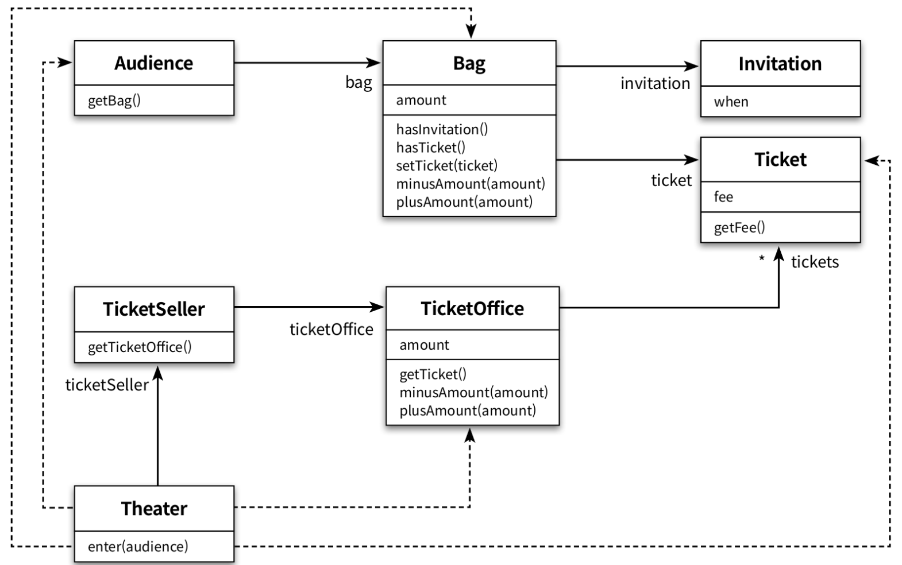
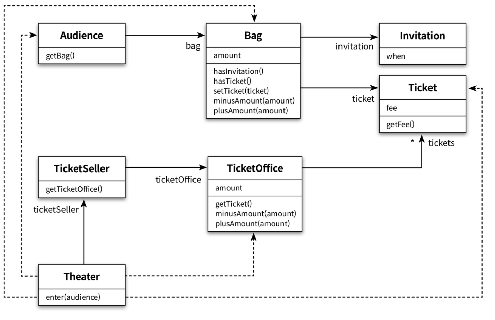
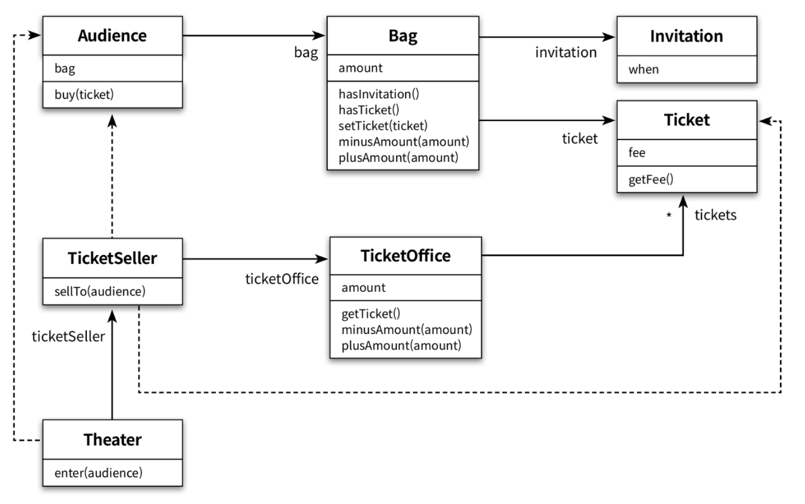

# Chapter 1. 객체, 설계

대부분의 사람들은 이론이 먼저 정립된 후에 실무가 그 뒤를 따라 발전한다고 생각한다.

하지만 로버트 L. 글래스(Robert L. Glass)는 그 반대라고 주장한다.

실무가 먼저 발전하고 난 다음에 실무의 실용성을 입증할 수 있는 이론이 그 모습을 갖춰지기 시작하고,

해당 분야가 충분히 성숙해지는 시점에 이론이 실무를 추월하게 된다고 한다.

예로 소프트웨어 역사를 보면 수많은 소프트웨어 설계 개발과 소프트웨어 유지보수가 있었는데

대부분의 설계 원칙과 개념은 실무에서 반복적으로 적용되던 기법들을 이론화 한것이 대부분이다.

따라서, 추상적인 개념이나 이론들을 앞세워 보는 것 보다 글래스의 주장을 믿고 실무를 먼저 보고 이해하는 것이 좋다고 한다.

## 1. 티켓 판매 애플리케이션 구현

> 여러분은 소극장의 홍보도 겸할 겸 관람객들의 발길이 이어지도록 작은 이벤트를 기획하기로 했다.
이벤트의 내용은 간단한데 추첨을 통해 선정된 관람객에게 공연을 무료로 관람할 수 있는 초대장을 발송하는 것이다.
드디어 기다리던 공연 날이 밝았다.
소극장 앞은 초대장 당첨자들과 표를 구매하려는 관람객으로 장사진을 이루고 있다.
이제 소극장의 문을 열어 오랜시간 공연을 기다려온 관람객들을 맞이하자.
> 

### 코드 작성

코드 외 내용은 생략하겠다. 코드는 클래스단위로 작성되었다.

<details>
<summary>Invitation (초대장) - 초대일자가 써져있는 초대장이다.</summary>
<div markdown="1">

```java
/**
 * 이벤트 당첨자에게 발송되는 초대장.
 */
public class Invitation {
  private LocalDateTime when;
}

```

</div>
</details>

<details>
<summary>Ticket (티켓) - 초대장과 교환하거나, 사야한다.</summary>
<div markdown="2">

```java
/** 공연 관람 티켓. */
public class Ticket {
  @Getter
  private Long fee;

  public Ticket(Long fee) {
    this.fee = fee;
  }
}
```

</div>
</details>

<details>
<summary>Bag (가방) - 위에서 작성한 초대장, 티켓 그리고 현금을 가지고 있다. - 생성자를 통해서 초대장과 현금은 인스턴스를 생성할 때 설정하도록 제약을 강제해주었다.</summary>
<div markdown="3">

```java
/** 관람객이 소지품을 보관할 가방. */
public class Bag {
  @Getter
  private Long amount;
  private Invitation invitation;
  private Ticket ticket;

  /**
   * 이벤트에 당첨되지 않은 관람객. 초대장이 없다.
   *
   * @param amount 현금
   */
  public Bag(Long amount) {
    this.(null, amount);
  }

  /**
   * 이벤트에 당첨된 관람객. 현금과 초대장이 있다.
   *
   * @param amount     현금
   * @param invitation 초대장
   */
  public Bag(Long amount, Invitation invitation) {
    this.amount = amount;
    this.invitation = invitation;
  }

  /** 관람객이 초대장을 갖고 있다면 true 를 리턴한다. */
  private boolean hasInvitation() {
    return invitation != null;
  }

  /** 관람객이 티켓을 갖고 있다면 true 를 리턴한다. */
  public boolean hasTicket() {
    return ticket != null;
  }

  private void setTicket(Ticket ticket) {
    this.ticket = ticket;
  }

  /** 현금을 감소시킨다. */
  private void minusAmount(Long amount) {
    this.amount -= amount;
  }

  /** 현금을 증가시킨다. */
  private void plusAmount(Long amount) {
    this.amount += amount;
  }
}
```

</div>
</details>

<details>
<summary>Audience (관람객) - 관람객은 소지품을 보관하기 위해 가방을 소지할 수 있다.</summary>
<div markdown="4">

```java
/** 관람객. */
public class Audience {
  private Bag bag;

  public Audience(Bag bag) {
    this.bag = bag;
  }

  public Long buy(Ticket ticket) {
    return bag;
  }
}
```

</div>
</details>

<details>
<summary>TicketOffice (매표소) - 초대장을 티켓으로 교환하거나 구매할 수 있어야 한다. - 따라서 티켓과 티켓의 판매 금액이 필요하다.</summary>
<div markdown="5">

```java
/** 매표소. */
public class TicketOffice {
  /** 매표소에서 판매한 모든 티켓의 금액. */
  private Long amount;
  /** 매표소에서 판매하거나 초대장과 교환해 줄 티켓의 목록. */
  private List<Ticket> tickets = new ArrayList<>();

  public TicketOffice(Long amount, List<Ticket> tickets) {
    this.amount = amount;
    this.tickets.addAll(Arrays.asList(tickets));
  }

  /** 판매할 티켓을 꺼내준다. */
  private Ticket getTicket() {
    // 편의상 티켓 컬렉션에서 첫 번째 위치에 저장된 티켓을 리턴한다.
    return tickets.remove(0);
  }

  /** 판매 금액을 차감한다. */
  private void minusAmount(Long amount) {
    this.amount -= amount;
  }

  /** 판매 금액을 더한다. */
  private void plusAmount(Long amount) {
    this.amount += amount;
  }
}
```

</div>
</details>

<details>
<summary>TicketSeller (판매원) - 초대장을 티켓으로 교환해주거나 티켓을 판매한다.</summary>
<div markdown="6">

```java
/** 티켓 판매원. */
public class TicketSeller {
  private TicketOffice ticketOffice;

  /** 티켓 판매원은 자신이 일하는 매표소를 알고 있어야 한다. */
  public TicketSeller(TicketOffice ticketOffice) {
    this.ticketOffice = ticketOffice;
  }

  /** 티켓을 관람객에게 판매한다. */
  public TicketOffice getTicketOffice() {
    return ticketOffice;
  }
}
```

</div>
</details>

작성한 클래스들의 관계는 아래의 UML 다이어그램처럼 이루어져 있다.



이제 준비는 끝났다. 위 클래스들을 조합해서 관람객을 소극장에 입장시키는 로직을 만들면 된다.

Theater (소극장) - 관람객을 맞이할 수 있다.

```java
/** 극장. */
public class Theater {
  private TicketSeller ticketSeller;

  public Theater(TicketSeller ticketSeller) {
    this.ticketSeller = ticketSeller;
  }

  /**
   * 관람객을 맞이한다.
   *
   * @param audience 관람객
   */
  public void enter(Audience audience) {
    /** 1. 관람객의 가방에 초대장이 들어 있는지 확인한다. */
    /** A. 초대장이 들어있다면 */
    if (audience.getBag().hasInvitation()) {
      /** A-1. 판매원에게서 매표소의 티켓을 가져오게하여 */
      Ticket ticket = ticketSeller.getTicketOffice().getTicket();
      /** A-2. 관람객의 가방에 티켓을 넣어준다. */
      audience.getBag().setTicket(ticket);
    } else {
      /** B-1. 판매원에게서 매표소의 티켓을 가져오게 하여 */
      Ticket ticket = ticketSeller.getTicketOffice().getTicket();
      /** B-2. 관람객의 가방에서 티켓만큼 돈을 차감하고 */
      audience.getBag().minusAmount(ticket.getFee());
      /** B-3. 판매원을 통하여 매표소의 잔고를 티켓값만큼 증가시킨다. */
      ticketSeller.getTicketOffice().plusAmount(ticket.getFee());
      /** B-4. 관람객의 가방에 티켓을 넣어준다. */
      audience.getBag().setTicket(ticket);
		}
  }
}
```

## 2. 무엇이 문제인가

로버트 마틴은 <<클린 소프트웨어 : 애자일 원칙과 패턴, 그리고 실천 방법>>에서 소프트웨어 모듈이 가져야 하는 세 가지 기능에 관해 설명한다. 여기서 모듈이란 크기와 상관 없이 클래스나 패키지, 라이브러리와 같이 프로그램을 구성하는 임이의 요소를 의미한다.

모든 소프트웨어 모듈에는 세 가지 목적이 있다.

- 실행 중에 제대로 동작
- 간단한 작업만으로도 변경 가능
- 개발자가 쉽게 읽고 이해할 수 있어햐 할 것

앞에서 작성한 프로그램은 관람객들을 입장시키는 데 필요한 기능을 오류 없이 정확하게 수행하고 있다. 따라서 제대로 동작한다는 제약은 만족시킨다.

하지만 변경 용이성과 읽는 사람과의 의사소통이라는 목적은 만족시키지 못한다. 지금부터 그 이유를 살펴보자.

### 예상을 빗나가는 코드

작성한 코드의 문제를 살펴본다.

시나리오를 보면

- 관람객의 가방을 열어서 초대장을 가지고 있는지 확인한다.
- 초대장이 있다면 판매원은 티켓을 꺼내고 관람객의 가방에 넣어준다.
- 아닐 시 판매원은 돈을 받고 매표소에 적립 후, 티켓을 꺼내 관람객의 가방에 넣어준다.

현재 코드의 문제점은 **이러한 과정을 전부 다 소극장에서 한다는 것**이다.

Theater 클래스의 enter 메소드를 다시 한번 봐보자.

```java
/** 극장. */
public class Theater {
  private TicketSeller ticketSeller;

  public Theater(TicketSeller ticketSeller) {
    this.ticketSeller = ticketSeller;
  }

  /**
    * 관람객을 맞이한다.
    *
    * @param audience 관람객
    */
  public void enter(Audience audience) {
    /** 1. 관람객의 가방에 초대장이 들어 있는지 확인한다. */
    /** A. 초대장이 들어있다면 */
    if (audience.getBag().hasInvitation()) {
      /** A-1. 판매원에게서 매표소의 티켓을 가져오게하여 */
      Ticket ticket = ticketSeller.getTicketOffice().getTicket();
      /** A-2. 관람객의 가방에 티켓을 넣어준다. */
      audience.getBag().setTicket(ticket);
    } else {
      /** B-1. 판매원에게서 매표소의 티켓을 가져오게 하여 */
      Ticket ticket = ticketSeller.getTicketOffice().getTicket();
      /** B-2. 관람객의 가방에서 티켓만큼 돈을 차감하고 */
      audience.getBag().minusAmount(ticket.getFee());
      /** B-3. 판매원을 통하여 매표소의 잔고를 티켓값만큼 증가시킨다. */
      ticketSeller.getTicketOffice().plusAmount(ticket.getFee());
      /** B-4. 관람객의 가방에 티켓을 넣어준다. */
      audience.getBag().setTicket(ticket);
    }
  }
}
```

위의 코드를 이해하기 위해서는 여러가지 세부적인 내용들을 한꺼번에 기억하고 있어야 한다.

- Audience가 Bag을 가지고 있어야 하고
- Bag 안에는 현금과 티켓이 들어있으며
- TicketSeller가 TicketOffice에서 티켓을 판매하고
- TicketOffice안에 Ticket과 현금이 보관되어 있다.

위의 4개의 사실을 전부 다 알고 있어야하고, 티켓이 어떻게 교환되는지에 대한 일련의 과정을 전부 다 알고있어야 코드를 이해할 수 있다. 이것은 코드를 작성하는 사람과 읽는 사람 모두에게 큰 부담을 준다.

작성하는 사람과 읽는 사람 모두에게 큰 부담을 준다.

**가장 심각한 것은 Audience와 TicketSeller를 변경할 경우 Theater도 같이 변경해야 한다는 점이다.**

## 변경에 취약한 코드

위에 말한 것 처럼 변경에 매우 취약하다는 것이다.

이 코드는 관람객이 가방을 꼭 들고다녀야한다. 이러한 제약에서 벗어나기 위해 코드를 수정하는 순간 코드를 전체적으로 손봐야 한다.

이처럼 Audience의 영향을 받는 Theater를 보고, **Theater가 Audience에 의존**한다고 표현한다.

이러한 **의존성(dependency)**이 높아질 수록 코드는 수정하기 어려워진다. 의존성이라는 말 속에는 **어떤 객체가 변경될 때 그 객체에게 의존하는 다른 객체도 함께 변경될 수 있다**는 사실이 내포돼 있다.

그렇기에 우리는 불필요한 변경을 피하기 위해서 **객체간의 최소한의 의존성만 유지해야한다.**

이것은 Theater를 추가한 UML이다. 이처럼 의존성이 과한 경우를 **결합도(coupling)가 높다**고 한다.



## 3. 설계 개선하기

이제 객체간의 결합도를 낮추고 응집도를 높일 수 있도록 개선할 것이다.

각각의 클래스들을 **자율적인 존재**로 만드는 것이다.

- 각각의 클래스가 자기 할 일을 클래스 내에서 처리한다.
- 의존하는 클래스에서 이 클래스가 무슨 로직으로 돌아가는지는 알 수 없게 최대한 **캡슐화**한다.
    - ex) Theater에서 TicketSeller가 내부에 TicketOffice 인스턴스를 포함하는 사실을 알 수 없게 한다.

판매원은 아래의 기능을 하면 된다.

- 매표소에서 티켓을 가져온다.
- 관객에게 티켓을 판다.
- 매표소에 티켓 판 돈을 적립한다.

위 세가지 사항에 주의하며 코드를 수정해보겠다.

일단 Theater에서 enter 메소드에서 티켓과 관련된 모든 내용을 TicketSeller로 옮기자.

TicketSeller에 SellTo라는 메소드를 추가해주고 이 메소드를 enter메소드에서 접근하겠다.

```java
public class TicketSeller {
  private TicketOffice ticketOffice;

  public TicketSeller(TicketOffice ticketOffice) { ... }

  public TicketOffice getTicketOffice() {
    return ticketOffice;
  }

  public void sellTo(Audience audience) {
    if (audience.getBag().hasInvitation()) {
      Ticket ticket = ticketOffice.getTicket();
      audience.getBag().setTicket(ticket);
    } else {
      Ticket ticket = ticketOffice.getTicket();
      audience.getBag().minusAmount(ticket.getFee());
      ticketOffice().plusAmount(ticket.getFee());
      audience.getBag().setTicket(ticket);
    }
  }
}
```

```java
public class Theater {
  private TicketSeller ticketSeller;

  public Theater(TicketSeller ticketSeller) {
    this.ticketSeller = ticketSeller;
  }

  public void enter(Audience audience) {
    ticketSeller.sellTo(audience);
  }
}
```

이제 Theater에서는 ticketSeller에만 접근을 하고있다.

그리고 TicketSeller를 한번 살펴보자. **getTicketOffice()가 사라졌다.**

해당 메소드가 없어져서, 외부에서 TicketSeller를 통해서 ticketOffice에 접근할 수 없게 되었다.

따라서 TicketSeller는 TicketOffice에서 티켓을 꺼내거나 판매 요금을 적립하는 일을 스스로 수행해야만 한다.

여기서 더 나아가서 생각해보자.

현재 판매원은 관람객의 가방에 직접 접근하여 티켓을 넣어주고 있다.

관람객이 직접 티켓을 사서 가방에 티켓을 넣을 수 있게 캡슐화를 개선해보자.

- 초대장유무에 따라 가방에서 현금(티켓값 or 0원)을 꺼내서 판매원에게 주고 티켓을 받는다.
- 받은 티켓을 가방에 넣는다.

그렇다면 우리가 해야할 일은 다음과 같다.

- Audience에게 Ticket을 사는 Buy()를 추가해주자.
- TicketSeller에서 Bag에 접근하는 코드를 Buy()로 옮겨주자.
- TicketSeller의 SellTo()를 통해 매표소의 잔액을 올리게 해주자.

```java
public class Audience {
  private Bag bag;

  public Audience(Bag bag) { ... }

  public Bag getBag() {
    return bag;
  }

  public Long buy(Ticket ticket) {
    if (bag.hasInvitation()) {
      bag.setTicket(ticket);
      return 0L;
    } else {
      bag.setTicket(ticket);
      bag.minusAmount(ticket.getFee());
      return ticket.getFee();
    }
  }
}
```

```java
/** TicketSeller의 sellTo 메소드 */
public void sellTo(Audience audience) {
  ticketOffice.plusAmount(audience.buy(ticketOffice.getTicket());
}
```

Audience를 보면 getBag()이 지워져있다. 가방은 관람객만 접근하면 되므로 지워주었다.

TicketSeller 또한 매표소에 돈을 적립하고 티켓을 가져오기만 한다.

관람객이 티켓을 산다는 사실만 알 뿐, 사고나서 무엇을 하는지는 알 수 없다.

지금까지의 진행상황을 UML로 표현하면 다음과 같다.



하지만 아직도 Audience가 Bag에 직접 접근하고 있다. 관람객은 티켓을 사기 위해 가방에게 돈을 달라고만 하면 된다. **(사실 돈 또는 초대장을 판매원에게 보내야하지만, 초대장의 유무를 판별하는 것 또한 가방에게 넘겨주겠다.)**

거의 다왔다. 이제 Bag 또한 자율적인 존재로 만들어주자. 관람객의 가방에 티켓과 돈을 건내주고 가방이 티켓을 알아서 넣어놓게 하자. 이것을 하기위해 hold()를 추가할 것이다.

```java
public class Bag {
  private Long amount;
  private Invitation invitation;
  private Ticket ticket;

  public Bag(Long amount) { ... }
  public Bag(Invitation invitation, long amount) { ... }

  /** 돈이 없다면 티켓을 못사야하지만 일단 그러한 경우는 제외 */
  public long hold(Ticket ticket) {
    setTicket(ticket);
    if (hasInvitation()) {
      return 0L;
    } else {
      minusAmount(ticket.getFee());
      return ticket.getFee();
    }
  }

  private boolean hasInvitation() { ... }
  public boolean hasTicket() { ... }
  private void setTicket(Ticket ticket) { ... }
  private void minusAmount(long amount) { ... }
  public void plusAmount(long amount) { ... }
}
```

```java
/** Audience 클래스 */
public long buy(Ticket ticket) {
  return bag.hold(ticket);
}
```

처음의 코드는 Theater가 Audience와 TicketSeller가 어느 클래스와 연결되어 있는지 세세하게 알 수 있다. 하지만 지금의 코드는 그저 판매원이 티켓을 판다는 것만 알고 있다.

private으로 변경된 메소드는 굳이 제거하지 않은 이유는 앞으로 생길 코드의 중복을 제거하고 표현력을 높이기 위해서다.

마지막으로, TicketSeller를 보면 TicketOffice의 자율권을 침해한다.

매표소에 있는 티켓을 마음대로 꺼내서는 관람객에게 팔고나서 매표소의 돈을 직접 적립시켜준다.

이것 또한 수정해보자.

```java
/** TicketOffice 클래스 */
public void sellTicketTo(Audience audience) {
  plusAmount(audience.buy(getTicket()));
}

private Ticket getTicket() { ... }
private void plusAmount() { ... }
```

```java
/** TicketSeller 클래스 */
public void sellTo(Audience audience) {
  ticketOffice.sellTicketTo(audience);
}
```

결합도를 최대한 낮춰봤지만, 마지막에 TicketOffice와 audience 사이에 의존성이 추가되었다.

Audience에 대한 결합도와 TicketOffice의 자율성을 모두 만족시키는 방법이 이젠 잘 떠오르지 않는다. 이제 트레이드오프의 시점이 왔다.

TicketOffice의 자율성과 Audience에 대한 결합도를 낮추는 것 중에 어떤 것을 우선해야할 지 결정해야한다. 이제부터는 본인의 선택에 따라 어떤방식으로 설계를 할지 결정하면 된다.

> Theater, TicketOffice, Bag 처럼 현실에서는 수동적인 존재가 객체지향의 세계에 들어오면 모든것이 능동적이고 자율적인 존재로 바뀐다. 이처럼 능동적이고 자율적인 존재로 소프트웨어 객체를 설계하는 원칙을 **의인화(anthropomorphism)**라고 한다.
> 

### 절차지향과 객체지향

수정 전의 코드는

Theater에서 관람객을 입장시키기 위한 모든 절차를 구현했었다. 이 때의 Theater의 메서드는

**프로세스(Process)**이며, Audience, TicketSeller, Bag, TicketOffice는 **데이터(Data)**에 불과하다.

이처럼 프로세스와 데이터를 별도의 모듈에 위치시키는 방식을

**절차적 프로그래밍(Procedural Programming)**이라고 부른다.

수정 후의 코드를 보면

Theater는 오직 TicketSeller에만 의존한다. 물론 TicketSeller 입장에서는 Audience에 대한 의존성이 추가되었지만, 이것은 타협의 결과이다. 우리가 결합도를 계속해서 낮춰왔기 때문에 아직까지 의존성은 통제될 수 있는 수준이다.

이처럼 데이터와 프로세스가 동일한 모듈 내부에 위치하도록 하는 방식을 **객체지향 프로그래밍(Object-Oriented Programming)**이라고 부른다.

## 4. 객체지향 설계 설계가 왜 필요한가

설계란 코드를 배치하는 것과 같다.

우리가 코드를 변경하기 전과 후의 실행결과는 같다. 하지만 변경 전, 후의 설계는 다르다.

그렇다면 좋은 설계는 무엇일까?

프로그램은 요구기능을 온전히 수행해야하고 변경사항에 대해 매끄럽게 수용해야 한다.

변경을 수용할 수 있는 설계가 중요한 이유는 다음과 같다.

- 개발이 진행되는 동안 요구사항은 바뀔 수 밖에 없다.
- 요구사항이 바뀌면 코드가 수정된다.
- 코드가 수정되면 버그가 추가될 가능성이 높아진다.

### 객체지향 설계

따라서 우리가 원하는 코드는 변경에 유연하게 대응할 수 있는 코드다.

객체지향 프로그래밍은 의존성을 효율적으로 통제할 수 있는 다양한 방법을 제공함으로써 요구사항 변경에 좀 더 수월하게 대응할 수 있는 가능성을 높여준다. 객체지향은 우리가 예상하는 방식대로 객체가 행동하리라는 것을 보장함으로써 코드를 좀 더 이해하기 쉽게 해준다.

그러나 단순히 데이터와 프로세스를 객체라는 덩어리 안으로 밀어 넣었다고 해서 변경하기 쉬운 설계를 얻는 것은 아니다. 객체지향에서 애플리케이션은 객체들로 구성되며 애플리케이션의 기능은 객체들간의 상호작용을 통해 구현된다. 그리고 객체간의 상호작용은 객체 사이에 주고 받는 메시지로 표현된다. 마치 TicketSeller가 Audience에게 buy 메시지를 전송하듯이 말이다.

이처럼 객체들은 협력하는 과정 속에서 다른 객체에 의존하게 된다. TicketSeller가 Audience에 메시지를 전송하기 위해서는 Audience에 대해 알고 있어야 한다. 이러한 사전지식이 두 객체를 결합시키고 이 결합이 객체 사이의 **의존성을** 만든다.

다시 한번 강조하자면

**훌륭한 객체지향 서례란 의존성을 그냥 낮추는게 아니라, 의존성을 적절하게 관리하는 설계다!**

### 부가설명

캡슐화의 의의는 의존성(=결합도)를 낮추고 응집도를 올리는 것이다.

기능을 수정할 상황이 생기면 수정할 기능이 있는 모듈만 수정하면 되게 하는것이다.

즉 특정 기능을 구현할 때 필요한 데이터(=변수)들은 그 기능이 구현될 클래스에만 최대한 머물 수 있게 만드는 것이 중요한 것이다.

관람객(Audience)의 메서드인 buy()의 내부로직은 가방(Bag)에 티켓을 주는 것이다.

가방(Bag)은 hold()를 통해서 초대장 유무를 판별하여 돈을 준다.

하지만 buy()라는 인터페이스만 봐서는 이러한 일련의 로직을 알 수가 없고,

티켓을 사는 기능 이라는 것만 알 수 있다.

바로 이러한 효과를 내기 위해 캡슐화를 한다고 생각한다.

단순 getter/setter가 아닌.

## 출처

- [https://l4279625.tistory.com/entry/오브젝트-1장-객체-설계?category=1022141](https://l4279625.tistory.com/entry/%EC%98%A4%EB%B8%8C%EC%A0%9D%ED%8A%B8-1%EC%9E%A5-%EA%B0%9D%EC%B2%B4-%EC%84%A4%EA%B3%84?category=1022141)
- [https://github.com/johngrib/study-objects/tree/master/src/main/java/com/johngrib/objects/_01_ticket](https://github.com/johngrib/study-objects/tree/master/src/main/java/com/johngrib/objects/_01_ticket)
