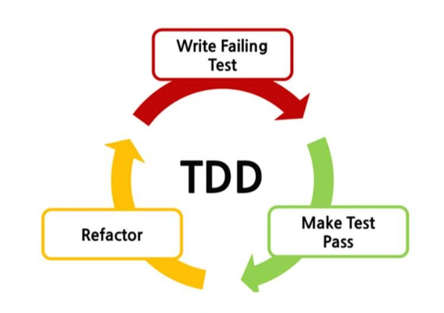
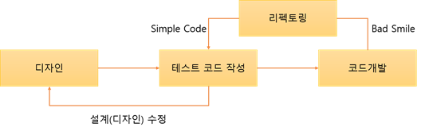
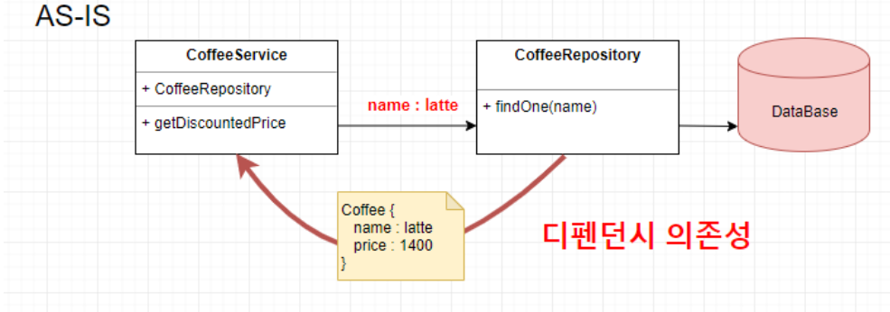
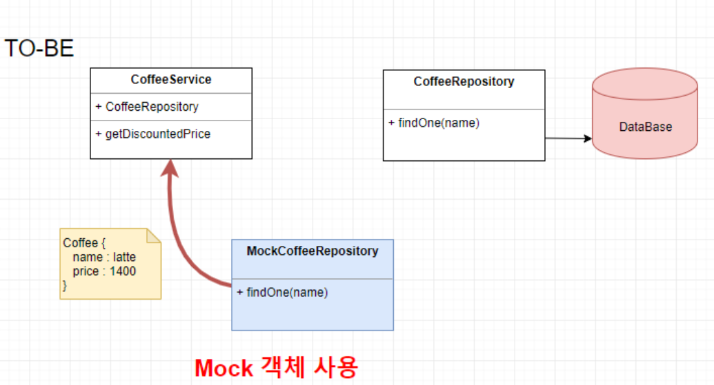

# 테스트 주도 개발 TDD

## Test Driven Development, TDD란?

테스트 주도 개발로 반복 테스트를 이용한 소프트웨어 방법론이다.

작은 단위의 테스트 케이스를 작성하고 이를 통과하는 코드를 추가하는 단계를 반복하여 구현한다.

짧은 개발 주기의 반복에 의존하는 개발 프로세스이며, 애자일 방법론 중 하나인 eXtream Programming(XP)의 ‘Test-First’ 개념에 기반을 둔 단순 설계를 중요시한다. ~~TDD의 창시자는 TDD보단 TFD(Test First Development) 또는 TDD (Test Driven Design)으로 지었어야 했다고 한다.(?)~~

> eXtream Programming(XP)
미래 예측을 최대한 하지 않고, 지속적으로 prototype을 완성하는 애자일 방법론 중 하나
추가 요구사항이 생기면 실시간으로 반영 가능
> 

> 단위 테스트(Unit Test)
한 단위(일반적으로 class)만을 테스트하는 것
> 

## TDD 개발주기



<**RED**>단계에서는 **실패하는 테스트 코드를 먼저 작성**한다.

<**GREEN**>단계에서는 **테스트 코드를 성공시키기 위한 실제 코드를 작성**한다.

<**YELLOW**>단계에서는 중복 코드 제거, 일반화 등의 **리팩토링을 수행**한다.

### **중요!**

- 실패하는 테스트 코드를 작성할 때까지 실제 코드를 작성하지 않는 것
- 실패하는 테스트를 통과할 정도의 최소 실제 코드를 작성하는 것

> **※ 실제 코드에 대해 기대되는 바를 보다 명확하게 정의함으로써 불필요한 설계를 피함
※ 정확한 요구 사항에 집중**
> 

## 일반 개발 방식과 TDD 개발 방식 비교

### 일반 개발 방식


보통의 개발 방식은 **‘요구사항 분석 → 설계 → 개발 → 테스트 → 배포’**의  형태로 개발 주기를 갖는다.

이는 **소프트웨어 개발을 느리게 하는 잠재적 위험이 존재**한다.

1. 소비자의 요구사항이 **처음부터 명확하지 않을 수 있다.**
2. 1에 의거하여 **처음부터 완벽한 설계는 어렵다.**
3. 자체 버그 검출 능력 저하 또는 **소스코드의 품질이 저하**될 수 있다.
4. **자체 테스트 비용이 증가**할 수 있다.

고객의 요구사항과 디자인의 오류 등 많은 외부 또는 내부 조건에 의해 재설계를 하여 **점진적으로 완벽한 설계가 되어가는 일반 개발 방식**은 재설계로 인해 코드를 삽입, 수정, 삭제 하는 과정에서 **불필요한 코드가 남거나 중복 처리 될 가능성**이 크다.

**결론적으로 코드의 재사용이 어렵고 관리가 어려워 유지보수가 힘들다!!!**

작은 부분의 기능 수정에도 모든 부분을 테스트해야 하므로 전체적인 버그 검출이 어렵다..

### TDD 개발 방식



큰 차이점은 **테스트 코드를 작성한 뒤에 실제 코드를 작성**한다.

디자인(설계) 단계에서 **프로그래밍 목적을 반드시 미리 정의**해야만 하고, 또 **무엇을 테스트해야 할지 미리 정의(테스트 케이스 작성)**해야만 한다.

테스트 코드를 작성하는 **도중에 발생하는 예외 사항(버그, 수정사항)들은 테스트 케이스에 추가**하고 **설계를 개선**한다. 이후 테스트가 **통과된 코드만을 코드 개발 단계에서 실제 코드로 작성**한다.

**이러한 반복적인 단계가 진행되면서 자연스럽게 코드의 버그가 줄어들고, 소스코드는 간결해진다.**

## 사용 예제

[https://github.com/Chaeonida/jpaboardForTdd](https://github.com/Chaeonida/jpaboardForTdd)

```java
@ExtendWith(MockitoExtension.class)
public class Comment Test {
	@Mock
	private PostRepository postRepository;
	@Mock
	private CommentRepository commentRepository;
	@Mock
	private UserRepository userRepository;
	
	@InjectMocks
	private CommentService commentService;
	
	static User user = User.builder().id(1L).age(14).name("ChaeWon").hobby("drawing").build();
	static Post post = Post.builder().id(1L).content("아무내용").title("제목").user(user).build();
	static Comment comment = Comment.builder().id(1L).content("댓글내용1").post(post).user(user).build();
	
	@Test
	@DisplayName("댓글 등록 테스트 ")
	void createCommentTest(Long userId) {
	    //given(user,Post 가 주어졌을때 )
	    Mockito.given(userRepository.findById(any())).willReturn(Optional.of(user));
	    Mockito.given(postRepository.findById(any())).willReturn(Optional.of(post));
	    Mockito.given(commentRepository.save(any())).willReturn(comment);
	
	    CommentCreateRequest commentRequest = CommentCreateRequest.builder()
	            .content("댓글내용1")
	            .build();
	
	    //when(user가 댓글을 작성하면)
	    Comment savedComment = commentService.saveComment(commentRequest, post.getId(), user.getId());
	
	    //then(등록이 되어야한다.)
	    assertThat(savedComment.getId(), is(1L));
	    assertThat(savedComment.getUser().getId(), is(1L));
	    assertThat(savedComment.getPost().getId(), is(1L));
	    assertThat(savedComment.getContent(), is("댓글내용1"));
	}
```

## 장 단점

### 장점

- 보다 튼튼한 객체 지향적인 코드 생산
- 재설계 시간의 단축
- 디버깅 시간의 단축
- 테스트 문서의 대체 가능
- 추가 구현의 용이함

### 단점

- 생산성 저하
- 자신이 개발하던 방식을 많이 변경해야 함
- 박혀있는 틀과 이미지
- 계속해서 본인이 일하는 방식을 업그레이드

## 어노테이션

기본적인 어노테이션에 대해서 설명 하겠다.

### @Test

이 어노테이션을 붙이면 Test 메서드로 인식하고 테스트 한다.

JUnit5 기준으로 접근제한자가 Default 여도 된다. (JUnit4까지는 public)

### @BeforeAll

이 어노테이션을 붙인 메서드는 해당 테스트 클래스를 초기화할 때 딱 한번 수행되는 메서드

메서드 시그니쳐는 static으로 선언

### @BeforeEach

이 어노테이션을 붙인 메서드는 테스트 메서드 실행 이전에 수행

### @AfterAll

이 어노테이션을 붙인 메서드는 테스트 클래스 내 테스트 메서드를 모두 실행시킨 후 딱 한번 수행되는 메서드

시그니처는 static으로 선언

### @AfterEach

이 어노테이션을 붙인 메서드는 테스트 메서드 실행 이후에 수행

### @Disabled

이 어노테이션을 붙인 테스트 메서드는 무시

### 코드

```java
class StudyTest {

	@Test
	void create1() {
		Study study = new Study();
		assertNotNull(study);
		System.out.println("create1()");
	}
	
	@Test
	void create2() {
		System.out.println("create2()");
	}
	
	@Disabled
	@Test
	void create3() {
		System.out.println("create3()");
	}
	
	@BeforeAll
	static void beforeAll() {
		System.out.println("@BeforeAll");
	}
	
	
	@AfterAll
	static void afterAll() {
		System.out.println("@AfterAll");
	}
	
	@BeforeEach
	void beforeEach() {
		System.out.println("@BeforeEach");
	}
	
	@AfterEach
	void afterEach() {
		System.out.println("@AfterEach");
	}
}
```

### 결과

```
@BeforeAll

@BeforeEach
create1()
@AfterEach

@BeforeEach
create2()
@AfterEach

~~ is @Disabled

@AfterAll
```

### @ExtendWith

Mockito의 Mock 객체를 사용하기 위한 Annotation이다.

JUnit4에서는 RunWith(MockitoJUnitRunner.class)를,

JUnit5에서는 ExtendWith를 쓰도록 되어있다.

### @Mock vs @Spy

@Mock은 로직이 삭제된 빈 껍데기, 실제로 메서드는 갖고 있지만 내부 구현이 없는 상태

@Spy는 모든 기능을 가지고 있는 완전한 객체

대체로 Spy보다는 Mock을 사용하길 권고한다. 하지만 **외부 라이브러리를 이용한 테스트에는 Spy를 사용**하는 것을 추천

임의의 객체를 생성하기에 실제 데이터베이스에 연동을 하지 않아도 됨

### @InjectMocks

테스트 객체의 각 항목을 주입받게 하려면 이 어노테이션을 사용해야한다.

@Spy, @Mock 어노테이션이 붙은 객체들을 주입시켜준다.

@Mock에서 만들어진 객체들을 사용하여 자신을 생성





## Given - When - Then Pattern

Given-When-Then은 곧

[준비 - 실행 - 검증]

### Given

테스트를 위해 준비하는 과정

테스트에 사용하는 변수, 입력 값 등을 정의

Mock 객체를 정의하는구문도 Given에 포함

Mockito의 when이라는 메서드는 테스트를 위한 준비과정이기에 given에 포함

> Mockito.when() 메서드는 메서드 호출 조건을 그리고 thenReturn()은 그 조건을 충족할 때 리턴할 값을 지정한다.
> 

### When

액션을 하는 테스트를 실행하는 과정

When은 가장 중요한 구문이지만 보통 한줄이면 끝나는 가장 짧은 구문

### Then

테스트를 검증하는 과정

예상 값, 실제 실행을 통해 나온 값을 검증

## 예제

보고 따라하면 된다.

[https://mangkyu.tistory.com/184](https://mangkyu.tistory.com/184)

## 출처

- [https://wooaoe.tistory.com/33](https://wooaoe.tistory.com/33)
- [https://gracelove91.tistory.com/107](https://gracelove91.tistory.com/107)
- [https://brunch.co.kr/@springboot/292](https://brunch.co.kr/@springboot/292)