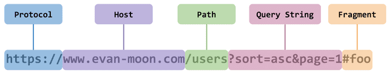

# CORS

- **CORS?**
    - Cross-Origin Resource Sharing(교차 출처 리소스 공유)
    - 한 도메인 또는 Origin의 웹 페이지가 다른 도메인 (도메인 간 요청)을 가진 리소스에 엑세스 할 수 있게 하는 보안 메커니즘.
    - 추가적인 HTTP header를 사용해서 애플리케이션이 다른 origin의 리소스에 접근할 수 있도록 하는 메커니즘.
    - 서버와 클라이언트가 정해진 헤더를 통해 서로 요청이나 응답에 반응할지 결정하는 방식.
    - 다른 origin에서 내 리소스에 함부로 접근하지 못하게 하기 위해 사용.
    - 최신 브라우저에서 구현된 동일 출처 정책(same-origin policy) 때문에 등장.

- **동일 출처 정책**
    - 동일한 출처의 리소스에만 접근하도록 제한 하는 것.
        - 출처 → 프로토콜, 호스트명, 포트
    - ex) 동일한 출처에서만 접근을 허용하는 이유
        - 도메인사이트 : https://naver.com:80
            
            → http : 프로토콜, [naver.com](http://naver.com) : 호스트, 80 : 포트
            
        - 해당 사이트의 api 주소는 https://naver.com/api
            - 사용자가 로그인 후 인증 토근 발급.
            - 로그인 상태에서 [https://www.google.com사이트에](https://www.google.com사이트에) 접속하면 naver에서 발급받은 인증 토큰이 자동으로 첨부되어 google에 사용자인척하면서 요청을 보낼 수 있음.
        
        ⇒ 자동으로 쿠키가 첨부되기 때문에 보안상의 이유로 브라우저는 HTTP 호출을 동일한 출처로 제안
        

- **CORS가 생긴 이유**
    - 예전에는 동일한 도메인에서 리소스를 받아왔는데, 지금은 클라이언트에서 도메인이 다른 서버에서 제공하는 API를 사용하는 일이 많아졌다.
    - 그래서 예전처럼 동일한 도메인간의 요청만 할 수 겂어졌고 CORS가 생겼다.
    - 만약 내가 서비스하고 있지 않은 사이트에서 세션을 요청해서 세션을 획득할 수 있다면 해당 사이트는 악의적으로 내 세션을 탈취하거나 나른 행동을 할 수 있음.그래서 브라우저에서는 이러한 요청을 막는다. 피싱사이트가 대표적인 공격 사례인데 이러한 것을 막고 내가 허용한 origin들만 요청할 수 있도록 하기 위해 필요.
    
- **CORS 동작 원리**
    - 동일 출처 정책은 브라우저에서 임의로 하는 것.
    - 브라우저를 통하지 않고 요청을 보내거나 브라우저에서 동일 출처 정책이 아니라면 동일 출처가 아니라도 요청을 보내고 응답을 받을 수 있다.
        - 즉, 브라우저가 리소스를 요청할 때 추가적인 헤더에 정보를 담는다. 내 origin은 무엇이고 어떤 메소드를 사용해서 요청을 할 것이고 어떤 헤더들을 포함할 것인지를 담아서 서버에 전송.서버는 서버가 응답할 수 있는 origin들을 헤더에 담아서 브라우저에게 보냄. 브라우저가 이 헤더를 보고 해당 origin에서 요청할 수 있다면 리소스 전송을 허용하고 만약 불가능하다면 에러를 발생시킴.
            
    - 브라우저가 다른 출처로 요청을 보낼 때 절차
        - **Simple request**
            - simple요청은 pre-flighted요청을 보내지 않는다.
            - 아래 3가지 조건을 모두 만족하면 Simple request이다.
                - HTTP method가 GET, HEAD, POST 중의 한 가지 방식을 사용
                - POST방식일 경우 content-type이 3중 하나여야 한다.
                    - application/x-www-form-unlencoded
                    - multipart/form-data
                    - text
                - 자동으로 설정되는 헤더는 제외하고, 설정할 수 있는 헤더들만 변경한다.
                    - Accept
                    - Accept-Language
                    - Content-Language
            
            ⇒ 모두 만족하면 추가적으로 확인하지 않고 바로 본 요청.
            
            - Simple request 과정
                1. 요청을 보낸다.
                2. 브라우저는 Host와 같은 헤더를 추가하는 것 외에도 교차 출처 요청에 대해 Origin Request Header를 자동으로 추가한다.
                    
                    ```jsx
                    GET/products/HTTP/1.1
                    Host : api.domain.com
                    Origin: https://www.domain.com
                    ```
                    
                - **Origin**
                  
                    
                    - Origin은 Protocol과 Host, 그리고 포트번호까지 모두 합친 것.
                        
                        → 즉, 서버의 위치를 찾아가기 위해 필요한 가장 기본적인 것들을 합쳐놓은 것.
                        
                3. 서버에서 Origin 리퀘스트 헤더를 확인. Origin값이 허용되면 Access-Control-Allow-Origin 요청 헤더 Origin값으로 설정
                    
                    ```jsx
                    Http/1.1 200 OK
                    Access-Control-Allow-Origin: https://www.domain.com
                    Content-Type: application/json
                    ```
                    
                4. 응답을 받은 브라우저는 Access-Control-Allow-Origin 헤더가 탭의 출처와 일치하는지 확인.
                값이 일치하거나 ‘*’ 와일드 카드 연산자를 포함하는 경우가 통과
        - **Preflighted request**
            - Simple request와는 다른 유형의 CORS요청.
            - 브라우저에서 진짜 요청을 보내기 전에 미리 확인 요청을 보낸다. 이 때 OPTION메소드를 사용.
            - Preflighted request 과정
                1. ajax요청을 보낸다.
                
                ```jsx
                OPTIONS /products/ HTTP/1.1
                Host: api.domain.com
                Origin: https://www.domain.com
                Access-Control-Request-Method: POST
                Access-Control-Request-Headers: Authorization, Content-Type
                ```
                
                2. 서버는 허용된 메소드 및 헤더를 지정하여 응답한다.
                
                ```jsx
                HTTP/1.1 200 OK
                Access-Control-Allow-Origin: https://www.domain.com
                Access-Control-Allow-Method: GET, POST, OPTIONS, PUT
                Access-Control-Allow-Headers: Authorization, Content-Type
                Content-Type: application/json
                ```
                
                3. 헤더와 메소드가 통과되면, 브라우저는 원래 CORS요청을 보낸다.
                
                ```jsx
                POST /products/ HTTP/1.1
                Host: api.domain.com
                Authorization: token
                Content-Type: application/json
                Origin: https://www.domain.com
                ```
                
                4. 응답은 Access-Control-Allow-Origin헤더에 올바른 출처가 있으므로 검사를 통과한다.
- **요청 헤더 목록**
    - **Access-Control-Request-Method**
        - preflight요청을 할 때 실제 요청에서 어떤 메서드를 사용할 것인지 서버에게 알리기 위해 사용.
    - **Access-Control-Request-Headers**
        - preflight요청을 할 때 실제 요청에서 어떤 header를 사용할 것인지 서버에게 알리기 위해 사용.
- **응답 헤더 목록**
    - **Access-Control-Allow-Origin**
        - 브라우저가 해당 origin이 자원에 접근할 수 있도록 허용. 혹은 *은 credentials이 없는 요청에 한해서 모든 origin에서 접근이 가능하도록 허용.
    - **Access-Control-Expose-Headers**
        - 브라우저가 액세스할 수있는 서버 화이트리스트 헤더를 허용.
    - **Access-Control-Max-Age**
        - 얼마나 오랫동안 preflight요청이 캐싱 될 수 있는지를 나타냄.
    - **Access-Control-Allow-Credentials**
        - Credentials가 true 일 때 요청에 대한 응답이 노출될 수 있는지를 나타냄.
        - preflight요청에 대한 응답의 일부로 사용되는 경우 실제 자격 증명을 사용하여 실제 요청을 수행 할 수 있는지를 나타냄.
        - 간단한 GET 요청은 preflight되지 않으므로 자격 증명이 있는 리소스를 요청하면 헤더가 리소스와 함께 반환되지 않으면 브라우저에서 응답을 무시하고 웹 콘텐츠로 반환하지 않음.
    - **Access-Control-Allow-Methods**
        - preflight요청에 대한 대한 응답으로 허용되는 메서드들을 나타냄.
    - **Access-Control-Allow-Headers**
        - preflight요청에 대한 대한 응답으로 실제 요청 시 사용할 수 있는 HTTP 헤더를 나타냄.

[CORS 에러 해결하기](https://github.com/outlastudy/2022-weekly-study/blob/%EC%B0%BD%EC%9A%A9/%EC%B0%BD%EC%9A%A9/CORS%20%EC%97%90%EB%9F%AC%20%ED%95%B4%EA%B2%B0%ED%95%98%EA%B8%B0.md)
