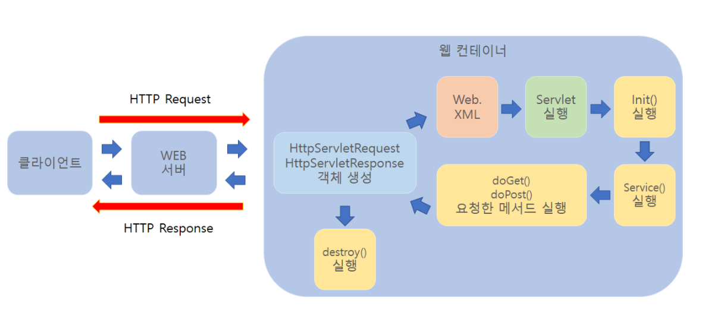
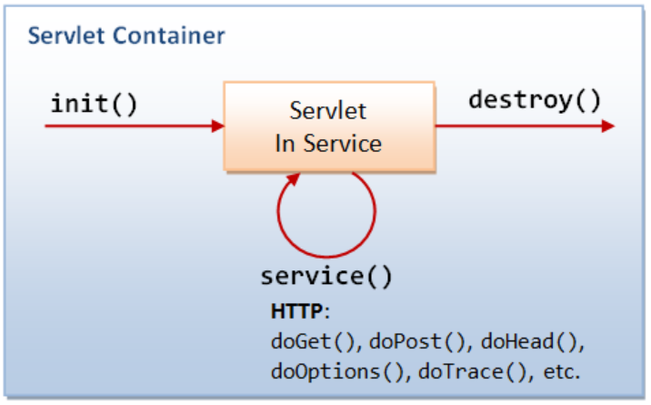
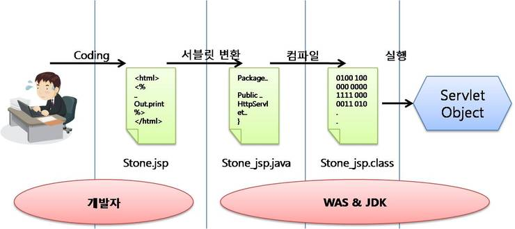

# Servlet

- **서버에서 실행되다가 클라이언트의 요청을 처리하고, 그 결과를 반환하는 Servlete 클래스의 구현 규칙을 지킨 자바 웹 프로그래밍 기술**
- 사용자가 로그인 하려고 할 때, 사용자는 아이디와 비밀번호를 입력하고, 로그인 버튼을 누를때 서버는 클라이언트의 아이디와 비밀번호를 확인하고, 다음 페이지를 띄워주어야 하는데, 이러한 역할을 수행하는 것이 바로 Servlet. Servlet은 자바로 구현된 CGI라고도 함.

### Servlet 특징

- 클라이언트의 요청에 대해 동적으로 작동하는 웹 어플리케이션 컴포넌트
- html을 사용하여 요청에 응답
- Java Thread를 이용하여 동작
- MVC 패턴에서 Controller로 이용
- HTTP 프로토콜 서비스를 지원하는 javax.servlet.http.HttpServlet 클래스를 상속
- UDP보다 처리 속도가 느림
- HTML 변경 시 Servlet을 재컴파일해야 하는 단점

일반적으로 웹서버는 정적인 페이지만을 제공.

동적인 페이지를 제공하기 위해서 웹서버는 다른 곳에 도움을 요청하여 동적인 페이지를 작성해야한다. 여기서 웹서버가 동적인 페이지를 제공할 수 있도록 도와주는 애플리케이션이 Servlet

### **Servlet 동작과정**

1.  클라이언트 요청
2. HttpServletRequest, HttpServletResponse 객체 생성
3. Web.xml이 어느 서블릿에 대해 요청한 것인지 탐색

   web.xml → 웹 어플리케이션 서비스 처리에 대한 정의된 환경 설정파일

4. 해당하는 서블릿에서 service() 메소드 호출
5. doGet() 또는 doPost() 호출
6. 동적 페이지 생성 후 ServletResponse 객체에 응답 전송
7. HttpServletRequest, HttpServletResponse 객체 소멸
- CGI

  CGI는 특별한 라이브러리나 도구를 의미하는 것이 아니고, 별도로 제작된 웹서버와 프로그램간의 교환방식. CGI방식은 어떠한 프로그래밍언어로도 구현이가능하며, 별도로 만들어 놓은 프로그램에 HTML의 Get or Post 방법으로 클라이언트의 데이터를 환경변수로 전달하고, 프로그램의 표준 출력 결과를 클라이언트에게 전송하는 것.

  ⇒ 자바 어플리케이션 코딩을 하듯 웹 브라우저용 출력 화면을 만드는 방법입니다.

## Servlet Container(서블릿 컨테이너)

- 서블릿은 스스로 동작하는 것이 아니고 서블릿을 관리해주는 것. 서블릿 컨테이너가 필요.
- 서블릿이 어떠한 역할을 수행하는 정의서라고 보면, 서블릿 컨테이너는 그 정의서를 보고 수행
- 클라이언트의 Request를 받아주고 Response를 할 수 있게, 웹서버와 소켓으로 통신하며 대표적인 예로 Tomcat이 있음
- Tomcat은 웹 서버와 통하여 JSP와 Servlet이 작동하는 환경을 제공

### **Servlet Container 역할**

**1. 웹서버와의 통신 지원**

- Servlet과 웹서버가 손쉽게 통신할 수 있게 해줌
- API를 제공하여 복잡한 과정을 생략. 그래서 개발자가 Servlet에 구현해야 할 비지니스 로직에 대해서만 초점을 두게끔 도와줍니다.

**2. Servlet 생명주기(Life Cycle) 관리**

- Servlet의 탄생과 죽음을 관리
- Servlet 클래스를 로딩하여 인스턴스화하고, 초기화 메소드를 호출하고, 요청이 들어오면 적절한 Servlet 메소드를 호출
- 또한 Servlet이 생명을 다 한 순간에는 적절하게 Garbage Collection(가비지 컬렉션)을 진행하여 편의를 제공.

**3. 멀티쓰레드 지원 및 관리**

- Servlet 컨테이너는 요청이 올 때 마다 새로운 자바 쓰레드를 하나 생성하는데, HTTP 서비스 메소드를 실행하고 나면, 쓰레드는 자동으로 죽게된다.
- 원래는 쓰레드를 관리해야 하지만 서버가 다중 쓰레드를 생성 및 운영해주니 쓰레드의 안정성에 대해서 걱정할 필요 없음

**4. 선언적인 보안 관리**

- Servlet 컨테이너를 사용하면 개발자는 보안에 관련된 내용을 Servlet 또는 자바 클래스에 구현할 필요 없음
- 일반적으로 보안관리는 XML 기록하므로, 보안에 대해 수정할 일이 생겨도 자바 소스 코드를 수정하여 다시 컴파일 하지 않아도 보안관리가 가능

- **Servlet 생명주기(Life Cycle)**

    - 클라이언트의 요청이 들어오면 컨테이너는 해당 Servlet이 메모리에 있는지 확인하고, 없을 경우 init()메소드를 호출하여 적재합니다. init()메소드는 처음 한번만 실행되기 때문에, Servlet의 쓰레드에서 공통적으로 사용해야하는 것이 있다면 오버라이딩하여 구현하면 됩니다. 실행 중 Servlet이 변경될 경우, 기존 서블릿을 파괴하고 init()을 통해 새로운 내용을 다시 메모리에 적재합니다.
    - init()이 호출된 후 클라이언트의 요청에 따라서 service()메소드를 통해 요청에 대한 응답이 doGet()가 doPost()로 분기됩니다. 이때 Servlet 컨테이너가 클라이언트의 요청이 오면 가장 먼저 처리하는 과정으로 생성된 HttpServletRequest, HttpServletResponse에 의해 request와 response객체가 제공됩니다.
    - 컨테이너가 Servlet에 종료 요청을 하면 destroy()메소드가 호출되는데 마찬가지로 한번만 실행되며, 종료시에 처리해야하는 작업들은 destroy()메소드를 오버라이딩하여 구현하면 됩니다.
  

- **JSP(Java Server Page)**
    - Servlet은 자바 코드속에 HTML코드가 들어가는 형태인데, JSP는 반대로 HTML소스코드 속에 자바코드가 들어가는 구조
    - <% 소스코드 %>, <%= 소스코드 %>
    - 해당 부분은 웹 브라우저로 보내는 것이 아니라 웹 서버에서 실행되는 부분
    - 컴파일 같은 과정을 할 필요없이 JSP페이지를 작성하여 웹 서버의 디렉토리에 추가하면 사용가능.
    - Servlet 규칙이 꽤나 복잡하기 때문에 JSP가 나오게 되었는데 JSP는 WAS에 의하여 서블릿 클래스로 변환되어 사용
