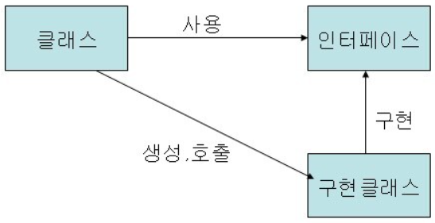
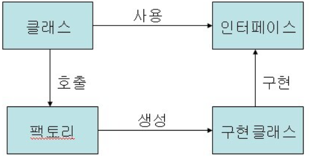
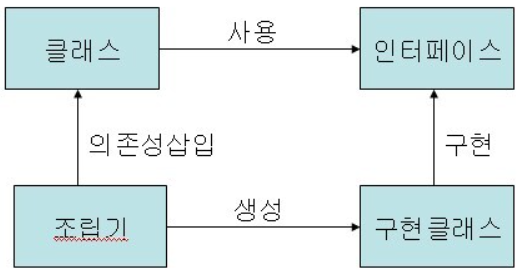
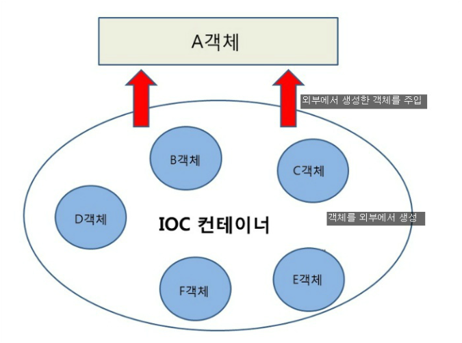

# 스프링 IoC컨테이너란?

- 가장 중요한 인터페이스는 **BeanFactory,** **ApplicatonContext**이다
- **BeanFactory**
    
    스프링 빈 컨테이너에 접근하기 위한 최상위 인터페이스이다.Bean 객체를 생성하고 관리하는 인터페이스이다. 디자인패턴의 일종인 팩토리 패턴을 구현한 것이다. BeanFactory 컨테이너는 구동될 때 Bean 객체를 생성하는 것이 아니라. 클라이언트의 요청이 있을 때(getBean()) 객체를 생성한다.
    
- **ApplicationContext**
    
    ListableBeanFactory(BeanFactory에 하위 인터페이스이며, Bean을 Listable하게 보관하는 인터페이스를 말한다. 대표적으로 DefaultListableBeanFactory 클래스)를 상속하고 있으며, 여러 기능(ResourceLoader, ApplicationEventPublisher, MessageSource, Bean Lifecycle)을 추가로 제공한다.
    
    BeanFactory를 상속받은 interface이며, ApplicationContext 컨테이너는 구동되는 시점에 등록된 Bean 객체들을 스캔하여 객체화한다
    
- 애플리케이션 컴포넌트의 중앙 저장소이다.
- **빈** 설정 소스로 부터 **빈** 정의를 읽어들이고, 빈을 구성하고 제공한다.
- 빈들의 의존 관계를 설정해준다.(객체의 생성을 책임지고, 의존성을 관리한다)

## **사용 목적**

### 클래스 호출 방식

- 클래스내에 선언과 구현이 같이 있기 때문에 다양한 형태로 변화가 불가능하다.

### 인터페이스 호출 방식

- 클래스를 인터페이스와 인터페이스를 상속받아 구현하는 클래스로 분리
    
    → 구현클래스 교체가 용이하여 다양한 변화가 가능
    
    → 그러나 구현클래스 교체시 호출 클래스의 코드 수정이 필요(부분종속)
    
    

### 팩토리 호출 방식

- 팩토리가 구현클래스를 생성하기 때문에 호출클래스는 팩토리를 호출하는 코드로 충분
- 구현클래스 변경시 팩토리만 수정하면 되기 때문에 호출클래스에는 영향을 미치지 않는다
    
    → 그러나 호출클래스에서 팩토리를 호출하는 코드가 들어가야 하는 것 또한 팩토리에 의존함을 의미
    
    
    ### IoC
    
    - 팩토리 패턴의 장점을 더해 어떠한 것에도 의존하지 않는 형태가 되었다. 실행시점에 클래스간의 관계가 형성이 된다.
        
        →즉, **의존성이 삽입된다는 의미로 IoC를 DI라는 표현으로 사용한다.**
        
        

## Container 정리

- 컨테이너의 사전적 의미 - 무언가를 담는 용기, 그릇이다.
- **스프링의 컨테이너**
프로그래머가 작성한 코드의 처리과정을 위임받아 독립적으로 처리하는 존재.
- 지금까지 객체를 사용하기 위해서 new 생성자를 이용하거나 getter/setter 기능을 써야만 했다.어플리케이션에는 이러한 객체가 무수히 많이 존재하고 서로 참조하고 있을 것.
- 서로 참조하고 있는 정도가 심할 수록 의존성이 높다고 표현한다. 낮은 결합도와 높은 캡슐화로 대변되는 OOP에서 높은 의존성은 매우 지양된다.

⇒ 의존성 제어, 즉 객체 간의 의존성을 낮추기 위해 Spring IoC 컨테이너가 사용된다.

